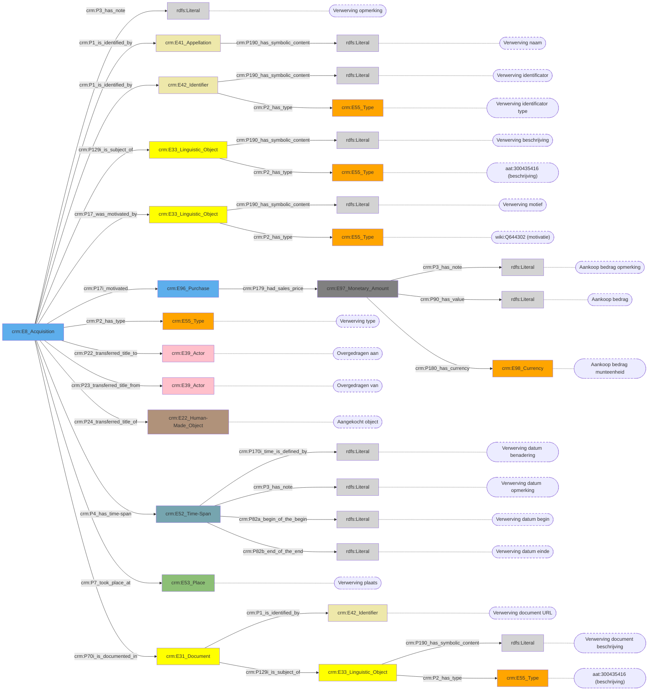

```mermaid
graph LR
style 0a2a3cd4-e991-11ed-9064-00163e71351b fill:#ffff00
style 0a2a41ac-e991-11ed-9064-00163e71351b fill:#D3D3D3
style 0a2a44d6-e991-11ed-9064-00163e71351b fill:#ffa500
style 0b25d0f2-ee5b-11ed-9064-00163e71351b fill:#ffa500
style 122e596a-e991-11ed-9232-00163e71351b fill:#D3D3D3
style 24843382-e542-11ee-8f1b-960002548b4f fill:#EEE8AA
style 2c119771-e540-11ee-b73f-960002548b4f fill:#D3D3D3
style 30ce6bc2-3d17-11ef-ac04-960002548b4f fill:#D3D3D3
style 35be857b-e542-11ee-98ef-960002548b4f fill:#D3D3D3
style 37872002-ea6d-11ed-a1e6-00163e71351b fill:#5DAEEC
style 39e86e48-e994-11ed-9232-00163e71351b fill:#B0927A
style 3bcc24d5-e540-11ee-94ee-960002548b4f fill:#ffa500
style 4b81aff7-e541-11ee-921a-960002548b4f fill:#ffff00
style 572bbd7d-3d17-11ef-93c1-960002548b4f fill:#D3D3D3
style 695b5b55-f19f-11ee-a866-960002548b4f fill:#D3D3D3
style 70b9ebb3-e541-11ee-8711-960002548b4f fill:#D3D3D3
style 7b658ca8-d44e-11ed-9064-00163e71351b fill:#5DAEEC
style 7fd84e3a-e991-11ed-9655-00163e71351b fill:#8CBF76
style 8be2fd34-e990-11ed-9655-00163e71351b fill:#ffc0cb
style 99988ee4-e990-11ed-9232-00163e71351b fill:#ffa500
style b2f4b0e2-e991-11ed-9064-00163e71351b fill:#ffc0cb
style b35a7c94-b086-11ee-b321-960002548b4f fill:#EEE8AA
style b35a81b6-b086-11ee-a40a-960002548b4f fill:#D3D3D3
style b35a82e2-b086-11ee-913f-960002548b4f fill:#ffa500
style bd85e9d7-e53f-11ee-9402-960002548b4f fill:#ffff00
style bfbfd116-ee5b-11ed-9232-00163e71351b fill:#D3D3D3
style cc4f2144-ea6d-11ed-9232-00163e71351b fill:#808080
style ce2590b1-6e7f-11ef-a8c0-960002548b4f fill:#ffa500
style d5400f4c-e53f-11ee-928f-960002548b4f fill:#EEE8AA
style d638bcba-e541-11ee-bb9d-960002548b4f fill:#D3D3D3
style d865b38b-645b-11ef-b970-960002548b4f fill:#D3D3D3
style dcc8aca4-f0c9-11ee-b461-960002548b4f fill:#76A5AF
style fa4a2c3c-e53f-11ee-a766-960002548b4f fill:#ffff00
0a2a3cd4-e991-11ed-9064-00163e71351b["crm:E33_Linguistic_Object"]-->|"crm:P190_has_symbolic_content"|0a2a41ac-e991-11ed-9064-00163e71351b(rdfs:Literal)
24843382-e542-11ee-8f1b-960002548b4f["crm:E41_Appellation"]-->|"crm:P190_has_symbolic_content"|35be857b-e542-11ee-98ef-960002548b4f(rdfs:Literal)
4b81aff7-e541-11ee-921a-960002548b4f["crm:E33_Linguistic_Object"]-->|"crm:P190_has_symbolic_content"|70b9ebb3-e541-11ee-8711-960002548b4f(rdfs:Literal)
7b658ca8-d44e-11ed-9064-00163e71351b["crm:E8_Acquisition"]-->|"crm:P3_has_note"|122e596a-e991-11ed-9232-00163e71351b(rdfs:Literal)
b35a7c94-b086-11ee-b321-960002548b4f["crm:E42_Identifier"]-->|"crm:P190_has_symbolic_content"|b35a81b6-b086-11ee-a40a-960002548b4f(rdfs:Literal)
cc4f2144-ea6d-11ed-9232-00163e71351b["crm:E97_Monetary_Amount"]-->|"crm:P3_has_note"|d638bcba-e541-11ee-bb9d-960002548b4f(rdfs:Literal)
cc4f2144-ea6d-11ed-9232-00163e71351b["crm:E97_Monetary_Amount"]-->|"crm:P90_has_value"|bfbfd116-ee5b-11ed-9232-00163e71351b(rdfs:Literal)
dcc8aca4-f0c9-11ee-b461-960002548b4f["crm:E52_Time-Span"]-->|"crm:P170i_time_is_defined_by"|d865b38b-645b-11ef-b970-960002548b4f(rdfs:Literal)
dcc8aca4-f0c9-11ee-b461-960002548b4f["crm:E52_Time-Span"]-->|"crm:P3_has_note"|695b5b55-f19f-11ee-a866-960002548b4f(rdfs:Literal)
dcc8aca4-f0c9-11ee-b461-960002548b4f["crm:E52_Time-Span"]-->|"crm:P82a_begin_of_the_begin"|30ce6bc2-3d17-11ef-ac04-960002548b4f(rdfs:Literal)
dcc8aca4-f0c9-11ee-b461-960002548b4f["crm:E52_Time-Span"]-->|"crm:P82b_end_of_the_end"|572bbd7d-3d17-11ef-93c1-960002548b4f(rdfs:Literal)
fa4a2c3c-e53f-11ee-a766-960002548b4f["crm:E33_Linguistic_Object"]-->|"crm:P190_has_symbolic_content"|2c119771-e540-11ee-b73f-960002548b4f(rdfs:Literal)
0a2a41ac-e991-11ed-9064-00163e71351b["rdfs:Literal"]-.-0a2a41ac-e991-11ed-9064-00163e71351b_s(["Verwerving beschrijving"])
0a2a44d6-e991-11ed-9064-00163e71351b["crm:E55_Type"]-.-0a2a44d6-e991-11ed-9064-00163e71351b_s(["aat:300435416 (beschrijving)"])
35be857b-e542-11ee-98ef-960002548b4f["rdfs:Literal"]-.-35be857b-e542-11ee-98ef-960002548b4f_s(["Verwerving naam"])
70b9ebb3-e541-11ee-8711-960002548b4f["rdfs:Literal"]-.-70b9ebb3-e541-11ee-8711-960002548b4f_s(["Verwerving motief"])
ce2590b1-6e7f-11ef-a8c0-960002548b4f["crm:E55_Type"]-.-ce2590b1-6e7f-11ef-a8c0-960002548b4f_s(["wiki:Q644302 (motivatie)"])
99988ee4-e990-11ed-9232-00163e71351b["crm:E55_Type"]-.-99988ee4-e990-11ed-9232-00163e71351b_s(["Verwerving type"])
b2f4b0e2-e991-11ed-9064-00163e71351b["crm:E39_Actor"]-.-b2f4b0e2-e991-11ed-9064-00163e71351b_s(["Overgedragen aan"])
8be2fd34-e990-11ed-9655-00163e71351b["crm:E39_Actor"]-.-8be2fd34-e990-11ed-9655-00163e71351b_s(["Overgedragen van"])
39e86e48-e994-11ed-9232-00163e71351b["crm:E22_Human-Made_Object"]-.-39e86e48-e994-11ed-9232-00163e71351b_s(["Aangekocht object"])
122e596a-e991-11ed-9232-00163e71351b["rdfs:Literal"]-.-122e596a-e991-11ed-9232-00163e71351b_s(["Verwerving opmerking"])
7fd84e3a-e991-11ed-9655-00163e71351b["crm:E53_Place"]-.-7fd84e3a-e991-11ed-9655-00163e71351b_s(["Verwerving plaats"])
b35a81b6-b086-11ee-a40a-960002548b4f["rdfs:Literal"]-.-b35a81b6-b086-11ee-a40a-960002548b4f_s(["Verwerving identificator"])
b35a82e2-b086-11ee-913f-960002548b4f["crm:E55_Type"]-.-b35a82e2-b086-11ee-913f-960002548b4f_s(["Verwerving identificator type"])
d5400f4c-e53f-11ee-928f-960002548b4f["crm:E42_Identifier"]-.-d5400f4c-e53f-11ee-928f-960002548b4f_s(["Verwerving document URL"])
0b25d0f2-ee5b-11ed-9064-00163e71351b["crm:E98_Currency"]-.-0b25d0f2-ee5b-11ed-9064-00163e71351b_s(["Aankoop bedrag munteenheid"])
d638bcba-e541-11ee-bb9d-960002548b4f["rdfs:Literal"]-.-d638bcba-e541-11ee-bb9d-960002548b4f_s(["Aankoop bedrag opmerking"])
bfbfd116-ee5b-11ed-9232-00163e71351b["rdfs:Literal"]-.-bfbfd116-ee5b-11ed-9232-00163e71351b_s(["Aankoop bedrag"])
d865b38b-645b-11ef-b970-960002548b4f["rdfs:Literal"]-.-d865b38b-645b-11ef-b970-960002548b4f_s(["Verwerving datum benadering"])
695b5b55-f19f-11ee-a866-960002548b4f["rdfs:Literal"]-.-695b5b55-f19f-11ee-a866-960002548b4f_s(["Verwerving datum  opmerking"])
30ce6bc2-3d17-11ef-ac04-960002548b4f["rdfs:Literal"]-.-30ce6bc2-3d17-11ef-ac04-960002548b4f_s(["Verwerving datum begin"])
572bbd7d-3d17-11ef-93c1-960002548b4f["rdfs:Literal"]-.-572bbd7d-3d17-11ef-93c1-960002548b4f_s(["Verwerving datum einde"])
2c119771-e540-11ee-b73f-960002548b4f["rdfs:Literal"]-.-2c119771-e540-11ee-b73f-960002548b4f_s(["Verwerving document beschrijving"])
3bcc24d5-e540-11ee-94ee-960002548b4f["crm:E55_Type"]-.-3bcc24d5-e540-11ee-94ee-960002548b4f_s(["aat:300435416 (beschrijving)"])
0a2a3cd4-e991-11ed-9064-00163e71351b["crm:E33_Linguistic_Object"]-->|"crm:P2_has_type"|0a2a44d6-e991-11ed-9064-00163e71351b["crm:E55_Type"]
37872002-ea6d-11ed-a1e6-00163e71351b["crm:E96_Purchase"]-->|"crm:P179_had_sales_price"|cc4f2144-ea6d-11ed-9232-00163e71351b["crm:E97_Monetary_Amount"]
4b81aff7-e541-11ee-921a-960002548b4f["crm:E33_Linguistic_Object"]-->|"crm:P2_has_type"|ce2590b1-6e7f-11ef-a8c0-960002548b4f["crm:E55_Type"]
7b658ca8-d44e-11ed-9064-00163e71351b["crm:E8_Acquisition"]-->|"crm:P1_is_identified_by"|24843382-e542-11ee-8f1b-960002548b4f["crm:E41_Appellation"]
7b658ca8-d44e-11ed-9064-00163e71351b["crm:E8_Acquisition"]-->|"crm:P1_is_identified_by"|b35a7c94-b086-11ee-b321-960002548b4f["crm:E42_Identifier"]
7b658ca8-d44e-11ed-9064-00163e71351b["crm:E8_Acquisition"]-->|"crm:P129i_is_subject_of"|0a2a3cd4-e991-11ed-9064-00163e71351b["crm:E33_Linguistic_Object"]
7b658ca8-d44e-11ed-9064-00163e71351b["crm:E8_Acquisition"]-->|"crm:P17_was_motivated_by"|4b81aff7-e541-11ee-921a-960002548b4f["crm:E33_Linguistic_Object"]
7b658ca8-d44e-11ed-9064-00163e71351b["crm:E8_Acquisition"]-->|"crm:P17i_motivated"|37872002-ea6d-11ed-a1e6-00163e71351b["crm:E96_Purchase"]
7b658ca8-d44e-11ed-9064-00163e71351b["crm:E8_Acquisition"]-->|"crm:P2_has_type"|99988ee4-e990-11ed-9232-00163e71351b["crm:E55_Type"]
7b658ca8-d44e-11ed-9064-00163e71351b["crm:E8_Acquisition"]-->|"crm:P22_transferred_title_to"|b2f4b0e2-e991-11ed-9064-00163e71351b["crm:E39_Actor"]
7b658ca8-d44e-11ed-9064-00163e71351b["crm:E8_Acquisition"]-->|"crm:P23_transferred_title_from"|8be2fd34-e990-11ed-9655-00163e71351b["crm:E39_Actor"]
7b658ca8-d44e-11ed-9064-00163e71351b["crm:E8_Acquisition"]-->|"crm:P24_transferred_title_of"|39e86e48-e994-11ed-9232-00163e71351b["crm:E22_Human-Made_Object"]
7b658ca8-d44e-11ed-9064-00163e71351b["crm:E8_Acquisition"]-->|"crm:P4_has_time-span"|dcc8aca4-f0c9-11ee-b461-960002548b4f["crm:E52_Time-Span"]
7b658ca8-d44e-11ed-9064-00163e71351b["crm:E8_Acquisition"]-->|"crm:P7_took_place_at"|7fd84e3a-e991-11ed-9655-00163e71351b["crm:E53_Place"]
7b658ca8-d44e-11ed-9064-00163e71351b["crm:E8_Acquisition"]-->|"crm:P70i_is_documented_in"|bd85e9d7-e53f-11ee-9402-960002548b4f["crm:E31_Document"]
b35a7c94-b086-11ee-b321-960002548b4f["crm:E42_Identifier"]-->|"crm:P2_has_type"|b35a82e2-b086-11ee-913f-960002548b4f["crm:E55_Type"]
bd85e9d7-e53f-11ee-9402-960002548b4f["crm:E31_Document"]-->|"crm:P1_is_identified_by"|d5400f4c-e53f-11ee-928f-960002548b4f["crm:E42_Identifier"]
bd85e9d7-e53f-11ee-9402-960002548b4f["crm:E31_Document"]-->|"crm:P129i_is_subject_of"|fa4a2c3c-e53f-11ee-a766-960002548b4f["crm:E33_Linguistic_Object"]
cc4f2144-ea6d-11ed-9232-00163e71351b["crm:E97_Monetary_Amount"]-->|"crm:P180_has_currency"|0b25d0f2-ee5b-11ed-9064-00163e71351b["crm:E98_Currency"]
fa4a2c3c-e53f-11ee-a766-960002548b4f["crm:E33_Linguistic_Object"]-->|"crm:P2_has_type"|3bcc24d5-e540-11ee-94ee-960002548b4f["crm:E55_Type"]
style 0a2a41ac-e991-11ed-9064-00163e71351b_s stroke-dasharray: 5
style 0a2a44d6-e991-11ed-9064-00163e71351b_s stroke-dasharray: 5
style 35be857b-e542-11ee-98ef-960002548b4f_s stroke-dasharray: 5
style 70b9ebb3-e541-11ee-8711-960002548b4f_s stroke-dasharray: 5
style ce2590b1-6e7f-11ef-a8c0-960002548b4f_s stroke-dasharray: 5
style 99988ee4-e990-11ed-9232-00163e71351b_s stroke-dasharray: 5
style b2f4b0e2-e991-11ed-9064-00163e71351b_s stroke-dasharray: 5
style 8be2fd34-e990-11ed-9655-00163e71351b_s stroke-dasharray: 5
style 39e86e48-e994-11ed-9232-00163e71351b_s stroke-dasharray: 5
style 122e596a-e991-11ed-9232-00163e71351b_s stroke-dasharray: 5
style 7fd84e3a-e991-11ed-9655-00163e71351b_s stroke-dasharray: 5
style b35a81b6-b086-11ee-a40a-960002548b4f_s stroke-dasharray: 5
style b35a82e2-b086-11ee-913f-960002548b4f_s stroke-dasharray: 5
style d5400f4c-e53f-11ee-928f-960002548b4f_s stroke-dasharray: 5
style 0b25d0f2-ee5b-11ed-9064-00163e71351b_s stroke-dasharray: 5
style d638bcba-e541-11ee-bb9d-960002548b4f_s stroke-dasharray: 5
style bfbfd116-ee5b-11ed-9232-00163e71351b_s stroke-dasharray: 5
style d865b38b-645b-11ef-b970-960002548b4f_s stroke-dasharray: 5
style 695b5b55-f19f-11ee-a866-960002548b4f_s stroke-dasharray: 5
style 30ce6bc2-3d17-11ef-ac04-960002548b4f_s stroke-dasharray: 5
style 572bbd7d-3d17-11ef-93c1-960002548b4f_s stroke-dasharray: 5
style 2c119771-e540-11ee-b73f-960002548b4f_s stroke-dasharray: 5
style 3bcc24d5-e540-11ee-94ee-960002548b4f_s stroke-dasharray: 5
```
