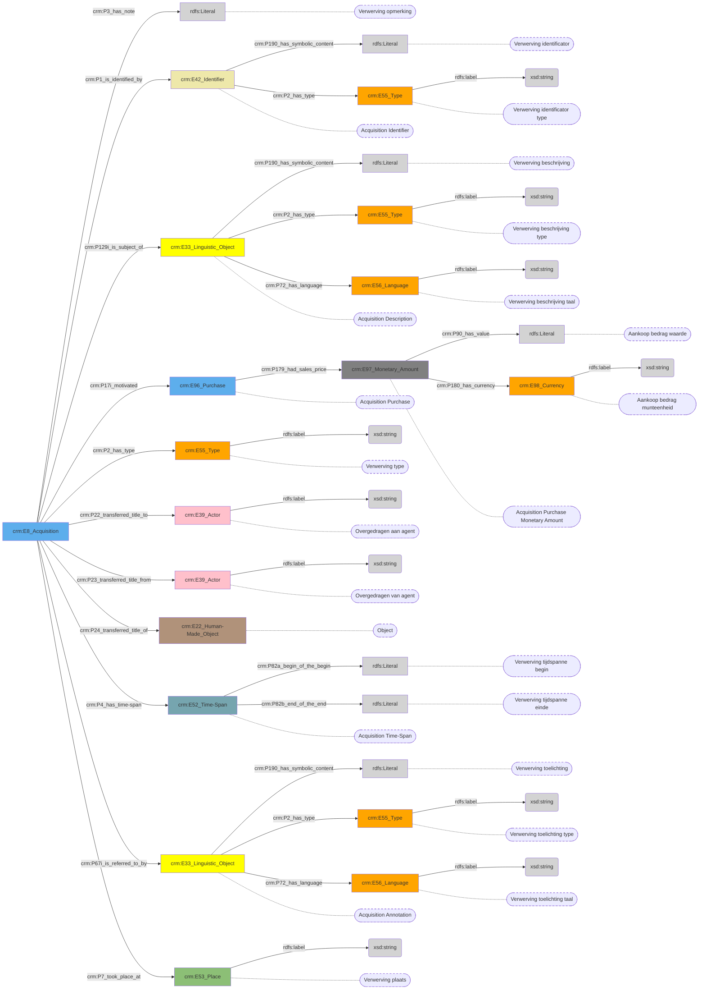

```mermaid
graph LR
0a2a3cd4-e991-11ed-9064-00163e71351b["crm:E33_Linguistic_Object"]-->|"crm:P190_has_symbolic_content"|0a2a41ac-e991-11ed-9064-00163e71351b(rdfs:Literal)
0a2a44d6-e991-11ed-9064-00163e71351b["crm:E55_Type"]-->|"rdfs:label"|0a2a4364-e991-11ed-9064-00163e71351b(xsd:string)
0a2a479c-e991-11ed-9064-00163e71351b["crm:E56_Language"]-->|"rdfs:label"|0a2a463e-e991-11ed-9064-00163e71351b(xsd:string)
0b25d0f2-ee5b-11ed-9064-00163e71351b["crm:E98_Currency"]-->|"rdfs:label"|2b87213e-ee5b-11ed-9232-00163e71351b(xsd:string)
7b658ca8-d44e-11ed-9064-00163e71351b["crm:E8_Acquisition"]-->|"crm:P3_has_note"|122e596a-e991-11ed-9232-00163e71351b(rdfs:Literal)
7fd84e3a-e991-11ed-9655-00163e71351b["crm:E53_Place"]-->|"rdfs:label"|944805ae-e991-11ed-9655-00163e71351b(xsd:string)
8b3dd634-ee3a-11ed-9232-00163e71351b["crm:E33_Linguistic_Object"]-->|"crm:P190_has_symbolic_content"|8b3ddc60-ee3a-11ed-9232-00163e71351b(rdfs:Literal)
8b3dda12-ee3a-11ed-9232-00163e71351b["crm:E55_Type"]-->|"rdfs:label"|8b3dde5e-ee3a-11ed-9232-00163e71351b(xsd:string)
8b3ddb52-ee3a-11ed-9232-00163e71351b["crm:E56_Language"]-->|"rdfs:label"|8b3ddd5a-ee3a-11ed-9232-00163e71351b(xsd:string)
8be2fd34-e990-11ed-9655-00163e71351b["crm:E39_Actor"]-->|"rdfs:label"|8be301f8-e990-11ed-9655-00163e71351b(xsd:string)
920ead2a-e990-11ed-9232-00163e71351b["crm:E52_Time-Span"]-->|"crm:P82a_begin_of_the_begin"|920eb66c-e990-11ed-9232-00163e71351b(rdfs:Literal)
920ead2a-e990-11ed-9232-00163e71351b["crm:E52_Time-Span"]-->|"crm:P82b_end_of_the_end"|920eb400-e990-11ed-9232-00163e71351b(rdfs:Literal)
99988ee4-e990-11ed-9232-00163e71351b["crm:E55_Type"]-->|"rdfs:label"|999895b0-e990-11ed-9232-00163e71351b(xsd:string)
b2f4b0e2-e991-11ed-9064-00163e71351b["crm:E39_Actor"]-->|"rdfs:label"|c905c4f2-e991-11ed-9232-00163e71351b(xsd:string)
b35a7c94-b086-11ee-b321-960002548b4f["crm:E42_Identifier"]-->|"crm:P190_has_symbolic_content"|b35a81b6-b086-11ee-a40a-960002548b4f(rdfs:Literal)
b35a82e2-b086-11ee-913f-960002548b4f["crm:E55_Type"]-->|"rdfs:label"|b35a8079-b086-11ee-a834-960002548b4f(xsd:string)
cc4f2144-ea6d-11ed-9232-00163e71351b["crm:E97_Monetary_Amount"]-->|"crm:P90_has_value"|bfbfd116-ee5b-11ed-9232-00163e71351b(rdfs:Literal)
0a2a3cd4-e991-11ed-9064-00163e71351b["crm:E33_Linguistic_Object"]-->|"crm:P2_has_type"|0a2a44d6-e991-11ed-9064-00163e71351b["crm:E55_Type"]
0a2a3cd4-e991-11ed-9064-00163e71351b["crm:E33_Linguistic_Object"]-->|"crm:P72_has_language"|0a2a479c-e991-11ed-9064-00163e71351b["crm:E56_Language"]
37872002-ea6d-11ed-a1e6-00163e71351b["crm:E96_Purchase"]-->|"crm:P179_had_sales_price"|cc4f2144-ea6d-11ed-9232-00163e71351b["crm:E97_Monetary_Amount"]
7b658ca8-d44e-11ed-9064-00163e71351b["crm:E8_Acquisition"]-->|"crm:P1_is_identified_by"|b35a7c94-b086-11ee-b321-960002548b4f["crm:E42_Identifier"]
7b658ca8-d44e-11ed-9064-00163e71351b["crm:E8_Acquisition"]-->|"crm:P129i_is_subject_of"|0a2a3cd4-e991-11ed-9064-00163e71351b["crm:E33_Linguistic_Object"]
7b658ca8-d44e-11ed-9064-00163e71351b["crm:E8_Acquisition"]-->|"crm:P17i_motivated"|37872002-ea6d-11ed-a1e6-00163e71351b["crm:E96_Purchase"]
7b658ca8-d44e-11ed-9064-00163e71351b["crm:E8_Acquisition"]-->|"crm:P2_has_type"|99988ee4-e990-11ed-9232-00163e71351b["crm:E55_Type"]
7b658ca8-d44e-11ed-9064-00163e71351b["crm:E8_Acquisition"]-->|"crm:P22_transferred_title_to"|b2f4b0e2-e991-11ed-9064-00163e71351b["crm:E39_Actor"]
7b658ca8-d44e-11ed-9064-00163e71351b["crm:E8_Acquisition"]-->|"crm:P23_transferred_title_from"|8be2fd34-e990-11ed-9655-00163e71351b["crm:E39_Actor"]
7b658ca8-d44e-11ed-9064-00163e71351b["crm:E8_Acquisition"]-->|"crm:P24_transferred_title_of"|39e86e48-e994-11ed-9232-00163e71351b["crm:E22_Human-Made_Object"]
7b658ca8-d44e-11ed-9064-00163e71351b["crm:E8_Acquisition"]-->|"crm:P4_has_time-span"|920ead2a-e990-11ed-9232-00163e71351b["crm:E52_Time-Span"]
7b658ca8-d44e-11ed-9064-00163e71351b["crm:E8_Acquisition"]-->|"crm:P67i_is_referred_to_by"|8b3dd634-ee3a-11ed-9232-00163e71351b["crm:E33_Linguistic_Object"]
7b658ca8-d44e-11ed-9064-00163e71351b["crm:E8_Acquisition"]-->|"crm:P7_took_place_at"|7fd84e3a-e991-11ed-9655-00163e71351b["crm:E53_Place"]
8b3dd634-ee3a-11ed-9232-00163e71351b["crm:E33_Linguistic_Object"]-->|"crm:P2_has_type"|8b3dda12-ee3a-11ed-9232-00163e71351b["crm:E55_Type"]
8b3dd634-ee3a-11ed-9232-00163e71351b["crm:E33_Linguistic_Object"]-->|"crm:P72_has_language"|8b3ddb52-ee3a-11ed-9232-00163e71351b["crm:E56_Language"]
b35a7c94-b086-11ee-b321-960002548b4f["crm:E42_Identifier"]-->|"crm:P2_has_type"|b35a82e2-b086-11ee-913f-960002548b4f["crm:E55_Type"]
cc4f2144-ea6d-11ed-9232-00163e71351b["crm:E97_Monetary_Amount"]-->|"crm:P180_has_currency"|0b25d0f2-ee5b-11ed-9064-00163e71351b["crm:E98_Currency"]
style 0a2a41ac-e991-11ed-9064-00163e71351b_s stroke-dasharray: 5
style 0a2a44d6-e991-11ed-9064-00163e71351b_s stroke-dasharray: 5
style 0a2a479c-e991-11ed-9064-00163e71351b_s stroke-dasharray: 5
style cc4f2144-ea6d-11ed-9232-00163e71351b_s stroke-dasharray: 5
style b35a7c94-b086-11ee-b321-960002548b4f_s stroke-dasharray: 5
style 0a2a3cd4-e991-11ed-9064-00163e71351b_s stroke-dasharray: 5
style 37872002-ea6d-11ed-a1e6-00163e71351b_s stroke-dasharray: 5
style 99988ee4-e990-11ed-9232-00163e71351b_s stroke-dasharray: 5
style b2f4b0e2-e991-11ed-9064-00163e71351b_s stroke-dasharray: 5
style 8be2fd34-e990-11ed-9655-00163e71351b_s stroke-dasharray: 5
style 39e86e48-e994-11ed-9232-00163e71351b_s stroke-dasharray: 5
style 122e596a-e991-11ed-9232-00163e71351b_s stroke-dasharray: 5
style 920ead2a-e990-11ed-9232-00163e71351b_s stroke-dasharray: 5
style 8b3dd634-ee3a-11ed-9232-00163e71351b_s stroke-dasharray: 5
style 7fd84e3a-e991-11ed-9655-00163e71351b_s stroke-dasharray: 5
style 8b3ddc60-ee3a-11ed-9232-00163e71351b_s stroke-dasharray: 5
style 8b3dda12-ee3a-11ed-9232-00163e71351b_s stroke-dasharray: 5
style 8b3ddb52-ee3a-11ed-9232-00163e71351b_s stroke-dasharray: 5
style 920eb66c-e990-11ed-9232-00163e71351b_s stroke-dasharray: 5
style 920eb400-e990-11ed-9232-00163e71351b_s stroke-dasharray: 5
style b35a81b6-b086-11ee-a40a-960002548b4f_s stroke-dasharray: 5
style b35a82e2-b086-11ee-913f-960002548b4f_s stroke-dasharray: 5
style 0b25d0f2-ee5b-11ed-9064-00163e71351b_s stroke-dasharray: 5
style bfbfd116-ee5b-11ed-9232-00163e71351b_s stroke-dasharray: 5
0a2a41ac-e991-11ed-9064-00163e71351b["rdfs:Literal"]-.-0a2a41ac-e991-11ed-9064-00163e71351b_s(["Verwerving beschrijving"])
0a2a44d6-e991-11ed-9064-00163e71351b["crm:E55_Type"]-.-0a2a44d6-e991-11ed-9064-00163e71351b_s(["Verwerving beschrijving type"])
0a2a479c-e991-11ed-9064-00163e71351b["crm:E56_Language"]-.-0a2a479c-e991-11ed-9064-00163e71351b_s(["Verwerving beschrijving taal"])
cc4f2144-ea6d-11ed-9232-00163e71351b["crm:E97_Monetary_Amount"]-.-cc4f2144-ea6d-11ed-9232-00163e71351b_s(["Acquisition Purchase Monetary Amount"])
b35a7c94-b086-11ee-b321-960002548b4f["crm:E42_Identifier"]-.-b35a7c94-b086-11ee-b321-960002548b4f_s(["Acquisition Identifier"])
0a2a3cd4-e991-11ed-9064-00163e71351b["crm:E33_Linguistic_Object"]-.-0a2a3cd4-e991-11ed-9064-00163e71351b_s(["Acquisition Description"])
37872002-ea6d-11ed-a1e6-00163e71351b["crm:E96_Purchase"]-.-37872002-ea6d-11ed-a1e6-00163e71351b_s(["Acquisition Purchase"])
99988ee4-e990-11ed-9232-00163e71351b["crm:E55_Type"]-.-99988ee4-e990-11ed-9232-00163e71351b_s(["Verwerving type"])
b2f4b0e2-e991-11ed-9064-00163e71351b["crm:E39_Actor"]-.-b2f4b0e2-e991-11ed-9064-00163e71351b_s(["Overgedragen aan agent"])
8be2fd34-e990-11ed-9655-00163e71351b["crm:E39_Actor"]-.-8be2fd34-e990-11ed-9655-00163e71351b_s(["Overgedragen van agent"])
39e86e48-e994-11ed-9232-00163e71351b["crm:E22_Human-Made_Object"]-.-39e86e48-e994-11ed-9232-00163e71351b_s(["Object"])
122e596a-e991-11ed-9232-00163e71351b["rdfs:Literal"]-.-122e596a-e991-11ed-9232-00163e71351b_s(["Verwerving opmerking"])
920ead2a-e990-11ed-9232-00163e71351b["crm:E52_Time-Span"]-.-920ead2a-e990-11ed-9232-00163e71351b_s(["Acquisition Time-Span"])
8b3dd634-ee3a-11ed-9232-00163e71351b["crm:E33_Linguistic_Object"]-.-8b3dd634-ee3a-11ed-9232-00163e71351b_s(["Acquisition Annotation"])
7fd84e3a-e991-11ed-9655-00163e71351b["crm:E53_Place"]-.-7fd84e3a-e991-11ed-9655-00163e71351b_s(["Verwerving plaats"])
8b3ddc60-ee3a-11ed-9232-00163e71351b["rdfs:Literal"]-.-8b3ddc60-ee3a-11ed-9232-00163e71351b_s(["Verwerving toelichting"])
8b3dda12-ee3a-11ed-9232-00163e71351b["crm:E55_Type"]-.-8b3dda12-ee3a-11ed-9232-00163e71351b_s(["Verwerving toelichting type"])
8b3ddb52-ee3a-11ed-9232-00163e71351b["crm:E56_Language"]-.-8b3ddb52-ee3a-11ed-9232-00163e71351b_s(["Verwerving toelichting taal"])
920eb66c-e990-11ed-9232-00163e71351b["rdfs:Literal"]-.-920eb66c-e990-11ed-9232-00163e71351b_s(["Verwerving tijdspanne begin"])
920eb400-e990-11ed-9232-00163e71351b["rdfs:Literal"]-.-920eb400-e990-11ed-9232-00163e71351b_s(["Verwerving tijdspanne einde"])
b35a81b6-b086-11ee-a40a-960002548b4f["rdfs:Literal"]-.-b35a81b6-b086-11ee-a40a-960002548b4f_s(["Verwerving identificator"])
b35a82e2-b086-11ee-913f-960002548b4f["crm:E55_Type"]-.-b35a82e2-b086-11ee-913f-960002548b4f_s(["Verwerving identificator type"])
0b25d0f2-ee5b-11ed-9064-00163e71351b["crm:E98_Currency"]-.-0b25d0f2-ee5b-11ed-9064-00163e71351b_s(["Aankoop bedrag munteenheid"])
bfbfd116-ee5b-11ed-9232-00163e71351b["rdfs:Literal"]-.-bfbfd116-ee5b-11ed-9232-00163e71351b_s(["Aankoop bedrag waarde"])
style 0a2a3cd4-e991-11ed-9064-00163e71351b fill:#ffff00
style 0a2a41ac-e991-11ed-9064-00163e71351b fill:#D3D3D3
style 0a2a4364-e991-11ed-9064-00163e71351b fill:#D3D3D3
style 0a2a44d6-e991-11ed-9064-00163e71351b fill:#ffa500
style 0a2a463e-e991-11ed-9064-00163e71351b fill:#D3D3D3
style 0a2a479c-e991-11ed-9064-00163e71351b fill:#ffa500
style 0b25d0f2-ee5b-11ed-9064-00163e71351b fill:#ffa500
style 122e596a-e991-11ed-9232-00163e71351b fill:#D3D3D3
style 2b87213e-ee5b-11ed-9232-00163e71351b fill:#D3D3D3
style 37872002-ea6d-11ed-a1e6-00163e71351b fill:#5DAEEC
style 39e86e48-e994-11ed-9232-00163e71351b fill:#B0927A
style 7b658ca8-d44e-11ed-9064-00163e71351b fill:#5DAEEC
style 7fd84e3a-e991-11ed-9655-00163e71351b fill:#8CBF76
style 8b3dd634-ee3a-11ed-9232-00163e71351b fill:#ffff00
style 8b3dda12-ee3a-11ed-9232-00163e71351b fill:#ffa500
style 8b3ddb52-ee3a-11ed-9232-00163e71351b fill:#ffa500
style 8b3ddc60-ee3a-11ed-9232-00163e71351b fill:#D3D3D3
style 8b3ddd5a-ee3a-11ed-9232-00163e71351b fill:#D3D3D3
style 8b3dde5e-ee3a-11ed-9232-00163e71351b fill:#D3D3D3
style 8be2fd34-e990-11ed-9655-00163e71351b fill:#ffc0cb
style 8be301f8-e990-11ed-9655-00163e71351b fill:#D3D3D3
style 920ead2a-e990-11ed-9232-00163e71351b fill:#76A5AF
style 920eb400-e990-11ed-9232-00163e71351b fill:#D3D3D3
style 920eb66c-e990-11ed-9232-00163e71351b fill:#D3D3D3
style 944805ae-e991-11ed-9655-00163e71351b fill:#D3D3D3
style 99988ee4-e990-11ed-9232-00163e71351b fill:#ffa500
style 999895b0-e990-11ed-9232-00163e71351b fill:#D3D3D3
style b2f4b0e2-e991-11ed-9064-00163e71351b fill:#ffc0cb
style b35a7c94-b086-11ee-b321-960002548b4f fill:#EEE8AA
style b35a8079-b086-11ee-a834-960002548b4f fill:#D3D3D3
style b35a81b6-b086-11ee-a40a-960002548b4f fill:#D3D3D3
style b35a82e2-b086-11ee-913f-960002548b4f fill:#ffa500
style bfbfd116-ee5b-11ed-9232-00163e71351b fill:#D3D3D3
style c905c4f2-e991-11ed-9232-00163e71351b fill:#D3D3D3
style cc4f2144-ea6d-11ed-9232-00163e71351b fill:#808080
```
