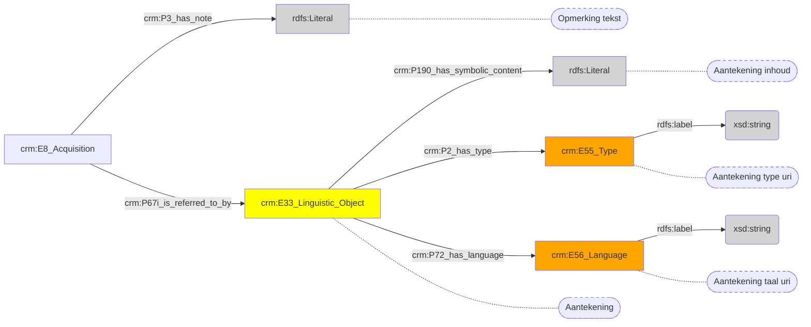

```mermaid
graph LR
7b658ca8-d44e-11ed-9064-00163e71351b["crm:E8_Acquisition"]-->|"crm:P3_has_note"|122e596a-e991-11ed-9232-00163e71351b(rdfs:Literal)
8b3dd634-ee3a-11ed-9232-00163e71351b["crm:E33_Linguistic_Object"]-->|"crm:P190_has_symbolic_content"|8b3ddc60-ee3a-11ed-9232-00163e71351b(rdfs:Literal)
8b3dda12-ee3a-11ed-9232-00163e71351b["crm:E55_Type"]-->|"rdfs:label"|8b3dde5e-ee3a-11ed-9232-00163e71351b(xsd:string)
8b3ddb52-ee3a-11ed-9232-00163e71351b["crm:E56_Language"]-->|"rdfs:label"|8b3ddd5a-ee3a-11ed-9232-00163e71351b(xsd:string)
7b658ca8-d44e-11ed-9064-00163e71351b["crm:E8_Acquisition"]-->|"crm:P67i_is_referred_to_by"|8b3dd634-ee3a-11ed-9232-00163e71351b["crm:E33_Linguistic_Object"]
8b3dd634-ee3a-11ed-9232-00163e71351b["crm:E33_Linguistic_Object"]-->|"crm:P2_has_type"|8b3dda12-ee3a-11ed-9232-00163e71351b["crm:E55_Type"]
8b3dd634-ee3a-11ed-9232-00163e71351b["crm:E33_Linguistic_Object"]-->|"crm:P72_has_language"|8b3ddb52-ee3a-11ed-9232-00163e71351b["crm:E56_Language"]
style 122e596a-e991-11ed-9232-00163e71351b_s stroke-dasharray: 5
style 8b3dd634-ee3a-11ed-9232-00163e71351b_s stroke-dasharray: 5
style 8b3ddc60-ee3a-11ed-9232-00163e71351b_s stroke-dasharray: 5
style 8b3dda12-ee3a-11ed-9232-00163e71351b_s stroke-dasharray: 5
style 8b3ddb52-ee3a-11ed-9232-00163e71351b_s stroke-dasharray: 5
122e596a-e991-11ed-9232-00163e71351b["rdfs:Literal"]-.-122e596a-e991-11ed-9232-00163e71351b_s(["Opmerking tekst"])
8b3dd634-ee3a-11ed-9232-00163e71351b["crm:E33_Linguistic_Object"]-.-8b3dd634-ee3a-11ed-9232-00163e71351b_s(["Aantekening"])
8b3ddc60-ee3a-11ed-9232-00163e71351b["rdfs:Literal"]-.-8b3ddc60-ee3a-11ed-9232-00163e71351b_s(["Aantekening inhoud"])
8b3dda12-ee3a-11ed-9232-00163e71351b["crm:E55_Type"]-.-8b3dda12-ee3a-11ed-9232-00163e71351b_s(["Aantekening type uri"])
8b3ddb52-ee3a-11ed-9232-00163e71351b["crm:E56_Language"]-.-8b3ddb52-ee3a-11ed-9232-00163e71351b_s(["Aantekening taal uri"])
style 122e596a-e991-11ed-9232-00163e71351b fill:#D3D3D3
style 8b3dd634-ee3a-11ed-9232-00163e71351b fill:#ffff00
style 8b3dda12-ee3a-11ed-9232-00163e71351b fill:#ffa500
style 8b3ddb52-ee3a-11ed-9232-00163e71351b fill:#ffa500
style 8b3ddc60-ee3a-11ed-9232-00163e71351b fill:#D3D3D3
style 8b3ddd5a-ee3a-11ed-9232-00163e71351b fill:#D3D3D3
style 8b3dde5e-ee3a-11ed-9232-00163e71351b fill:#D3D3D3
```
