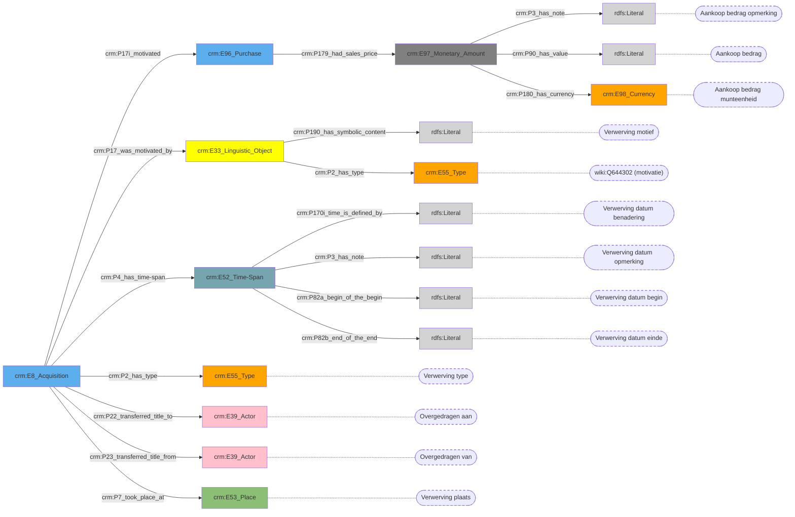

```mermaid
graph LR
style 0b25d0f2-ee5b-11ed-9064-00163e71351b fill:#ffa500
style 30ce6bc2-3d17-11ef-ac04-960002548b4f fill:#D3D3D3
style 37872002-ea6d-11ed-a1e6-00163e71351b fill:#5DAEEC
style 4b81aff7-e541-11ee-921a-960002548b4f fill:#ffff00
style 572bbd7d-3d17-11ef-93c1-960002548b4f fill:#D3D3D3
style 695b5b55-f19f-11ee-a866-960002548b4f fill:#D3D3D3
style 70b9ebb3-e541-11ee-8711-960002548b4f fill:#D3D3D3
style 7b658ca8-d44e-11ed-9064-00163e71351b fill:#5DAEEC
style 7fd84e3a-e991-11ed-9655-00163e71351b fill:#8CBF76
style 8be2fd34-e990-11ed-9655-00163e71351b fill:#ffc0cb
style 99988ee4-e990-11ed-9232-00163e71351b fill:#ffa500
style b2f4b0e2-e991-11ed-9064-00163e71351b fill:#ffc0cb
style bfbfd116-ee5b-11ed-9232-00163e71351b fill:#D3D3D3
style cc4f2144-ea6d-11ed-9232-00163e71351b fill:#808080
style ce2590b1-6e7f-11ef-a8c0-960002548b4f fill:#ffa500
style d638bcba-e541-11ee-bb9d-960002548b4f fill:#D3D3D3
style d865b38b-645b-11ef-b970-960002548b4f fill:#D3D3D3
style dcc8aca4-f0c9-11ee-b461-960002548b4f fill:#76A5AF
4b81aff7-e541-11ee-921a-960002548b4f["crm:E33_Linguistic_Object"]-->|"crm:P190_has_symbolic_content"|70b9ebb3-e541-11ee-8711-960002548b4f(rdfs:Literal)
cc4f2144-ea6d-11ed-9232-00163e71351b["crm:E97_Monetary_Amount"]-->|"crm:P3_has_note"|d638bcba-e541-11ee-bb9d-960002548b4f(rdfs:Literal)
cc4f2144-ea6d-11ed-9232-00163e71351b["crm:E97_Monetary_Amount"]-->|"crm:P90_has_value"|bfbfd116-ee5b-11ed-9232-00163e71351b(rdfs:Literal)
dcc8aca4-f0c9-11ee-b461-960002548b4f["crm:E52_Time-Span"]-->|"crm:P170i_time_is_defined_by"|d865b38b-645b-11ef-b970-960002548b4f(rdfs:Literal)
dcc8aca4-f0c9-11ee-b461-960002548b4f["crm:E52_Time-Span"]-->|"crm:P3_has_note"|695b5b55-f19f-11ee-a866-960002548b4f(rdfs:Literal)
dcc8aca4-f0c9-11ee-b461-960002548b4f["crm:E52_Time-Span"]-->|"crm:P82a_begin_of_the_begin"|30ce6bc2-3d17-11ef-ac04-960002548b4f(rdfs:Literal)
dcc8aca4-f0c9-11ee-b461-960002548b4f["crm:E52_Time-Span"]-->|"crm:P82b_end_of_the_end"|572bbd7d-3d17-11ef-93c1-960002548b4f(rdfs:Literal)
37872002-ea6d-11ed-a1e6-00163e71351b["crm:E96_Purchase"]-->|"crm:P179_had_sales_price"|cc4f2144-ea6d-11ed-9232-00163e71351b["crm:E97_Monetary_Amount"]
4b81aff7-e541-11ee-921a-960002548b4f["crm:E33_Linguistic_Object"]-->|"crm:P2_has_type"|ce2590b1-6e7f-11ef-a8c0-960002548b4f["crm:E55_Type"]
7b658ca8-d44e-11ed-9064-00163e71351b["crm:E8_Acquisition"]-->|"crm:P17_was_motivated_by"|4b81aff7-e541-11ee-921a-960002548b4f["crm:E33_Linguistic_Object"]
7b658ca8-d44e-11ed-9064-00163e71351b["crm:E8_Acquisition"]-->|"crm:P17i_motivated"|37872002-ea6d-11ed-a1e6-00163e71351b["crm:E96_Purchase"]
7b658ca8-d44e-11ed-9064-00163e71351b["crm:E8_Acquisition"]-->|"crm:P2_has_type"|99988ee4-e990-11ed-9232-00163e71351b["crm:E55_Type"]
7b658ca8-d44e-11ed-9064-00163e71351b["crm:E8_Acquisition"]-->|"crm:P22_transferred_title_to"|b2f4b0e2-e991-11ed-9064-00163e71351b["crm:E39_Actor"]
7b658ca8-d44e-11ed-9064-00163e71351b["crm:E8_Acquisition"]-->|"crm:P23_transferred_title_from"|8be2fd34-e990-11ed-9655-00163e71351b["crm:E39_Actor"]
7b658ca8-d44e-11ed-9064-00163e71351b["crm:E8_Acquisition"]-->|"crm:P4_has_time-span"|dcc8aca4-f0c9-11ee-b461-960002548b4f["crm:E52_Time-Span"]
7b658ca8-d44e-11ed-9064-00163e71351b["crm:E8_Acquisition"]-->|"crm:P7_took_place_at"|7fd84e3a-e991-11ed-9655-00163e71351b["crm:E53_Place"]
cc4f2144-ea6d-11ed-9232-00163e71351b["crm:E97_Monetary_Amount"]-->|"crm:P180_has_currency"|0b25d0f2-ee5b-11ed-9064-00163e71351b["crm:E98_Currency"]
style 70b9ebb3-e541-11ee-8711-960002548b4f_s stroke-dasharray: 5
style ce2590b1-6e7f-11ef-a8c0-960002548b4f_s stroke-dasharray: 5
style 99988ee4-e990-11ed-9232-00163e71351b_s stroke-dasharray: 5
style b2f4b0e2-e991-11ed-9064-00163e71351b_s stroke-dasharray: 5
style 8be2fd34-e990-11ed-9655-00163e71351b_s stroke-dasharray: 5
style 7fd84e3a-e991-11ed-9655-00163e71351b_s stroke-dasharray: 5
style 0b25d0f2-ee5b-11ed-9064-00163e71351b_s stroke-dasharray: 5
style d638bcba-e541-11ee-bb9d-960002548b4f_s stroke-dasharray: 5
style bfbfd116-ee5b-11ed-9232-00163e71351b_s stroke-dasharray: 5
style d865b38b-645b-11ef-b970-960002548b4f_s stroke-dasharray: 5
style 695b5b55-f19f-11ee-a866-960002548b4f_s stroke-dasharray: 5
style 30ce6bc2-3d17-11ef-ac04-960002548b4f_s stroke-dasharray: 5
style 572bbd7d-3d17-11ef-93c1-960002548b4f_s stroke-dasharray: 5
70b9ebb3-e541-11ee-8711-960002548b4f["rdfs:Literal"]-.-70b9ebb3-e541-11ee-8711-960002548b4f_s(["Verwerving motief"])
ce2590b1-6e7f-11ef-a8c0-960002548b4f["crm:E55_Type"]-.-ce2590b1-6e7f-11ef-a8c0-960002548b4f_s(["wiki:Q644302 (motivatie)"])
99988ee4-e990-11ed-9232-00163e71351b["crm:E55_Type"]-.-99988ee4-e990-11ed-9232-00163e71351b_s(["Verwerving type"])
b2f4b0e2-e991-11ed-9064-00163e71351b["crm:E39_Actor"]-.-b2f4b0e2-e991-11ed-9064-00163e71351b_s(["Overgedragen aan"])
8be2fd34-e990-11ed-9655-00163e71351b["crm:E39_Actor"]-.-8be2fd34-e990-11ed-9655-00163e71351b_s(["Overgedragen van"])
7fd84e3a-e991-11ed-9655-00163e71351b["crm:E53_Place"]-.-7fd84e3a-e991-11ed-9655-00163e71351b_s(["Verwerving plaats"])
0b25d0f2-ee5b-11ed-9064-00163e71351b["crm:E98_Currency"]-.-0b25d0f2-ee5b-11ed-9064-00163e71351b_s(["Aankoop bedrag munteenheid"])
d638bcba-e541-11ee-bb9d-960002548b4f["rdfs:Literal"]-.-d638bcba-e541-11ee-bb9d-960002548b4f_s(["Aankoop bedrag opmerking"])
bfbfd116-ee5b-11ed-9232-00163e71351b["rdfs:Literal"]-.-bfbfd116-ee5b-11ed-9232-00163e71351b_s(["Aankoop bedrag"])
d865b38b-645b-11ef-b970-960002548b4f["rdfs:Literal"]-.-d865b38b-645b-11ef-b970-960002548b4f_s(["Verwerving datum benadering"])
695b5b55-f19f-11ee-a866-960002548b4f["rdfs:Literal"]-.-695b5b55-f19f-11ee-a866-960002548b4f_s(["Verwerving datum  opmerking"])
30ce6bc2-3d17-11ef-ac04-960002548b4f["rdfs:Literal"]-.-30ce6bc2-3d17-11ef-ac04-960002548b4f_s(["Verwerving datum begin"])
572bbd7d-3d17-11ef-93c1-960002548b4f["rdfs:Literal"]-.-572bbd7d-3d17-11ef-93c1-960002548b4f_s(["Verwerving datum einde"])
```
