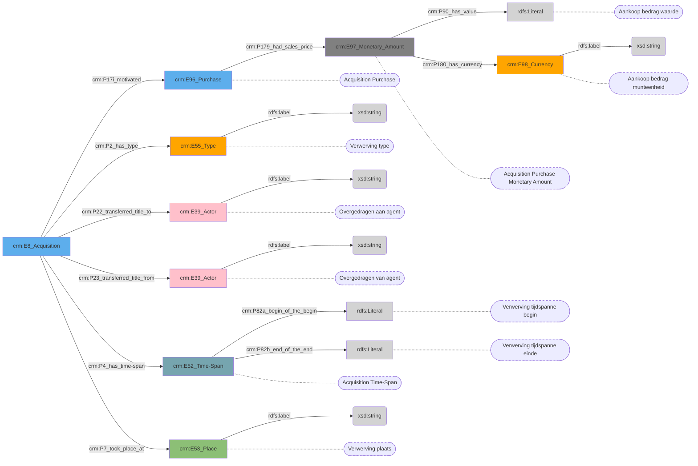

```mermaid
graph LR
0b25d0f2-ee5b-11ed-9064-00163e71351b["crm:E98_Currency"]-->|"rdfs:label"|2b87213e-ee5b-11ed-9232-00163e71351b(xsd:string)
7fd84e3a-e991-11ed-9655-00163e71351b["crm:E53_Place"]-->|"rdfs:label"|944805ae-e991-11ed-9655-00163e71351b(xsd:string)
8be2fd34-e990-11ed-9655-00163e71351b["crm:E39_Actor"]-->|"rdfs:label"|8be301f8-e990-11ed-9655-00163e71351b(xsd:string)
920ead2a-e990-11ed-9232-00163e71351b["crm:E52_Time-Span"]-->|"crm:P82a_begin_of_the_begin"|920eb66c-e990-11ed-9232-00163e71351b(rdfs:Literal)
920ead2a-e990-11ed-9232-00163e71351b["crm:E52_Time-Span"]-->|"crm:P82b_end_of_the_end"|920eb400-e990-11ed-9232-00163e71351b(rdfs:Literal)
99988ee4-e990-11ed-9232-00163e71351b["crm:E55_Type"]-->|"rdfs:label"|999895b0-e990-11ed-9232-00163e71351b(xsd:string)
b2f4b0e2-e991-11ed-9064-00163e71351b["crm:E39_Actor"]-->|"rdfs:label"|c905c4f2-e991-11ed-9232-00163e71351b(xsd:string)
cc4f2144-ea6d-11ed-9232-00163e71351b["crm:E97_Monetary_Amount"]-->|"crm:P90_has_value"|bfbfd116-ee5b-11ed-9232-00163e71351b(rdfs:Literal)
37872002-ea6d-11ed-a1e6-00163e71351b["crm:E96_Purchase"]-->|"crm:P179_had_sales_price"|cc4f2144-ea6d-11ed-9232-00163e71351b["crm:E97_Monetary_Amount"]
7b658ca8-d44e-11ed-9064-00163e71351b["crm:E8_Acquisition"]-->|"crm:P17i_motivated"|37872002-ea6d-11ed-a1e6-00163e71351b["crm:E96_Purchase"]
7b658ca8-d44e-11ed-9064-00163e71351b["crm:E8_Acquisition"]-->|"crm:P2_has_type"|99988ee4-e990-11ed-9232-00163e71351b["crm:E55_Type"]
7b658ca8-d44e-11ed-9064-00163e71351b["crm:E8_Acquisition"]-->|"crm:P22_transferred_title_to"|b2f4b0e2-e991-11ed-9064-00163e71351b["crm:E39_Actor"]
7b658ca8-d44e-11ed-9064-00163e71351b["crm:E8_Acquisition"]-->|"crm:P23_transferred_title_from"|8be2fd34-e990-11ed-9655-00163e71351b["crm:E39_Actor"]
7b658ca8-d44e-11ed-9064-00163e71351b["crm:E8_Acquisition"]-->|"crm:P4_has_time-span"|920ead2a-e990-11ed-9232-00163e71351b["crm:E52_Time-Span"]
7b658ca8-d44e-11ed-9064-00163e71351b["crm:E8_Acquisition"]-->|"crm:P7_took_place_at"|7fd84e3a-e991-11ed-9655-00163e71351b["crm:E53_Place"]
cc4f2144-ea6d-11ed-9232-00163e71351b["crm:E97_Monetary_Amount"]-->|"crm:P180_has_currency"|0b25d0f2-ee5b-11ed-9064-00163e71351b["crm:E98_Currency"]
cc4f2144-ea6d-11ed-9232-00163e71351b["crm:E97_Monetary_Amount"]-.-cc4f2144-ea6d-11ed-9232-00163e71351b_s(["Acquisition Purchase Monetary Amount"])
37872002-ea6d-11ed-a1e6-00163e71351b["crm:E96_Purchase"]-.-37872002-ea6d-11ed-a1e6-00163e71351b_s(["Acquisition Purchase"])
99988ee4-e990-11ed-9232-00163e71351b["crm:E55_Type"]-.-99988ee4-e990-11ed-9232-00163e71351b_s(["Verwerving type"])
b2f4b0e2-e991-11ed-9064-00163e71351b["crm:E39_Actor"]-.-b2f4b0e2-e991-11ed-9064-00163e71351b_s(["Overgedragen aan agent"])
8be2fd34-e990-11ed-9655-00163e71351b["crm:E39_Actor"]-.-8be2fd34-e990-11ed-9655-00163e71351b_s(["Overgedragen van agent"])
920ead2a-e990-11ed-9232-00163e71351b["crm:E52_Time-Span"]-.-920ead2a-e990-11ed-9232-00163e71351b_s(["Acquisition Time-Span"])
7fd84e3a-e991-11ed-9655-00163e71351b["crm:E53_Place"]-.-7fd84e3a-e991-11ed-9655-00163e71351b_s(["Verwerving plaats"])
920eb66c-e990-11ed-9232-00163e71351b["rdfs:Literal"]-.-920eb66c-e990-11ed-9232-00163e71351b_s(["Verwerving tijdspanne begin"])
920eb400-e990-11ed-9232-00163e71351b["rdfs:Literal"]-.-920eb400-e990-11ed-9232-00163e71351b_s(["Verwerving tijdspanne einde"])
0b25d0f2-ee5b-11ed-9064-00163e71351b["crm:E98_Currency"]-.-0b25d0f2-ee5b-11ed-9064-00163e71351b_s(["Aankoop bedrag munteenheid"])
bfbfd116-ee5b-11ed-9232-00163e71351b["rdfs:Literal"]-.-bfbfd116-ee5b-11ed-9232-00163e71351b_s(["Aankoop bedrag waarde"])
style cc4f2144-ea6d-11ed-9232-00163e71351b_s stroke-dasharray: 5
style 37872002-ea6d-11ed-a1e6-00163e71351b_s stroke-dasharray: 5
style 99988ee4-e990-11ed-9232-00163e71351b_s stroke-dasharray: 5
style b2f4b0e2-e991-11ed-9064-00163e71351b_s stroke-dasharray: 5
style 8be2fd34-e990-11ed-9655-00163e71351b_s stroke-dasharray: 5
style 920ead2a-e990-11ed-9232-00163e71351b_s stroke-dasharray: 5
style 7fd84e3a-e991-11ed-9655-00163e71351b_s stroke-dasharray: 5
style 920eb66c-e990-11ed-9232-00163e71351b_s stroke-dasharray: 5
style 920eb400-e990-11ed-9232-00163e71351b_s stroke-dasharray: 5
style 0b25d0f2-ee5b-11ed-9064-00163e71351b_s stroke-dasharray: 5
style bfbfd116-ee5b-11ed-9232-00163e71351b_s stroke-dasharray: 5
style 0b25d0f2-ee5b-11ed-9064-00163e71351b fill:#ffa500
style 2b87213e-ee5b-11ed-9232-00163e71351b fill:#D3D3D3
style 37872002-ea6d-11ed-a1e6-00163e71351b fill:#5DAEEC
style 7b658ca8-d44e-11ed-9064-00163e71351b fill:#5DAEEC
style 7fd84e3a-e991-11ed-9655-00163e71351b fill:#8CBF76
style 8be2fd34-e990-11ed-9655-00163e71351b fill:#ffc0cb
style 8be301f8-e990-11ed-9655-00163e71351b fill:#D3D3D3
style 920ead2a-e990-11ed-9232-00163e71351b fill:#76A5AF
style 920eb400-e990-11ed-9232-00163e71351b fill:#D3D3D3
style 920eb66c-e990-11ed-9232-00163e71351b fill:#D3D3D3
style 944805ae-e991-11ed-9655-00163e71351b fill:#D3D3D3
style 99988ee4-e990-11ed-9232-00163e71351b fill:#ffa500
style 999895b0-e990-11ed-9232-00163e71351b fill:#D3D3D3
style b2f4b0e2-e991-11ed-9064-00163e71351b fill:#ffc0cb
style bfbfd116-ee5b-11ed-9232-00163e71351b fill:#D3D3D3
style c905c4f2-e991-11ed-9232-00163e71351b fill:#D3D3D3
style cc4f2144-ea6d-11ed-9232-00163e71351b fill:#808080
```
