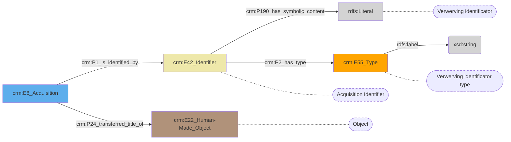

```mermaid
graph LR
b35a7c94-b086-11ee-b321-960002548b4f["crm:E42_Identifier"]-->|"crm:P190_has_symbolic_content"|b35a81b6-b086-11ee-a40a-960002548b4f(rdfs:Literal)
b35a82e2-b086-11ee-913f-960002548b4f["crm:E55_Type"]-->|"rdfs:label"|b35a8079-b086-11ee-a834-960002548b4f(xsd:string)
7b658ca8-d44e-11ed-9064-00163e71351b["crm:E8_Acquisition"]-->|"crm:P1_is_identified_by"|b35a7c94-b086-11ee-b321-960002548b4f["crm:E42_Identifier"]
7b658ca8-d44e-11ed-9064-00163e71351b["crm:E8_Acquisition"]-->|"crm:P24_transferred_title_of"|39e86e48-e994-11ed-9232-00163e71351b["crm:E22_Human-Made_Object"]
b35a7c94-b086-11ee-b321-960002548b4f["crm:E42_Identifier"]-->|"crm:P2_has_type"|b35a82e2-b086-11ee-913f-960002548b4f["crm:E55_Type"]
b35a7c94-b086-11ee-b321-960002548b4f["crm:E42_Identifier"]-.-b35a7c94-b086-11ee-b321-960002548b4f_s(["Acquisition Identifier"])
39e86e48-e994-11ed-9232-00163e71351b["crm:E22_Human-Made_Object"]-.-39e86e48-e994-11ed-9232-00163e71351b_s(["Object"])
b35a81b6-b086-11ee-a40a-960002548b4f["rdfs:Literal"]-.-b35a81b6-b086-11ee-a40a-960002548b4f_s(["Verwerving identificator"])
b35a82e2-b086-11ee-913f-960002548b4f["crm:E55_Type"]-.-b35a82e2-b086-11ee-913f-960002548b4f_s(["Verwerving identificator type"])
style b35a7c94-b086-11ee-b321-960002548b4f_s stroke-dasharray: 5
style 39e86e48-e994-11ed-9232-00163e71351b_s stroke-dasharray: 5
style b35a81b6-b086-11ee-a40a-960002548b4f_s stroke-dasharray: 5
style b35a82e2-b086-11ee-913f-960002548b4f_s stroke-dasharray: 5
style 39e86e48-e994-11ed-9232-00163e71351b fill:#B0927A
style 7b658ca8-d44e-11ed-9064-00163e71351b fill:#5DAEEC
style b35a7c94-b086-11ee-b321-960002548b4f fill:#EEE8AA
style b35a8079-b086-11ee-a834-960002548b4f fill:#D3D3D3
style b35a81b6-b086-11ee-a40a-960002548b4f fill:#D3D3D3
style b35a82e2-b086-11ee-913f-960002548b4f fill:#ffa500
```
