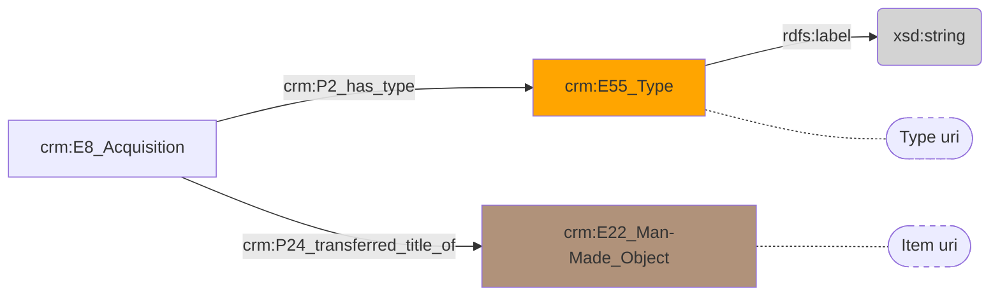

```mermaid
graph LR
99988ee4-e990-11ed-9232-00163e71351b["crm:E55_Type"]-->|"rdfs:label"|999895b0-e990-11ed-9232-00163e71351b(xsd:string)
7b658ca8-d44e-11ed-9064-00163e71351b["crm:E8_Acquisition"]-->|"crm:P2_has_type"|99988ee4-e990-11ed-9232-00163e71351b["crm:E55_Type"]
7b658ca8-d44e-11ed-9064-00163e71351b["crm:E8_Acquisition"]-->|"crm:P24_transferred_title_of"|39e86e48-e994-11ed-9232-00163e71351b["crm:E22_Man-Made_Object"]
99988ee4-e990-11ed-9232-00163e71351b["crm:E55_Type"]-.-99988ee4-e990-11ed-9232-00163e71351b_s(["Type uri"])
39e86e48-e994-11ed-9232-00163e71351b["crm:E22_Man-Made_Object"]-.-39e86e48-e994-11ed-9232-00163e71351b_s(["Item uri"])
style 99988ee4-e990-11ed-9232-00163e71351b_s stroke-dasharray: 5
style 39e86e48-e994-11ed-9232-00163e71351b_s stroke-dasharray: 5
style 39e86e48-e994-11ed-9232-00163e71351b fill:#B0927A
style 99988ee4-e990-11ed-9232-00163e71351b fill:#ffa500
style 999895b0-e990-11ed-9232-00163e71351b fill:#D3D3D3
```
