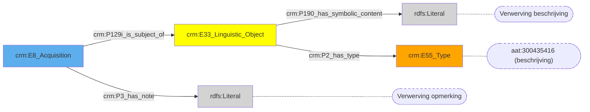

```mermaid
graph LR
style 0a2a3cd4-e991-11ed-9064-00163e71351b fill:#ffff00
style 0a2a41ac-e991-11ed-9064-00163e71351b fill:#D3D3D3
style 0a2a44d6-e991-11ed-9064-00163e71351b fill:#ffa500
style 122e596a-e991-11ed-9232-00163e71351b fill:#D3D3D3
style 7b658ca8-d44e-11ed-9064-00163e71351b fill:#5DAEEC
0a2a3cd4-e991-11ed-9064-00163e71351b["crm:E33_Linguistic_Object"]-->|"crm:P190_has_symbolic_content"|0a2a41ac-e991-11ed-9064-00163e71351b(rdfs:Literal)
7b658ca8-d44e-11ed-9064-00163e71351b["crm:E8_Acquisition"]-->|"crm:P3_has_note"|122e596a-e991-11ed-9232-00163e71351b(rdfs:Literal)
0a2a3cd4-e991-11ed-9064-00163e71351b["crm:E33_Linguistic_Object"]-->|"crm:P2_has_type"|0a2a44d6-e991-11ed-9064-00163e71351b["crm:E55_Type"]
7b658ca8-d44e-11ed-9064-00163e71351b["crm:E8_Acquisition"]-->|"crm:P129i_is_subject_of"|0a2a3cd4-e991-11ed-9064-00163e71351b["crm:E33_Linguistic_Object"]
0a2a41ac-e991-11ed-9064-00163e71351b["rdfs:Literal"]-.-0a2a41ac-e991-11ed-9064-00163e71351b_s(["Verwerving beschrijving"])
0a2a44d6-e991-11ed-9064-00163e71351b["crm:E55_Type"]-.-0a2a44d6-e991-11ed-9064-00163e71351b_s(["aat:300435416 (beschrijving)"])
122e596a-e991-11ed-9232-00163e71351b["rdfs:Literal"]-.-122e596a-e991-11ed-9232-00163e71351b_s(["Verwerving opmerking"])
style 0a2a41ac-e991-11ed-9064-00163e71351b_s stroke-dasharray: 5
style 0a2a44d6-e991-11ed-9064-00163e71351b_s stroke-dasharray: 5
style 122e596a-e991-11ed-9232-00163e71351b_s stroke-dasharray: 5
```
