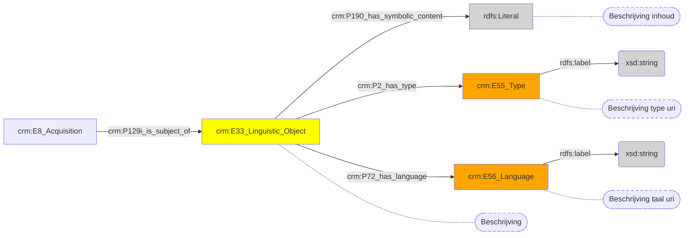

```mermaid
graph LR
0a2a3cd4-e991-11ed-9064-00163e71351b["crm:E33_Linguistic_Object"]-->|"crm:P190_has_symbolic_content"|0a2a41ac-e991-11ed-9064-00163e71351b(rdfs:Literal)
0a2a44d6-e991-11ed-9064-00163e71351b["crm:E55_Type"]-->|"rdfs:label"|0a2a4364-e991-11ed-9064-00163e71351b(xsd:string)
0a2a479c-e991-11ed-9064-00163e71351b["crm:E56_Language"]-->|"rdfs:label"|0a2a463e-e991-11ed-9064-00163e71351b(xsd:string)
0a2a3cd4-e991-11ed-9064-00163e71351b["crm:E33_Linguistic_Object"]-->|"crm:P2_has_type"|0a2a44d6-e991-11ed-9064-00163e71351b["crm:E55_Type"]
0a2a3cd4-e991-11ed-9064-00163e71351b["crm:E33_Linguistic_Object"]-->|"crm:P72_has_language"|0a2a479c-e991-11ed-9064-00163e71351b["crm:E56_Language"]
7b658ca8-d44e-11ed-9064-00163e71351b["crm:E8_Acquisition"]-->|"crm:P129i_is_subject_of"|0a2a3cd4-e991-11ed-9064-00163e71351b["crm:E33_Linguistic_Object"]
style 0a2a41ac-e991-11ed-9064-00163e71351b_s stroke-dasharray: 5
style 0a2a44d6-e991-11ed-9064-00163e71351b_s stroke-dasharray: 5
style 0a2a479c-e991-11ed-9064-00163e71351b_s stroke-dasharray: 5
style 0a2a3cd4-e991-11ed-9064-00163e71351b_s stroke-dasharray: 5
0a2a41ac-e991-11ed-9064-00163e71351b["rdfs:Literal"]-.-0a2a41ac-e991-11ed-9064-00163e71351b_s(["Beschrijving inhoud"])
0a2a44d6-e991-11ed-9064-00163e71351b["crm:E55_Type"]-.-0a2a44d6-e991-11ed-9064-00163e71351b_s(["Beschrijving type uri"])
0a2a479c-e991-11ed-9064-00163e71351b["crm:E56_Language"]-.-0a2a479c-e991-11ed-9064-00163e71351b_s(["Beschrijving taal uri"])
0a2a3cd4-e991-11ed-9064-00163e71351b["crm:E33_Linguistic_Object"]-.-0a2a3cd4-e991-11ed-9064-00163e71351b_s(["Beschrijving"])
style 0a2a3cd4-e991-11ed-9064-00163e71351b fill:#ffff00
style 0a2a41ac-e991-11ed-9064-00163e71351b fill:#D3D3D3
style 0a2a4364-e991-11ed-9064-00163e71351b fill:#D3D3D3
style 0a2a44d6-e991-11ed-9064-00163e71351b fill:#ffa500
style 0a2a463e-e991-11ed-9064-00163e71351b fill:#D3D3D3
style 0a2a479c-e991-11ed-9064-00163e71351b fill:#ffa500
```
