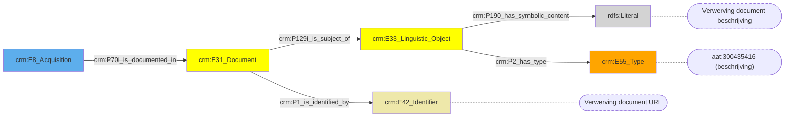

```mermaid
graph LR
style 2c119771-e540-11ee-b73f-960002548b4f fill:#D3D3D3
style 3bcc24d5-e540-11ee-94ee-960002548b4f fill:#ffa500
style 7b658ca8-d44e-11ed-9064-00163e71351b fill:#5DAEEC
style bd85e9d7-e53f-11ee-9402-960002548b4f fill:#ffff00
style d5400f4c-e53f-11ee-928f-960002548b4f fill:#EEE8AA
style fa4a2c3c-e53f-11ee-a766-960002548b4f fill:#ffff00
fa4a2c3c-e53f-11ee-a766-960002548b4f["crm:E33_Linguistic_Object"]-->|"crm:P190_has_symbolic_content"|2c119771-e540-11ee-b73f-960002548b4f(rdfs:Literal)
style d5400f4c-e53f-11ee-928f-960002548b4f_s stroke-dasharray: 5
style 2c119771-e540-11ee-b73f-960002548b4f_s stroke-dasharray: 5
style 3bcc24d5-e540-11ee-94ee-960002548b4f_s stroke-dasharray: 5
d5400f4c-e53f-11ee-928f-960002548b4f["crm:E42_Identifier"]-.-d5400f4c-e53f-11ee-928f-960002548b4f_s(["Verwerving document URL"])
2c119771-e540-11ee-b73f-960002548b4f["rdfs:Literal"]-.-2c119771-e540-11ee-b73f-960002548b4f_s(["Verwerving document beschrijving"])
3bcc24d5-e540-11ee-94ee-960002548b4f["crm:E55_Type"]-.-3bcc24d5-e540-11ee-94ee-960002548b4f_s(["aat:300435416 (beschrijving)"])
7b658ca8-d44e-11ed-9064-00163e71351b["crm:E8_Acquisition"]-->|"crm:P70i_is_documented_in"|bd85e9d7-e53f-11ee-9402-960002548b4f["crm:E31_Document"]
bd85e9d7-e53f-11ee-9402-960002548b4f["crm:E31_Document"]-->|"crm:P1_is_identified_by"|d5400f4c-e53f-11ee-928f-960002548b4f["crm:E42_Identifier"]
bd85e9d7-e53f-11ee-9402-960002548b4f["crm:E31_Document"]-->|"crm:P129i_is_subject_of"|fa4a2c3c-e53f-11ee-a766-960002548b4f["crm:E33_Linguistic_Object"]
fa4a2c3c-e53f-11ee-a766-960002548b4f["crm:E33_Linguistic_Object"]-->|"crm:P2_has_type"|3bcc24d5-e540-11ee-94ee-960002548b4f["crm:E55_Type"]
```
