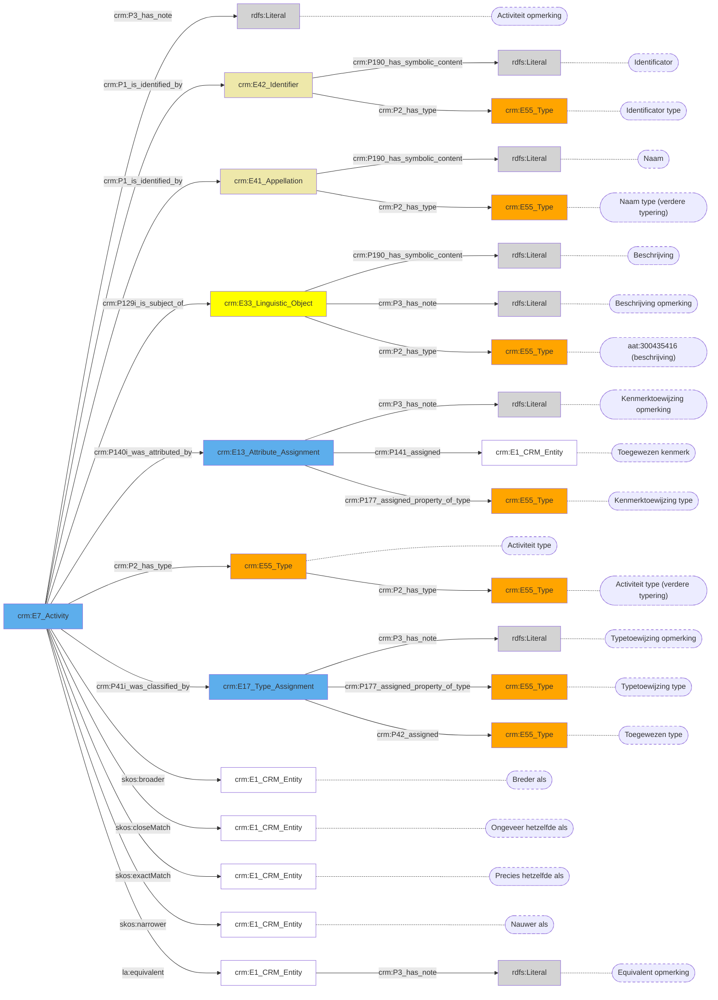

```mermaid
graph LR
style 0591fe96-18f1-11ef-a847-960002548b4f fill:#ffff00
style 059205ed-18f1-11ef-8fa1-960002548b4f fill:#D3D3D3
style 05920a47-18f1-11ef-9c36-960002548b4f fill:#D3D3D3
style 05920d08-18f1-11ef-a9d8-960002548b4f fill:#ffa500
style 12f006fd-18f1-11ef-9d4e-960002548b4f fill:#ffffff
style 12f00bec-18f1-11ef-bcdc-960002548b4f fill:#D3D3D3
style 226f5de9-18f1-11ef-8146-960002548b4f fill:#EEE8AA
style 226f64d8-18f1-11ef-bdc8-960002548b4f fill:#D3D3D3
style 226f6621-18f1-11ef-9346-960002548b4f fill:#ffa500
style 2eed8532-18f1-11ef-b9b8-960002548b4f fill:#EEE8AA
style 2eed8a49-18f1-11ef-9b8f-960002548b4f fill:#ffa500
style 2eed8d34-18f1-11ef-96af-960002548b4f fill:#D3D3D3
style 3a8efa85-18f1-11ef-9ab1-960002548b4f fill:#D3D3D3
style 4818a37e-18f1-11ef-8129-960002548b4f fill:#ffa500
style 4818a888-18f1-11ef-8db5-960002548b4f fill:#ffa500
style 57aa7208-18f1-11ef-8332-960002548b4f fill:#5DAEEC
style 57aa7431-18f1-11ef-a813-960002548b4f fill:#ffa500
style 57aa74ea-18f1-11ef-a038-960002548b4f fill:#ffa500
style 57aa7653-18f1-11ef-805f-960002548b4f fill:#D3D3D3
style 736ebc97-1dab-11ef-b95a-960002548b4f fill:#ffffff
style 943f314e-1dac-11ef-b1f3-960002548b4f fill:#ffffff
style 9d53dc5b-1dac-11ef-92b2-960002548b4f fill:#ffffff
style aff60cda-1dab-11ef-b781-960002548b4f fill:#ffffff
style daffea92-18f0-11ef-b007-960002548b4f fill:#5DAEEC
style eff48443-18f0-11ef-bfcb-960002548b4f fill:#5DAEEC
style eff48a15-18f0-11ef-9a74-960002548b4f fill:#ffa500
style eff48c1e-18f0-11ef-9686-960002548b4f fill:#ffffff
style eff48d80-18f0-11ef-a514-960002548b4f fill:#D3D3D3
0591fe96-18f1-11ef-a847-960002548b4f["crm:E33_Linguistic_Object"]-->|"crm:P190_has_symbolic_content"|05920a47-18f1-11ef-9c36-960002548b4f(rdfs:Literal)
0591fe96-18f1-11ef-a847-960002548b4f["crm:E33_Linguistic_Object"]-->|"crm:P3_has_note"|059205ed-18f1-11ef-8fa1-960002548b4f(rdfs:Literal)
12f006fd-18f1-11ef-9d4e-960002548b4f["crm:E1_CRM_Entity"]-->|"crm:P3_has_note"|12f00bec-18f1-11ef-bcdc-960002548b4f(rdfs:Literal)
226f5de9-18f1-11ef-8146-960002548b4f["crm:E42_Identifier"]-->|"crm:P190_has_symbolic_content"|226f64d8-18f1-11ef-bdc8-960002548b4f(rdfs:Literal)
2eed8532-18f1-11ef-b9b8-960002548b4f["crm:E41_Appellation"]-->|"crm:P190_has_symbolic_content"|2eed8d34-18f1-11ef-96af-960002548b4f(rdfs:Literal)
57aa7208-18f1-11ef-8332-960002548b4f["crm:E17_Type_Assignment"]-->|"crm:P3_has_note"|57aa7653-18f1-11ef-805f-960002548b4f(rdfs:Literal)
daffea92-18f0-11ef-b007-960002548b4f["crm:E7_Activity"]-->|"crm:P3_has_note"|3a8efa85-18f1-11ef-9ab1-960002548b4f(rdfs:Literal)
eff48443-18f0-11ef-bfcb-960002548b4f["crm:E13_Attribute_Assignment"]-->|"crm:P3_has_note"|eff48d80-18f0-11ef-a514-960002548b4f(rdfs:Literal)
05920a47-18f1-11ef-9c36-960002548b4f["rdfs:Literal"]-.-05920a47-18f1-11ef-9c36-960002548b4f_s(["Beschrijving"])
05920d08-18f1-11ef-a9d8-960002548b4f["crm:E55_Type"]-.-05920d08-18f1-11ef-a9d8-960002548b4f_s(["aat:300435416 (beschrijving)"])
059205ed-18f1-11ef-8fa1-960002548b4f["rdfs:Literal"]-.-059205ed-18f1-11ef-8fa1-960002548b4f_s(["Beschrijving opmerking"])
12f00bec-18f1-11ef-bcdc-960002548b4f["rdfs:Literal"]-.-12f00bec-18f1-11ef-bcdc-960002548b4f_s(["Equivalent opmerking"])
226f64d8-18f1-11ef-bdc8-960002548b4f["rdfs:Literal"]-.-226f64d8-18f1-11ef-bdc8-960002548b4f_s(["Identificator"])
226f6621-18f1-11ef-9346-960002548b4f["crm:E55_Type"]-.-226f6621-18f1-11ef-9346-960002548b4f_s(["Identificator type"])
2eed8d34-18f1-11ef-96af-960002548b4f["rdfs:Literal"]-.-2eed8d34-18f1-11ef-96af-960002548b4f_s(["Naam"])
2eed8a49-18f1-11ef-9b8f-960002548b4f["crm:E55_Type"]-.-2eed8a49-18f1-11ef-9b8f-960002548b4f_s(["Naam type (verdere typering)"])
4818a888-18f1-11ef-8db5-960002548b4f["crm:E55_Type"]-.-4818a888-18f1-11ef-8db5-960002548b4f_s(["Activiteit type (verdere typering)"])
57aa7431-18f1-11ef-a813-960002548b4f["crm:E55_Type"]-.-57aa7431-18f1-11ef-a813-960002548b4f_s(["Typetoewijzing type"])
57aa7653-18f1-11ef-805f-960002548b4f["rdfs:Literal"]-.-57aa7653-18f1-11ef-805f-960002548b4f_s(["Typetoewijzing opmerking"])
57aa74ea-18f1-11ef-a038-960002548b4f["crm:E55_Type"]-.-57aa74ea-18f1-11ef-a038-960002548b4f_s(["Toegewezen type"])
4818a37e-18f1-11ef-8129-960002548b4f["crm:E55_Type"]-.-4818a37e-18f1-11ef-8129-960002548b4f_s(["Activiteit type"])
3a8efa85-18f1-11ef-9ab1-960002548b4f["rdfs:Literal"]-.-3a8efa85-18f1-11ef-9ab1-960002548b4f_s(["Activiteit opmerking"])
736ebc97-1dab-11ef-b95a-960002548b4f["crm:E1_CRM_Entity"]-.-736ebc97-1dab-11ef-b95a-960002548b4f_s(["Breder als"])
aff60cda-1dab-11ef-b781-960002548b4f["crm:E1_CRM_Entity"]-.-aff60cda-1dab-11ef-b781-960002548b4f_s(["Ongeveer hetzelfde als"])
943f314e-1dac-11ef-b1f3-960002548b4f["crm:E1_CRM_Entity"]-.-943f314e-1dac-11ef-b1f3-960002548b4f_s(["Precies hetzelfde als"])
9d53dc5b-1dac-11ef-92b2-960002548b4f["crm:E1_CRM_Entity"]-.-9d53dc5b-1dac-11ef-92b2-960002548b4f_s(["Nauwer als"])
eff48c1e-18f0-11ef-9686-960002548b4f["crm:E1_CRM_Entity"]-.-eff48c1e-18f0-11ef-9686-960002548b4f_s(["Toegewezen kenmerk"])
eff48a15-18f0-11ef-9a74-960002548b4f["crm:E55_Type"]-.-eff48a15-18f0-11ef-9a74-960002548b4f_s(["Kenmerktoewijzing type"])
eff48d80-18f0-11ef-a514-960002548b4f["rdfs:Literal"]-.-eff48d80-18f0-11ef-a514-960002548b4f_s(["Kenmerktoewijzing opmerking"])
0591fe96-18f1-11ef-a847-960002548b4f["crm:E33_Linguistic_Object"]-->|"crm:P2_has_type"|05920d08-18f1-11ef-a9d8-960002548b4f["crm:E55_Type"]
226f5de9-18f1-11ef-8146-960002548b4f["crm:E42_Identifier"]-->|"crm:P2_has_type"|226f6621-18f1-11ef-9346-960002548b4f["crm:E55_Type"]
2eed8532-18f1-11ef-b9b8-960002548b4f["crm:E41_Appellation"]-->|"crm:P2_has_type"|2eed8a49-18f1-11ef-9b8f-960002548b4f["crm:E55_Type"]
4818a37e-18f1-11ef-8129-960002548b4f["crm:E55_Type"]-->|"crm:P2_has_type"|4818a888-18f1-11ef-8db5-960002548b4f["crm:E55_Type"]
57aa7208-18f1-11ef-8332-960002548b4f["crm:E17_Type_Assignment"]-->|"crm:P177_assigned_property_of_type"|57aa7431-18f1-11ef-a813-960002548b4f["crm:E55_Type"]
57aa7208-18f1-11ef-8332-960002548b4f["crm:E17_Type_Assignment"]-->|"crm:P42_assigned"|57aa74ea-18f1-11ef-a038-960002548b4f["crm:E55_Type"]
daffea92-18f0-11ef-b007-960002548b4f["crm:E7_Activity"]-->|"crm:P1_is_identified_by"|226f5de9-18f1-11ef-8146-960002548b4f["crm:E42_Identifier"]
daffea92-18f0-11ef-b007-960002548b4f["crm:E7_Activity"]-->|"crm:P1_is_identified_by"|2eed8532-18f1-11ef-b9b8-960002548b4f["crm:E41_Appellation"]
daffea92-18f0-11ef-b007-960002548b4f["crm:E7_Activity"]-->|"crm:P129i_is_subject_of"|0591fe96-18f1-11ef-a847-960002548b4f["crm:E33_Linguistic_Object"]
daffea92-18f0-11ef-b007-960002548b4f["crm:E7_Activity"]-->|"crm:P140i_was_attributed_by"|eff48443-18f0-11ef-bfcb-960002548b4f["crm:E13_Attribute_Assignment"]
daffea92-18f0-11ef-b007-960002548b4f["crm:E7_Activity"]-->|"crm:P2_has_type"|4818a37e-18f1-11ef-8129-960002548b4f["crm:E55_Type"]
daffea92-18f0-11ef-b007-960002548b4f["crm:E7_Activity"]-->|"crm:P41i_was_classified_by"|57aa7208-18f1-11ef-8332-960002548b4f["crm:E17_Type_Assignment"]
daffea92-18f0-11ef-b007-960002548b4f["crm:E7_Activity"]-->|"skos:broader"|736ebc97-1dab-11ef-b95a-960002548b4f["crm:E1_CRM_Entity"]
daffea92-18f0-11ef-b007-960002548b4f["crm:E7_Activity"]-->|"skos:closeMatch"|aff60cda-1dab-11ef-b781-960002548b4f["crm:E1_CRM_Entity"]
daffea92-18f0-11ef-b007-960002548b4f["crm:E7_Activity"]-->|"skos:exactMatch"|943f314e-1dac-11ef-b1f3-960002548b4f["crm:E1_CRM_Entity"]
daffea92-18f0-11ef-b007-960002548b4f["crm:E7_Activity"]-->|"skos:narrower"|9d53dc5b-1dac-11ef-92b2-960002548b4f["crm:E1_CRM_Entity"]
daffea92-18f0-11ef-b007-960002548b4f["crm:E7_Activity"]-->|"la:equivalent"|12f006fd-18f1-11ef-9d4e-960002548b4f["crm:E1_CRM_Entity"]
eff48443-18f0-11ef-bfcb-960002548b4f["crm:E13_Attribute_Assignment"]-->|"crm:P141_assigned"|eff48c1e-18f0-11ef-9686-960002548b4f["crm:E1_CRM_Entity"]
eff48443-18f0-11ef-bfcb-960002548b4f["crm:E13_Attribute_Assignment"]-->|"crm:P177_assigned_property_of_type"|eff48a15-18f0-11ef-9a74-960002548b4f["crm:E55_Type"]
style 05920a47-18f1-11ef-9c36-960002548b4f_s stroke-dasharray: 5
style 05920d08-18f1-11ef-a9d8-960002548b4f_s stroke-dasharray: 5
style 059205ed-18f1-11ef-8fa1-960002548b4f_s stroke-dasharray: 5
style 12f00bec-18f1-11ef-bcdc-960002548b4f_s stroke-dasharray: 5
style 226f64d8-18f1-11ef-bdc8-960002548b4f_s stroke-dasharray: 5
style 226f6621-18f1-11ef-9346-960002548b4f_s stroke-dasharray: 5
style 2eed8d34-18f1-11ef-96af-960002548b4f_s stroke-dasharray: 5
style 2eed8a49-18f1-11ef-9b8f-960002548b4f_s stroke-dasharray: 5
style 4818a888-18f1-11ef-8db5-960002548b4f_s stroke-dasharray: 5
style 57aa7431-18f1-11ef-a813-960002548b4f_s stroke-dasharray: 5
style 57aa7653-18f1-11ef-805f-960002548b4f_s stroke-dasharray: 5
style 57aa74ea-18f1-11ef-a038-960002548b4f_s stroke-dasharray: 5
style 4818a37e-18f1-11ef-8129-960002548b4f_s stroke-dasharray: 5
style 3a8efa85-18f1-11ef-9ab1-960002548b4f_s stroke-dasharray: 5
style 736ebc97-1dab-11ef-b95a-960002548b4f_s stroke-dasharray: 5
style aff60cda-1dab-11ef-b781-960002548b4f_s stroke-dasharray: 5
style 943f314e-1dac-11ef-b1f3-960002548b4f_s stroke-dasharray: 5
style 9d53dc5b-1dac-11ef-92b2-960002548b4f_s stroke-dasharray: 5
style eff48c1e-18f0-11ef-9686-960002548b4f_s stroke-dasharray: 5
style eff48a15-18f0-11ef-9a74-960002548b4f_s stroke-dasharray: 5
style eff48d80-18f0-11ef-a514-960002548b4f_s stroke-dasharray: 5
```
