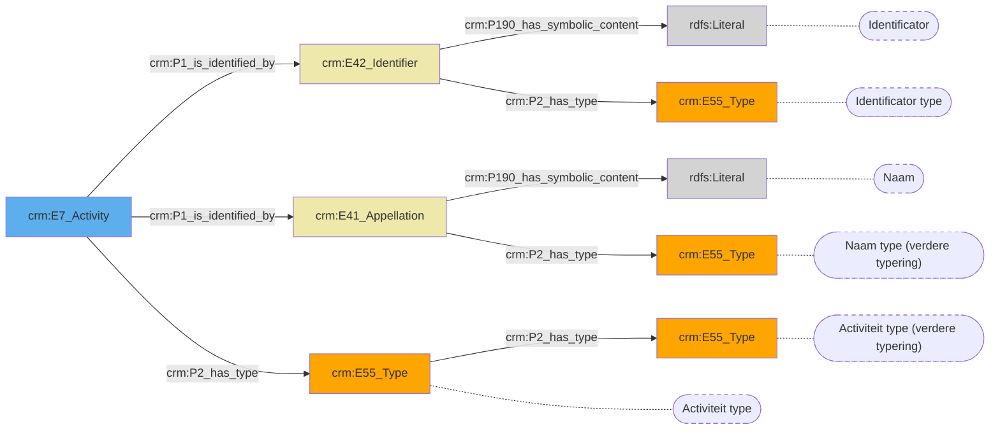

```mermaid
graph LR
style 226f5de9-18f1-11ef-8146-960002548b4f fill:#EEE8AA
style 226f64d8-18f1-11ef-bdc8-960002548b4f fill:#D3D3D3
style 226f6621-18f1-11ef-9346-960002548b4f fill:#ffa500
style 2eed8532-18f1-11ef-b9b8-960002548b4f fill:#EEE8AA
style 2eed8a49-18f1-11ef-9b8f-960002548b4f fill:#ffa500
style 2eed8d34-18f1-11ef-96af-960002548b4f fill:#D3D3D3
style 4818a37e-18f1-11ef-8129-960002548b4f fill:#ffa500
style 4818a888-18f1-11ef-8db5-960002548b4f fill:#ffa500
style daffea92-18f0-11ef-b007-960002548b4f fill:#5DAEEC
226f5de9-18f1-11ef-8146-960002548b4f["crm:E42_Identifier"]-->|"crm:P190_has_symbolic_content"|226f64d8-18f1-11ef-bdc8-960002548b4f(rdfs:Literal)
2eed8532-18f1-11ef-b9b8-960002548b4f["crm:E41_Appellation"]-->|"crm:P190_has_symbolic_content"|2eed8d34-18f1-11ef-96af-960002548b4f(rdfs:Literal)
style 226f64d8-18f1-11ef-bdc8-960002548b4f_s stroke-dasharray: 5
style 226f6621-18f1-11ef-9346-960002548b4f_s stroke-dasharray: 5
style 2eed8d34-18f1-11ef-96af-960002548b4f_s stroke-dasharray: 5
style 2eed8a49-18f1-11ef-9b8f-960002548b4f_s stroke-dasharray: 5
style 4818a888-18f1-11ef-8db5-960002548b4f_s stroke-dasharray: 5
style 4818a37e-18f1-11ef-8129-960002548b4f_s stroke-dasharray: 5
226f64d8-18f1-11ef-bdc8-960002548b4f["rdfs:Literal"]-.-226f64d8-18f1-11ef-bdc8-960002548b4f_s(["Identificator"])
226f6621-18f1-11ef-9346-960002548b4f["crm:E55_Type"]-.-226f6621-18f1-11ef-9346-960002548b4f_s(["Identificator type"])
2eed8d34-18f1-11ef-96af-960002548b4f["rdfs:Literal"]-.-2eed8d34-18f1-11ef-96af-960002548b4f_s(["Naam"])
2eed8a49-18f1-11ef-9b8f-960002548b4f["crm:E55_Type"]-.-2eed8a49-18f1-11ef-9b8f-960002548b4f_s(["Naam type (verdere typering)"])
4818a888-18f1-11ef-8db5-960002548b4f["crm:E55_Type"]-.-4818a888-18f1-11ef-8db5-960002548b4f_s(["Activiteit type (verdere typering)"])
4818a37e-18f1-11ef-8129-960002548b4f["crm:E55_Type"]-.-4818a37e-18f1-11ef-8129-960002548b4f_s(["Activiteit type"])
226f5de9-18f1-11ef-8146-960002548b4f["crm:E42_Identifier"]-->|"crm:P2_has_type"|226f6621-18f1-11ef-9346-960002548b4f["crm:E55_Type"]
2eed8532-18f1-11ef-b9b8-960002548b4f["crm:E41_Appellation"]-->|"crm:P2_has_type"|2eed8a49-18f1-11ef-9b8f-960002548b4f["crm:E55_Type"]
4818a37e-18f1-11ef-8129-960002548b4f["crm:E55_Type"]-->|"crm:P2_has_type"|4818a888-18f1-11ef-8db5-960002548b4f["crm:E55_Type"]
daffea92-18f0-11ef-b007-960002548b4f["crm:E7_Activity"]-->|"crm:P1_is_identified_by"|226f5de9-18f1-11ef-8146-960002548b4f["crm:E42_Identifier"]
daffea92-18f0-11ef-b007-960002548b4f["crm:E7_Activity"]-->|"crm:P1_is_identified_by"|2eed8532-18f1-11ef-b9b8-960002548b4f["crm:E41_Appellation"]
daffea92-18f0-11ef-b007-960002548b4f["crm:E7_Activity"]-->|"crm:P2_has_type"|4818a37e-18f1-11ef-8129-960002548b4f["crm:E55_Type"]
```
