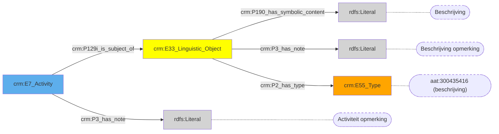

```mermaid
graph LR
style 0591fe96-18f1-11ef-a847-960002548b4f fill:#ffff00
style 059205ed-18f1-11ef-8fa1-960002548b4f fill:#D3D3D3
style 05920a47-18f1-11ef-9c36-960002548b4f fill:#D3D3D3
style 05920d08-18f1-11ef-a9d8-960002548b4f fill:#ffa500
style 3a8efa85-18f1-11ef-9ab1-960002548b4f fill:#D3D3D3
style daffea92-18f0-11ef-b007-960002548b4f fill:#5DAEEC
0591fe96-18f1-11ef-a847-960002548b4f["crm:E33_Linguistic_Object"]-->|"crm:P190_has_symbolic_content"|05920a47-18f1-11ef-9c36-960002548b4f(rdfs:Literal)
0591fe96-18f1-11ef-a847-960002548b4f["crm:E33_Linguistic_Object"]-->|"crm:P3_has_note"|059205ed-18f1-11ef-8fa1-960002548b4f(rdfs:Literal)
daffea92-18f0-11ef-b007-960002548b4f["crm:E7_Activity"]-->|"crm:P3_has_note"|3a8efa85-18f1-11ef-9ab1-960002548b4f(rdfs:Literal)
style 05920a47-18f1-11ef-9c36-960002548b4f_s stroke-dasharray: 5
style 05920d08-18f1-11ef-a9d8-960002548b4f_s stroke-dasharray: 5
style 059205ed-18f1-11ef-8fa1-960002548b4f_s stroke-dasharray: 5
style 3a8efa85-18f1-11ef-9ab1-960002548b4f_s stroke-dasharray: 5
05920a47-18f1-11ef-9c36-960002548b4f["rdfs:Literal"]-.-05920a47-18f1-11ef-9c36-960002548b4f_s(["Beschrijving"])
05920d08-18f1-11ef-a9d8-960002548b4f["crm:E55_Type"]-.-05920d08-18f1-11ef-a9d8-960002548b4f_s(["aat:300435416 (beschrijving)"])
059205ed-18f1-11ef-8fa1-960002548b4f["rdfs:Literal"]-.-059205ed-18f1-11ef-8fa1-960002548b4f_s(["Beschrijving opmerking"])
3a8efa85-18f1-11ef-9ab1-960002548b4f["rdfs:Literal"]-.-3a8efa85-18f1-11ef-9ab1-960002548b4f_s(["Activiteit opmerking"])
0591fe96-18f1-11ef-a847-960002548b4f["crm:E33_Linguistic_Object"]-->|"crm:P2_has_type"|05920d08-18f1-11ef-a9d8-960002548b4f["crm:E55_Type"]
daffea92-18f0-11ef-b007-960002548b4f["crm:E7_Activity"]-->|"crm:P129i_is_subject_of"|0591fe96-18f1-11ef-a847-960002548b4f["crm:E33_Linguistic_Object"]
```
