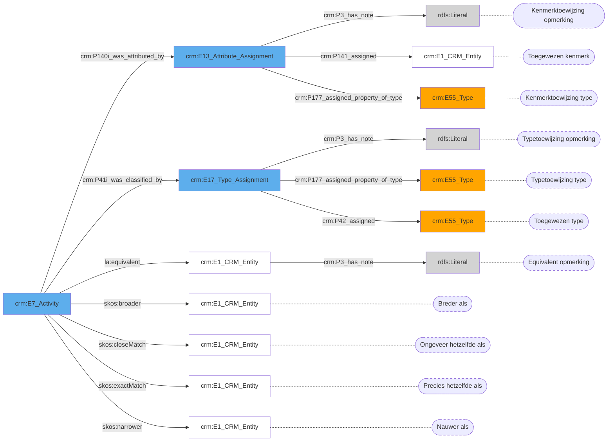

```mermaid
graph LR
style 12f006fd-18f1-11ef-9d4e-960002548b4f fill:#ffffff
style 12f00bec-18f1-11ef-bcdc-960002548b4f fill:#D3D3D3
style 57aa7208-18f1-11ef-8332-960002548b4f fill:#5DAEEC
style 57aa7431-18f1-11ef-a813-960002548b4f fill:#ffa500
style 57aa74ea-18f1-11ef-a038-960002548b4f fill:#ffa500
style 57aa7653-18f1-11ef-805f-960002548b4f fill:#D3D3D3
style 736ebc97-1dab-11ef-b95a-960002548b4f fill:#ffffff
style 943f314e-1dac-11ef-b1f3-960002548b4f fill:#ffffff
style 9d53dc5b-1dac-11ef-92b2-960002548b4f fill:#ffffff
style aff60cda-1dab-11ef-b781-960002548b4f fill:#ffffff
style daffea92-18f0-11ef-b007-960002548b4f fill:#5DAEEC
style eff48443-18f0-11ef-bfcb-960002548b4f fill:#5DAEEC
style eff48a15-18f0-11ef-9a74-960002548b4f fill:#ffa500
style eff48c1e-18f0-11ef-9686-960002548b4f fill:#ffffff
style eff48d80-18f0-11ef-a514-960002548b4f fill:#D3D3D3
12f006fd-18f1-11ef-9d4e-960002548b4f["crm:E1_CRM_Entity"]-->|"crm:P3_has_note"|12f00bec-18f1-11ef-bcdc-960002548b4f(rdfs:Literal)
57aa7208-18f1-11ef-8332-960002548b4f["crm:E17_Type_Assignment"]-->|"crm:P3_has_note"|57aa7653-18f1-11ef-805f-960002548b4f(rdfs:Literal)
eff48443-18f0-11ef-bfcb-960002548b4f["crm:E13_Attribute_Assignment"]-->|"crm:P3_has_note"|eff48d80-18f0-11ef-a514-960002548b4f(rdfs:Literal)
style 12f00bec-18f1-11ef-bcdc-960002548b4f_s stroke-dasharray: 5
style 57aa7431-18f1-11ef-a813-960002548b4f_s stroke-dasharray: 5
style 57aa7653-18f1-11ef-805f-960002548b4f_s stroke-dasharray: 5
style 57aa74ea-18f1-11ef-a038-960002548b4f_s stroke-dasharray: 5
style 736ebc97-1dab-11ef-b95a-960002548b4f_s stroke-dasharray: 5
style aff60cda-1dab-11ef-b781-960002548b4f_s stroke-dasharray: 5
style 943f314e-1dac-11ef-b1f3-960002548b4f_s stroke-dasharray: 5
style 9d53dc5b-1dac-11ef-92b2-960002548b4f_s stroke-dasharray: 5
style eff48c1e-18f0-11ef-9686-960002548b4f_s stroke-dasharray: 5
style eff48a15-18f0-11ef-9a74-960002548b4f_s stroke-dasharray: 5
style eff48d80-18f0-11ef-a514-960002548b4f_s stroke-dasharray: 5
12f00bec-18f1-11ef-bcdc-960002548b4f["rdfs:Literal"]-.-12f00bec-18f1-11ef-bcdc-960002548b4f_s(["Equivalent opmerking"])
57aa7431-18f1-11ef-a813-960002548b4f["crm:E55_Type"]-.-57aa7431-18f1-11ef-a813-960002548b4f_s(["Typetoewijzing type"])
57aa7653-18f1-11ef-805f-960002548b4f["rdfs:Literal"]-.-57aa7653-18f1-11ef-805f-960002548b4f_s(["Typetoewijzing opmerking"])
57aa74ea-18f1-11ef-a038-960002548b4f["crm:E55_Type"]-.-57aa74ea-18f1-11ef-a038-960002548b4f_s(["Toegewezen type"])
736ebc97-1dab-11ef-b95a-960002548b4f["crm:E1_CRM_Entity"]-.-736ebc97-1dab-11ef-b95a-960002548b4f_s(["Breder als"])
aff60cda-1dab-11ef-b781-960002548b4f["crm:E1_CRM_Entity"]-.-aff60cda-1dab-11ef-b781-960002548b4f_s(["Ongeveer hetzelfde als"])
943f314e-1dac-11ef-b1f3-960002548b4f["crm:E1_CRM_Entity"]-.-943f314e-1dac-11ef-b1f3-960002548b4f_s(["Precies hetzelfde als"])
9d53dc5b-1dac-11ef-92b2-960002548b4f["crm:E1_CRM_Entity"]-.-9d53dc5b-1dac-11ef-92b2-960002548b4f_s(["Nauwer als"])
eff48c1e-18f0-11ef-9686-960002548b4f["crm:E1_CRM_Entity"]-.-eff48c1e-18f0-11ef-9686-960002548b4f_s(["Toegewezen kenmerk"])
eff48a15-18f0-11ef-9a74-960002548b4f["crm:E55_Type"]-.-eff48a15-18f0-11ef-9a74-960002548b4f_s(["Kenmerktoewijzing type"])
eff48d80-18f0-11ef-a514-960002548b4f["rdfs:Literal"]-.-eff48d80-18f0-11ef-a514-960002548b4f_s(["Kenmerktoewijzing opmerking"])
57aa7208-18f1-11ef-8332-960002548b4f["crm:E17_Type_Assignment"]-->|"crm:P177_assigned_property_of_type"|57aa7431-18f1-11ef-a813-960002548b4f["crm:E55_Type"]
57aa7208-18f1-11ef-8332-960002548b4f["crm:E17_Type_Assignment"]-->|"crm:P42_assigned"|57aa74ea-18f1-11ef-a038-960002548b4f["crm:E55_Type"]
daffea92-18f0-11ef-b007-960002548b4f["crm:E7_Activity"]-->|"crm:P140i_was_attributed_by"|eff48443-18f0-11ef-bfcb-960002548b4f["crm:E13_Attribute_Assignment"]
daffea92-18f0-11ef-b007-960002548b4f["crm:E7_Activity"]-->|"crm:P41i_was_classified_by"|57aa7208-18f1-11ef-8332-960002548b4f["crm:E17_Type_Assignment"]
daffea92-18f0-11ef-b007-960002548b4f["crm:E7_Activity"]-->|"skos:broader"|736ebc97-1dab-11ef-b95a-960002548b4f["crm:E1_CRM_Entity"]
daffea92-18f0-11ef-b007-960002548b4f["crm:E7_Activity"]-->|"skos:closeMatch"|aff60cda-1dab-11ef-b781-960002548b4f["crm:E1_CRM_Entity"]
daffea92-18f0-11ef-b007-960002548b4f["crm:E7_Activity"]-->|"skos:exactMatch"|943f314e-1dac-11ef-b1f3-960002548b4f["crm:E1_CRM_Entity"]
daffea92-18f0-11ef-b007-960002548b4f["crm:E7_Activity"]-->|"skos:narrower"|9d53dc5b-1dac-11ef-92b2-960002548b4f["crm:E1_CRM_Entity"]
daffea92-18f0-11ef-b007-960002548b4f["crm:E7_Activity"]-->|"la:equivalent"|12f006fd-18f1-11ef-9d4e-960002548b4f["crm:E1_CRM_Entity"]
eff48443-18f0-11ef-bfcb-960002548b4f["crm:E13_Attribute_Assignment"]-->|"crm:P141_assigned"|eff48c1e-18f0-11ef-9686-960002548b4f["crm:E1_CRM_Entity"]
eff48443-18f0-11ef-bfcb-960002548b4f["crm:E13_Attribute_Assignment"]-->|"crm:P177_assigned_property_of_type"|eff48a15-18f0-11ef-9a74-960002548b4f["crm:E55_Type"]
```
