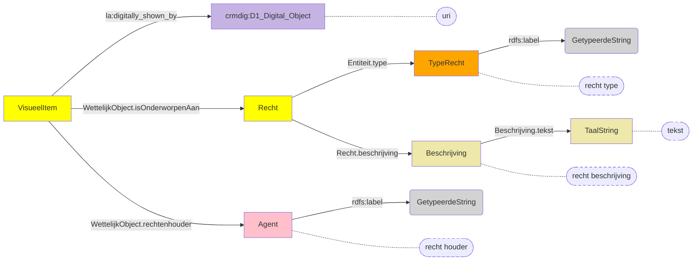

```mermaid
graph LR
179[VisueelItem]-->|la:digitally_shown_by|180[crmdig:D1_Digital_Object]
179[VisueelItem]-->|WettelijkObject.isOnderworpenAan|181[Recht]
179[VisueelItem]-->|WettelijkObject.rechtenhouder|186[Agent]
181[Recht]-->|Entiteit.type|184[TypeRecht]
181[Recht]-->|Recht.beschrijving|182[Beschrijving]
182[Beschrijving]-->|Beschrijving.tekst|183(TaalString)
184[TypeRecht]-->|rdfs:label|185(GetypeerdeString)
186[Agent]-->|rdfs:label|187(GetypeerdeString)
style 180_s stroke-dasharray: 5
style 186_s stroke-dasharray: 5
style 184_s stroke-dasharray: 5
style 182_s stroke-dasharray: 5
style 183_s stroke-dasharray: 5
180[crmdig:D1_Digital_Object]-.-180_s([uri])
186[Agent]-.-186_s([recht houder])
184[TypeRecht]-.-184_s([recht type])
182[Beschrijving]-.-182_s([recht beschrijving])
183[TaalString]-.-183_s([tekst])
style 179 fill:#ffff00
style 180 fill:#C5B4E3
style 181 fill:#ffff00
style 182 fill:#EEE8AA
style 183 fill:#EEE8AA
style 184 fill:#ffa500
style 185 fill:#D3D3D3
style 186 fill:#ffc0cb
style 187 fill:#D3D3D3
```
