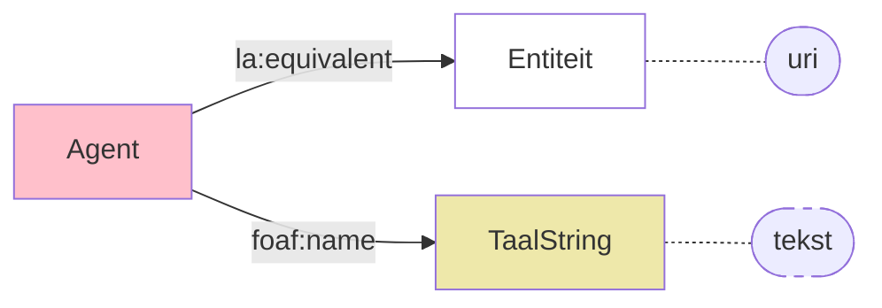

```mermaid
graph LR
1[Agent]-->|la:equivalent|3[Entiteit]
1[Agent]-->|foaf:name|2(TaalString)
style 2_s stroke-dasharray: 5
style 3_s stroke-dasharray: 5
2[TaalString]-.-2_s([tekst])
3[Entiteit]-.-3_s([uri])
style 1 fill:#ffc0cb
style 2 fill:#EEE8AA
style 3 fill:#ffffff
```
