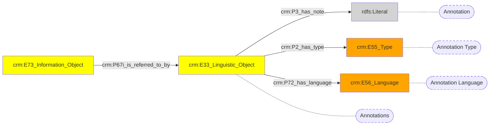

```mermaid
graph LR
2f6343a6-a5fe-11ec-b19f-9cf387da2c40["crm:E33_Linguistic_Object"]-->|"crm:P3_has_note"|2f636980-a5fe-11ec-b19f-9cf387da2c40(rdfs:Literal)
2f6343a6-a5fe-11ec-b19f-9cf387da2c40["crm:E33_Linguistic_Object"]-->|"crm:P2_has_type"|2f63aa3a-a5fe-11ec-b19f-9cf387da2c40["crm:E55_Type"]
2f6343a6-a5fe-11ec-b19f-9cf387da2c40["crm:E33_Linguistic_Object"]-->|"crm:P72_has_language"|2f63aae4-a5fe-11ec-b19f-9cf387da2c40["crm:E56_Language"]
2f63ae40-a5fe-11ec-b19f-9cf387da2c40["crm:E73_Information_Object"]-->|"crm:P67i_is_referred_to_by"|2f6343a6-a5fe-11ec-b19f-9cf387da2c40["crm:E33_Linguistic_Object"]
2f63aa3a-a5fe-11ec-b19f-9cf387da2c40["crm:E55_Type"]-.-2f63aa3a-a5fe-11ec-b19f-9cf387da2c40_s(["Annotation Type"])
2f636980-a5fe-11ec-b19f-9cf387da2c40["rdfs:Literal"]-.-2f636980-a5fe-11ec-b19f-9cf387da2c40_s(["Annotation"])
2f63aae4-a5fe-11ec-b19f-9cf387da2c40["crm:E56_Language"]-.-2f63aae4-a5fe-11ec-b19f-9cf387da2c40_s(["Annotation Language"])
2f6343a6-a5fe-11ec-b19f-9cf387da2c40["crm:E33_Linguistic_Object"]-.-2f6343a6-a5fe-11ec-b19f-9cf387da2c40_s(["Annotations"])
style 2f63aa3a-a5fe-11ec-b19f-9cf387da2c40_s stroke-dasharray: 5
style 2f636980-a5fe-11ec-b19f-9cf387da2c40_s stroke-dasharray: 5
style 2f63aae4-a5fe-11ec-b19f-9cf387da2c40_s stroke-dasharray: 5
style 2f6343a6-a5fe-11ec-b19f-9cf387da2c40_s stroke-dasharray: 5
style 2f6343a6-a5fe-11ec-b19f-9cf387da2c40 fill:#ffff00
style 2f636980-a5fe-11ec-b19f-9cf387da2c40 fill:#D3D3D3
style 2f63aa3a-a5fe-11ec-b19f-9cf387da2c40 fill:#ffa500
style 2f63aae4-a5fe-11ec-b19f-9cf387da2c40 fill:#ffa500
style 2f63ae40-a5fe-11ec-b19f-9cf387da2c40 fill:#ffff00
```
