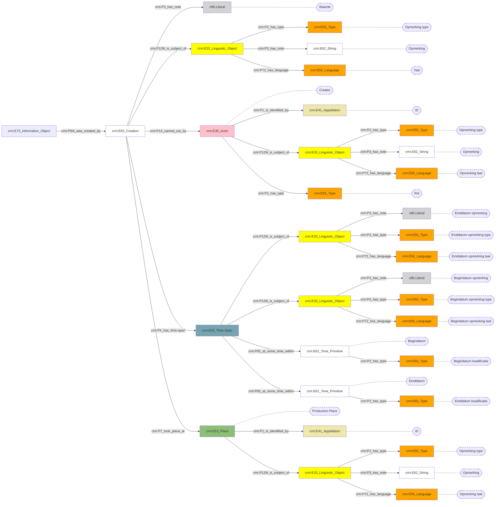

```mermaid
graph LR
2f62e096-a5fe-11ec-b19f-9cf387da2c40["crm:E65_Creation"]-->|"crm:P3_has_note"|2f6242a8-a5fe-11ec-b19f-9cf387da2c40(rdfs:Literal)
2f6384ba-a5fe-11ec-b19f-9cf387da2c40["crm:E33_Linguistic_Object"]-->|"crm:P3_has_note"|2f638a8c-a5fe-11ec-b19f-9cf387da2c40(rdfs:Literal)
2f638cd0-a5fe-11ec-b19f-9cf387da2c40["crm:E33_Linguistic_Object"]-->|"crm:P3_has_note"|2f63835c-a5fe-11ec-b19f-9cf387da2c40(rdfs:Literal)
2f638848-a5fe-11ec-b19f-9cf387da2c40["crm:E61_Time_Primitive"]-.-2f638848-a5fe-11ec-b19f-9cf387da2c40_s(["Begindatum"])
2f638c44-a5fe-11ec-b19f-9cf387da2c40["crm:E61_Time_Primitive"]-.-2f638c44-a5fe-11ec-b19f-9cf387da2c40_s(["Einddatum"])
2f636f8e-a5fe-11ec-b19f-9cf387da2c40["crm:E55_Type"]-.-2f636f8e-a5fe-11ec-b19f-9cf387da2c40_s(["Opmerking type"])
2f6368ae-a5fe-11ec-b19f-9cf387da2c40["crm:E62_String"]-.-2f6368ae-a5fe-11ec-b19f-9cf387da2c40_s(["Opmerking"])
2f638186-a5fe-11ec-b19f-9cf387da2c40["crm:E56_Language"]-.-2f638186-a5fe-11ec-b19f-9cf387da2c40_s(["Taal"])
2f63867c-a5fe-11ec-b19f-9cf387da2c40["crm:E41_Appellation"]-.-2f63867c-a5fe-11ec-b19f-9cf387da2c40_s(["ID"])
2f6382c6-a5fe-11ec-b19f-9cf387da2c40["crm:E41_Appellation"]-.-2f6382c6-a5fe-11ec-b19f-9cf387da2c40_s(["ID"])
2f63940a-a5fe-11ec-b19f-9cf387da2c40["crm:E55_Type"]-.-2f63940a-a5fe-11ec-b19f-9cf387da2c40_s(["Rol"])
2f62d240-a5fe-11ec-b19f-9cf387da2c40["crm:E39_Actor"]-.-2f62d240-a5fe-11ec-b19f-9cf387da2c40_s(["Creator"])
2f6242a8-a5fe-11ec-b19f-9cf387da2c40["rdfs:Literal"]-.-2f6242a8-a5fe-11ec-b19f-9cf387da2c40_s(["Waarde"])
2f62c5a2-a5fe-11ec-b19f-9cf387da2c40["crm:E53_Place"]-.-2f62c5a2-a5fe-11ec-b19f-9cf387da2c40_s(["Production Place"])
2f638712-a5fe-11ec-b19f-9cf387da2c40["crm:E55_Type"]-.-2f638712-a5fe-11ec-b19f-9cf387da2c40_s(["Opmerking type"])
2f6385dc-a5fe-11ec-b19f-9cf387da2c40["crm:E62_String"]-.-2f6385dc-a5fe-11ec-b19f-9cf387da2c40_s(["Opmerking"])
2f638bae-a5fe-11ec-b19f-9cf387da2c40["crm:E56_Language"]-.-2f638bae-a5fe-11ec-b19f-9cf387da2c40_s(["Opmerking taal"])
2f638dfc-a5fe-11ec-b19f-9cf387da2c40["crm:E55_Type"]-.-2f638dfc-a5fe-11ec-b19f-9cf387da2c40_s(["Einddatum opmerking type"])
2f638a8c-a5fe-11ec-b19f-9cf387da2c40["rdfs:Literal"]-.-2f638a8c-a5fe-11ec-b19f-9cf387da2c40_s(["Einddatum opmerking"])
2f638550-a5fe-11ec-b19f-9cf387da2c40["crm:E56_Language"]-.-2f638550-a5fe-11ec-b19f-9cf387da2c40_s(["Einddatum opmerking taal"])
2f638424-a5fe-11ec-b19f-9cf387da2c40["crm:E55_Type"]-.-2f638424-a5fe-11ec-b19f-9cf387da2c40_s(["Begindatum kwalificatie"])
2f639252-a5fe-11ec-b19f-9cf387da2c40["crm:E55_Type"]-.-2f639252-a5fe-11ec-b19f-9cf387da2c40_s(["Opmerking type"])
2f638b22-a5fe-11ec-b19f-9cf387da2c40["crm:E62_String"]-.-2f638b22-a5fe-11ec-b19f-9cf387da2c40_s(["Opmerking"])
2f63954a-a5fe-11ec-b19f-9cf387da2c40["crm:E56_Language"]-.-2f63954a-a5fe-11ec-b19f-9cf387da2c40_s(["Opmerking taal"])
2f6388d4-a5fe-11ec-b19f-9cf387da2c40["crm:E55_Type"]-.-2f6388d4-a5fe-11ec-b19f-9cf387da2c40_s(["Einddatum kwalificatie"])
2f6380e6-a5fe-11ec-b19f-9cf387da2c40["crm:E55_Type"]-.-2f6380e6-a5fe-11ec-b19f-9cf387da2c40_s(["Begindatum opmerking type"])
2f63835c-a5fe-11ec-b19f-9cf387da2c40["rdfs:Literal"]-.-2f63835c-a5fe-11ec-b19f-9cf387da2c40_s(["Begindatum opmerking"])
2f6389f6-a5fe-11ec-b19f-9cf387da2c40["crm:E56_Language"]-.-2f6389f6-a5fe-11ec-b19f-9cf387da2c40_s(["Begindatum opmerking taal"])
style 2f638848-a5fe-11ec-b19f-9cf387da2c40_s stroke-dasharray: 5
style 2f638c44-a5fe-11ec-b19f-9cf387da2c40_s stroke-dasharray: 5
style 2f636f8e-a5fe-11ec-b19f-9cf387da2c40_s stroke-dasharray: 5
style 2f6368ae-a5fe-11ec-b19f-9cf387da2c40_s stroke-dasharray: 5
style 2f638186-a5fe-11ec-b19f-9cf387da2c40_s stroke-dasharray: 5
style 2f63867c-a5fe-11ec-b19f-9cf387da2c40_s stroke-dasharray: 5
style 2f6382c6-a5fe-11ec-b19f-9cf387da2c40_s stroke-dasharray: 5
style 2f63940a-a5fe-11ec-b19f-9cf387da2c40_s stroke-dasharray: 5
style 2f62d240-a5fe-11ec-b19f-9cf387da2c40_s stroke-dasharray: 5
style 2f6242a8-a5fe-11ec-b19f-9cf387da2c40_s stroke-dasharray: 5
style 2f62c5a2-a5fe-11ec-b19f-9cf387da2c40_s stroke-dasharray: 5
style 2f638712-a5fe-11ec-b19f-9cf387da2c40_s stroke-dasharray: 5
style 2f6385dc-a5fe-11ec-b19f-9cf387da2c40_s stroke-dasharray: 5
style 2f638bae-a5fe-11ec-b19f-9cf387da2c40_s stroke-dasharray: 5
style 2f638dfc-a5fe-11ec-b19f-9cf387da2c40_s stroke-dasharray: 5
style 2f638a8c-a5fe-11ec-b19f-9cf387da2c40_s stroke-dasharray: 5
style 2f638550-a5fe-11ec-b19f-9cf387da2c40_s stroke-dasharray: 5
style 2f638424-a5fe-11ec-b19f-9cf387da2c40_s stroke-dasharray: 5
style 2f639252-a5fe-11ec-b19f-9cf387da2c40_s stroke-dasharray: 5
style 2f638b22-a5fe-11ec-b19f-9cf387da2c40_s stroke-dasharray: 5
style 2f63954a-a5fe-11ec-b19f-9cf387da2c40_s stroke-dasharray: 5
style 2f6388d4-a5fe-11ec-b19f-9cf387da2c40_s stroke-dasharray: 5
style 2f6380e6-a5fe-11ec-b19f-9cf387da2c40_s stroke-dasharray: 5
style 2f63835c-a5fe-11ec-b19f-9cf387da2c40_s stroke-dasharray: 5
style 2f6389f6-a5fe-11ec-b19f-9cf387da2c40_s stroke-dasharray: 5
2f62ac52-a5fe-11ec-b19f-9cf387da2c40["crm:E52_Time-Span"]-->|"crm:P129i_is_subject_of"|2f6384ba-a5fe-11ec-b19f-9cf387da2c40["crm:E33_Linguistic_Object"]
2f62ac52-a5fe-11ec-b19f-9cf387da2c40["crm:E52_Time-Span"]-->|"crm:P129i_is_subject_of"|2f638cd0-a5fe-11ec-b19f-9cf387da2c40["crm:E33_Linguistic_Object"]
2f62ac52-a5fe-11ec-b19f-9cf387da2c40["crm:E52_Time-Span"]-->|"crm:P82_at_some_time_within"|2f638848-a5fe-11ec-b19f-9cf387da2c40["crm:E61_Time_Primitive"]
2f62ac52-a5fe-11ec-b19f-9cf387da2c40["crm:E52_Time-Span"]-->|"crm:P82_at_some_time_within"|2f638c44-a5fe-11ec-b19f-9cf387da2c40["crm:E61_Time_Primitive"]
2f62b990-a5fe-11ec-b19f-9cf387da2c40["crm:E33_Linguistic_Object"]-->|"crm:P2_has_type"|2f636f8e-a5fe-11ec-b19f-9cf387da2c40["crm:E55_Type"]
2f62b990-a5fe-11ec-b19f-9cf387da2c40["crm:E33_Linguistic_Object"]-->|"crm:P3_has_note"|2f6368ae-a5fe-11ec-b19f-9cf387da2c40["crm:E62_String"]
2f62b990-a5fe-11ec-b19f-9cf387da2c40["crm:E33_Linguistic_Object"]-->|"crm:P72_has_language"|2f638186-a5fe-11ec-b19f-9cf387da2c40["crm:E56_Language"]
2f62c5a2-a5fe-11ec-b19f-9cf387da2c40["crm:E53_Place"]-->|"crm:P1_is_identified_by"|2f63867c-a5fe-11ec-b19f-9cf387da2c40["crm:E41_Appellation"]
2f62c5a2-a5fe-11ec-b19f-9cf387da2c40["crm:E53_Place"]-->|"crm:P129i_is_subject_of"|2f63896a-a5fe-11ec-b19f-9cf387da2c40["crm:E33_Linguistic_Object"]
2f62d240-a5fe-11ec-b19f-9cf387da2c40["crm:E39_Actor"]-->|"crm:P1_is_identified_by"|2f6382c6-a5fe-11ec-b19f-9cf387da2c40["crm:E41_Appellation"]
2f62d240-a5fe-11ec-b19f-9cf387da2c40["crm:E39_Actor"]-->|"crm:P129i_is_subject_of"|2f638230-a5fe-11ec-b19f-9cf387da2c40["crm:E33_Linguistic_Object"]
2f62d240-a5fe-11ec-b19f-9cf387da2c40["crm:E39_Actor"]-->|"crm:P2_has_type"|2f63940a-a5fe-11ec-b19f-9cf387da2c40["crm:E55_Type"]
2f62e096-a5fe-11ec-b19f-9cf387da2c40["crm:E65_Creation"]-->|"crm:P129i_is_subject_of"|2f62b990-a5fe-11ec-b19f-9cf387da2c40["crm:E33_Linguistic_Object"]
2f62e096-a5fe-11ec-b19f-9cf387da2c40["crm:E65_Creation"]-->|"crm:P14_carried_out_by"|2f62d240-a5fe-11ec-b19f-9cf387da2c40["crm:E39_Actor"]
2f62e096-a5fe-11ec-b19f-9cf387da2c40["crm:E65_Creation"]-->|"crm:P4_has_time-span"|2f62ac52-a5fe-11ec-b19f-9cf387da2c40["crm:E52_Time-Span"]
2f62e096-a5fe-11ec-b19f-9cf387da2c40["crm:E65_Creation"]-->|"crm:P7_took_place_at"|2f62c5a2-a5fe-11ec-b19f-9cf387da2c40["crm:E53_Place"]
2f638230-a5fe-11ec-b19f-9cf387da2c40["crm:E33_Linguistic_Object"]-->|"crm:P2_has_type"|2f638712-a5fe-11ec-b19f-9cf387da2c40["crm:E55_Type"]
2f638230-a5fe-11ec-b19f-9cf387da2c40["crm:E33_Linguistic_Object"]-->|"crm:P3_has_note"|2f6385dc-a5fe-11ec-b19f-9cf387da2c40["crm:E62_String"]
2f638230-a5fe-11ec-b19f-9cf387da2c40["crm:E33_Linguistic_Object"]-->|"crm:P72_has_language"|2f638bae-a5fe-11ec-b19f-9cf387da2c40["crm:E56_Language"]
2f6384ba-a5fe-11ec-b19f-9cf387da2c40["crm:E33_Linguistic_Object"]-->|"crm:P2_has_type"|2f638dfc-a5fe-11ec-b19f-9cf387da2c40["crm:E55_Type"]
2f6384ba-a5fe-11ec-b19f-9cf387da2c40["crm:E33_Linguistic_Object"]-->|"crm:P72_has_language"|2f638550-a5fe-11ec-b19f-9cf387da2c40["crm:E56_Language"]
2f638848-a5fe-11ec-b19f-9cf387da2c40["crm:E61_Time_Primitive"]-->|"crm:P2_has_type"|2f638424-a5fe-11ec-b19f-9cf387da2c40["crm:E55_Type"]
2f63896a-a5fe-11ec-b19f-9cf387da2c40["crm:E33_Linguistic_Object"]-->|"crm:P2_has_type"|2f639252-a5fe-11ec-b19f-9cf387da2c40["crm:E55_Type"]
2f63896a-a5fe-11ec-b19f-9cf387da2c40["crm:E33_Linguistic_Object"]-->|"crm:P3_has_note"|2f638b22-a5fe-11ec-b19f-9cf387da2c40["crm:E62_String"]
2f63896a-a5fe-11ec-b19f-9cf387da2c40["crm:E33_Linguistic_Object"]-->|"crm:P72_has_language"|2f63954a-a5fe-11ec-b19f-9cf387da2c40["crm:E56_Language"]
2f638c44-a5fe-11ec-b19f-9cf387da2c40["crm:E61_Time_Primitive"]-->|"crm:P2_has_type"|2f6388d4-a5fe-11ec-b19f-9cf387da2c40["crm:E55_Type"]
2f638cd0-a5fe-11ec-b19f-9cf387da2c40["crm:E33_Linguistic_Object"]-->|"crm:P2_has_type"|2f6380e6-a5fe-11ec-b19f-9cf387da2c40["crm:E55_Type"]
2f638cd0-a5fe-11ec-b19f-9cf387da2c40["crm:E33_Linguistic_Object"]-->|"crm:P72_has_language"|2f6389f6-a5fe-11ec-b19f-9cf387da2c40["crm:E56_Language"]
2f63ae40-a5fe-11ec-b19f-9cf387da2c40["crm:E73_Information_Object"]-->|"crm:P94i_was_created_by"|2f62e096-a5fe-11ec-b19f-9cf387da2c40["crm:E65_Creation"]
style 2f6242a8-a5fe-11ec-b19f-9cf387da2c40 fill:#D3D3D3
style 2f62ac52-a5fe-11ec-b19f-9cf387da2c40 fill:#76A5AF
style 2f62b990-a5fe-11ec-b19f-9cf387da2c40 fill:#ffff00
style 2f62c5a2-a5fe-11ec-b19f-9cf387da2c40 fill:#8CBF76
style 2f62d240-a5fe-11ec-b19f-9cf387da2c40 fill:#ffc0cb
style 2f62e096-a5fe-11ec-b19f-9cf387da2c40 fill:#ffffff
style 2f6368ae-a5fe-11ec-b19f-9cf387da2c40 fill:#ffffff
style 2f636f8e-a5fe-11ec-b19f-9cf387da2c40 fill:#ffa500
style 2f6380e6-a5fe-11ec-b19f-9cf387da2c40 fill:#ffa500
style 2f638186-a5fe-11ec-b19f-9cf387da2c40 fill:#ffa500
style 2f638230-a5fe-11ec-b19f-9cf387da2c40 fill:#ffff00
style 2f6382c6-a5fe-11ec-b19f-9cf387da2c40 fill:#EEE8AA
style 2f63835c-a5fe-11ec-b19f-9cf387da2c40 fill:#D3D3D3
style 2f638424-a5fe-11ec-b19f-9cf387da2c40 fill:#ffa500
style 2f6384ba-a5fe-11ec-b19f-9cf387da2c40 fill:#ffff00
style 2f638550-a5fe-11ec-b19f-9cf387da2c40 fill:#ffa500
style 2f6385dc-a5fe-11ec-b19f-9cf387da2c40 fill:#ffffff
style 2f63867c-a5fe-11ec-b19f-9cf387da2c40 fill:#EEE8AA
style 2f638712-a5fe-11ec-b19f-9cf387da2c40 fill:#ffa500
style 2f638848-a5fe-11ec-b19f-9cf387da2c40 fill:#ffffff
style 2f6388d4-a5fe-11ec-b19f-9cf387da2c40 fill:#ffa500
style 2f63896a-a5fe-11ec-b19f-9cf387da2c40 fill:#ffff00
style 2f6389f6-a5fe-11ec-b19f-9cf387da2c40 fill:#ffa500
style 2f638a8c-a5fe-11ec-b19f-9cf387da2c40 fill:#D3D3D3
style 2f638b22-a5fe-11ec-b19f-9cf387da2c40 fill:#ffffff
style 2f638bae-a5fe-11ec-b19f-9cf387da2c40 fill:#ffa500
style 2f638c44-a5fe-11ec-b19f-9cf387da2c40 fill:#ffffff
style 2f638cd0-a5fe-11ec-b19f-9cf387da2c40 fill:#ffff00
style 2f638dfc-a5fe-11ec-b19f-9cf387da2c40 fill:#ffa500
style 2f639252-a5fe-11ec-b19f-9cf387da2c40 fill:#ffa500
style 2f63940a-a5fe-11ec-b19f-9cf387da2c40 fill:#ffa500
style 2f63954a-a5fe-11ec-b19f-9cf387da2c40 fill:#ffa500
```
