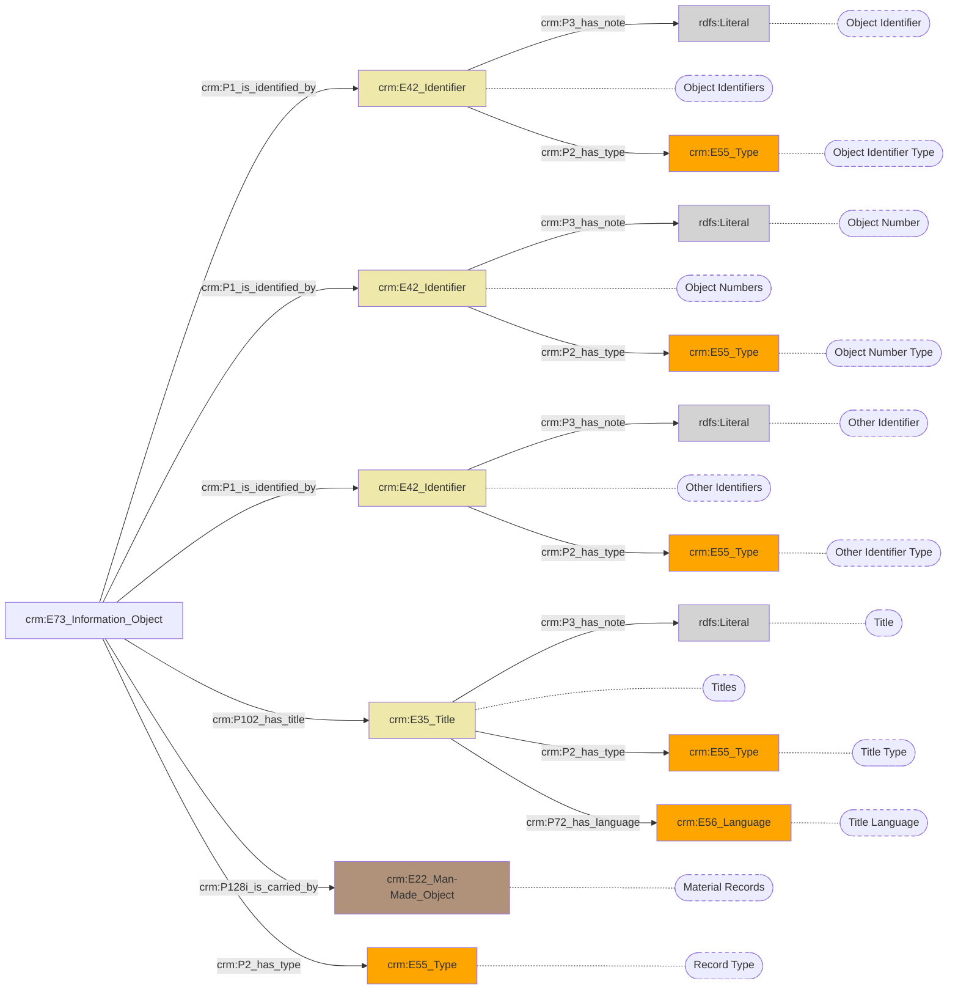

```mermaid
graph LR
2f6249d8-a5fe-11ec-b19f-9cf387da2c40["crm:E42_Identifier"]-->|"crm:P3_has_note"|2f636cc8-a5fe-11ec-b19f-9cf387da2c40(rdfs:Literal)
2f6286f0-a5fe-11ec-b19f-9cf387da2c40["crm:E42_Identifier"]-->|"crm:P3_has_note"|2f6379a2-a5fe-11ec-b19f-9cf387da2c40(rdfs:Literal)
2f62eca8-a5fe-11ec-b19f-9cf387da2c40["crm:E42_Identifier"]-->|"crm:P3_has_note"|2f63a1ac-a5fe-11ec-b19f-9cf387da2c40(rdfs:Literal)
2f634a2c-a5fe-11ec-b19f-9cf387da2c40["crm:E35_Title"]-->|"crm:P3_has_note"|2f635ac6-a5fe-11ec-b19f-9cf387da2c40(rdfs:Literal)
2f636e08-a5fe-11ec-b19f-9cf387da2c40["crm:E55_Type"]-.-2f636e08-a5fe-11ec-b19f-9cf387da2c40_s(["Object Identifier Type"])
2f636cc8-a5fe-11ec-b19f-9cf387da2c40["rdfs:Literal"]-.-2f636cc8-a5fe-11ec-b19f-9cf387da2c40_s(["Object Identifier"])
2f637902-a5fe-11ec-b19f-9cf387da2c40["crm:E55_Type"]-.-2f637902-a5fe-11ec-b19f-9cf387da2c40_s(["Object Number Type"])
2f6379a2-a5fe-11ec-b19f-9cf387da2c40["rdfs:Literal"]-.-2f6379a2-a5fe-11ec-b19f-9cf387da2c40_s(["Object Number"])
2f63a102-a5fe-11ec-b19f-9cf387da2c40["crm:E55_Type"]-.-2f63a102-a5fe-11ec-b19f-9cf387da2c40_s(["Other Identifier Type"])
2f63a1ac-a5fe-11ec-b19f-9cf387da2c40["rdfs:Literal"]-.-2f63a1ac-a5fe-11ec-b19f-9cf387da2c40_s(["Other Identifier"])
2f635c42-a5fe-11ec-b19f-9cf387da2c40["crm:E55_Type"]-.-2f635c42-a5fe-11ec-b19f-9cf387da2c40_s(["Title Type"])
2f635ac6-a5fe-11ec-b19f-9cf387da2c40["rdfs:Literal"]-.-2f635ac6-a5fe-11ec-b19f-9cf387da2c40_s(["Title"])
2f6387a8-a5fe-11ec-b19f-9cf387da2c40["crm:E56_Language"]-.-2f6387a8-a5fe-11ec-b19f-9cf387da2c40_s(["Title Language"])
2f6249d8-a5fe-11ec-b19f-9cf387da2c40["crm:E42_Identifier"]-.-2f6249d8-a5fe-11ec-b19f-9cf387da2c40_s(["Object Identifiers"])
2f6286f0-a5fe-11ec-b19f-9cf387da2c40["crm:E42_Identifier"]-.-2f6286f0-a5fe-11ec-b19f-9cf387da2c40_s(["Object Numbers"])
2f62eca8-a5fe-11ec-b19f-9cf387da2c40["crm:E42_Identifier"]-.-2f62eca8-a5fe-11ec-b19f-9cf387da2c40_s(["Other Identifiers"])
2f634a2c-a5fe-11ec-b19f-9cf387da2c40["crm:E35_Title"]-.-2f634a2c-a5fe-11ec-b19f-9cf387da2c40_s(["Titles"])
2f630f30-a5fe-11ec-b19f-9cf387da2c40["crm:E22_Man-Made_Object"]-.-2f630f30-a5fe-11ec-b19f-9cf387da2c40_s(["Material Records"])
2f62577a-a5fe-11ec-b19f-9cf387da2c40["crm:E55_Type"]-.-2f62577a-a5fe-11ec-b19f-9cf387da2c40_s(["Record Type"])
2f6249d8-a5fe-11ec-b19f-9cf387da2c40["crm:E42_Identifier"]-->|"crm:P2_has_type"|2f636e08-a5fe-11ec-b19f-9cf387da2c40["crm:E55_Type"]
2f6286f0-a5fe-11ec-b19f-9cf387da2c40["crm:E42_Identifier"]-->|"crm:P2_has_type"|2f637902-a5fe-11ec-b19f-9cf387da2c40["crm:E55_Type"]
2f62eca8-a5fe-11ec-b19f-9cf387da2c40["crm:E42_Identifier"]-->|"crm:P2_has_type"|2f63a102-a5fe-11ec-b19f-9cf387da2c40["crm:E55_Type"]
2f634a2c-a5fe-11ec-b19f-9cf387da2c40["crm:E35_Title"]-->|"crm:P2_has_type"|2f635c42-a5fe-11ec-b19f-9cf387da2c40["crm:E55_Type"]
2f634a2c-a5fe-11ec-b19f-9cf387da2c40["crm:E35_Title"]-->|"crm:P72_has_language"|2f6387a8-a5fe-11ec-b19f-9cf387da2c40["crm:E56_Language"]
2f63ae40-a5fe-11ec-b19f-9cf387da2c40["crm:E73_Information_Object"]-->|"crm:P1_is_identified_by"|2f6249d8-a5fe-11ec-b19f-9cf387da2c40["crm:E42_Identifier"]
2f63ae40-a5fe-11ec-b19f-9cf387da2c40["crm:E73_Information_Object"]-->|"crm:P1_is_identified_by"|2f6286f0-a5fe-11ec-b19f-9cf387da2c40["crm:E42_Identifier"]
2f63ae40-a5fe-11ec-b19f-9cf387da2c40["crm:E73_Information_Object"]-->|"crm:P1_is_identified_by"|2f62eca8-a5fe-11ec-b19f-9cf387da2c40["crm:E42_Identifier"]
2f63ae40-a5fe-11ec-b19f-9cf387da2c40["crm:E73_Information_Object"]-->|"crm:P102_has_title"|2f634a2c-a5fe-11ec-b19f-9cf387da2c40["crm:E35_Title"]
2f63ae40-a5fe-11ec-b19f-9cf387da2c40["crm:E73_Information_Object"]-->|"crm:P128i_is_carried_by"|2f630f30-a5fe-11ec-b19f-9cf387da2c40["crm:E22_Man-Made_Object"]
2f63ae40-a5fe-11ec-b19f-9cf387da2c40["crm:E73_Information_Object"]-->|"crm:P2_has_type"|2f62577a-a5fe-11ec-b19f-9cf387da2c40["crm:E55_Type"]
style 2f6249d8-a5fe-11ec-b19f-9cf387da2c40 fill:#EEE8AA
style 2f62577a-a5fe-11ec-b19f-9cf387da2c40 fill:#ffa500
style 2f6286f0-a5fe-11ec-b19f-9cf387da2c40 fill:#EEE8AA
style 2f62eca8-a5fe-11ec-b19f-9cf387da2c40 fill:#EEE8AA
style 2f630f30-a5fe-11ec-b19f-9cf387da2c40 fill:#B0927A
style 2f634a2c-a5fe-11ec-b19f-9cf387da2c40 fill:#EEE8AA
style 2f635ac6-a5fe-11ec-b19f-9cf387da2c40 fill:#D3D3D3
style 2f635c42-a5fe-11ec-b19f-9cf387da2c40 fill:#ffa500
style 2f636cc8-a5fe-11ec-b19f-9cf387da2c40 fill:#D3D3D3
style 2f636e08-a5fe-11ec-b19f-9cf387da2c40 fill:#ffa500
style 2f637902-a5fe-11ec-b19f-9cf387da2c40 fill:#ffa500
style 2f6379a2-a5fe-11ec-b19f-9cf387da2c40 fill:#D3D3D3
style 2f6387a8-a5fe-11ec-b19f-9cf387da2c40 fill:#ffa500
style 2f63a102-a5fe-11ec-b19f-9cf387da2c40 fill:#ffa500
style 2f63a1ac-a5fe-11ec-b19f-9cf387da2c40 fill:#D3D3D3
style 2f636e08-a5fe-11ec-b19f-9cf387da2c40_s stroke-dasharray: 5
style 2f636cc8-a5fe-11ec-b19f-9cf387da2c40_s stroke-dasharray: 5
style 2f637902-a5fe-11ec-b19f-9cf387da2c40_s stroke-dasharray: 5
style 2f6379a2-a5fe-11ec-b19f-9cf387da2c40_s stroke-dasharray: 5
style 2f63a102-a5fe-11ec-b19f-9cf387da2c40_s stroke-dasharray: 5
style 2f63a1ac-a5fe-11ec-b19f-9cf387da2c40_s stroke-dasharray: 5
style 2f635c42-a5fe-11ec-b19f-9cf387da2c40_s stroke-dasharray: 5
style 2f635ac6-a5fe-11ec-b19f-9cf387da2c40_s stroke-dasharray: 5
style 2f6387a8-a5fe-11ec-b19f-9cf387da2c40_s stroke-dasharray: 5
style 2f6249d8-a5fe-11ec-b19f-9cf387da2c40_s stroke-dasharray: 5
style 2f6286f0-a5fe-11ec-b19f-9cf387da2c40_s stroke-dasharray: 5
style 2f62eca8-a5fe-11ec-b19f-9cf387da2c40_s stroke-dasharray: 5
style 2f634a2c-a5fe-11ec-b19f-9cf387da2c40_s stroke-dasharray: 5
style 2f630f30-a5fe-11ec-b19f-9cf387da2c40_s stroke-dasharray: 5
style 2f62577a-a5fe-11ec-b19f-9cf387da2c40_s stroke-dasharray: 5
```
