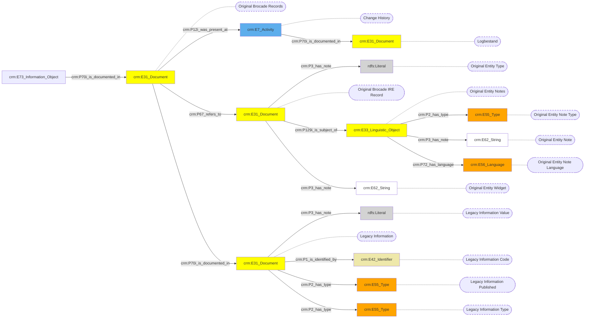

```mermaid
graph LR
2f629f50-a5fe-11ec-b19f-9cf387da2c40["crm:E31_Document"]-->|"crm:P3_has_note"|2f637f92-a5fe-11ec-b19f-9cf387da2c40(rdfs:Literal)
2f631e76-a5fe-11ec-b19f-9cf387da2c40["crm:E31_Document"]-->|"crm:P3_has_note"|299f1d20-7c6f-11ed-b806-960000f945b2(rdfs:Literal)
07babb0e-b4d6-11ec-9349-9cf387da2c40["crm:E31_Document"]-.-07babb0e-b4d6-11ec-9349-9cf387da2c40_s(["Logbestand"])
2f63aed6-a5fe-11ec-b19f-9cf387da2c40["crm:E42_Identifier"]-.-2f63aed6-a5fe-11ec-b19f-9cf387da2c40_s(["Legacy Information Code"])
2f637ef2-a5fe-11ec-b19f-9cf387da2c40["crm:E55_Type"]-.-2f637ef2-a5fe-11ec-b19f-9cf387da2c40_s(["Legacy Information Published"])
2f638028-a5fe-11ec-b19f-9cf387da2c40["crm:E55_Type"]-.-2f638028-a5fe-11ec-b19f-9cf387da2c40_s(["Legacy Information Type"])
2f637f92-a5fe-11ec-b19f-9cf387da2c40["rdfs:Literal"]-.-2f637f92-a5fe-11ec-b19f-9cf387da2c40_s(["Legacy Information Value"])
07bab76c-b4d6-11ec-9349-9cf387da2c40["crm:E7_Activity"]-.-07bab76c-b4d6-11ec-9349-9cf387da2c40_s(["Change History"])
2f631e76-a5fe-11ec-b19f-9cf387da2c40["crm:E31_Document"]-.-2f631e76-a5fe-11ec-b19f-9cf387da2c40_s(["Original Brocade IRE Record"])
2f629f50-a5fe-11ec-b19f-9cf387da2c40["crm:E31_Document"]-.-2f629f50-a5fe-11ec-b19f-9cf387da2c40_s(["Legacy Information"])
2f63a30a-a5fe-11ec-b19f-9cf387da2c40["crm:E33_Linguistic_Object"]-.-2f63a30a-a5fe-11ec-b19f-9cf387da2c40_s(["Original Entity Notes"])
299f1d20-7c6f-11ed-b806-960000f945b2["rdfs:Literal"]-.-299f1d20-7c6f-11ed-b806-960000f945b2_s(["Original Entity Type"])
2f639d60-a5fe-11ec-b19f-9cf387da2c40["crm:E62_String"]-.-2f639d60-a5fe-11ec-b19f-9cf387da2c40_s(["Original Entity Widget"])
2f63a44a-a5fe-11ec-b19f-9cf387da2c40["crm:E55_Type"]-.-2f63a44a-a5fe-11ec-b19f-9cf387da2c40_s(["Original Entity Note Type"])
2f63a3aa-a5fe-11ec-b19f-9cf387da2c40["crm:E62_String"]-.-2f63a3aa-a5fe-11ec-b19f-9cf387da2c40_s(["Original Entity Note"])
2f63a4ea-a5fe-11ec-b19f-9cf387da2c40["crm:E56_Language"]-.-2f63a4ea-a5fe-11ec-b19f-9cf387da2c40_s(["Original Entity Note Language"])
2f63173c-a5fe-11ec-b19f-9cf387da2c40["crm:E31_Document"]-.-2f63173c-a5fe-11ec-b19f-9cf387da2c40_s(["Original Brocade Records"])
07bab76c-b4d6-11ec-9349-9cf387da2c40["crm:E7_Activity"]-->|"crm:P70i_is_documented_in"|07babb0e-b4d6-11ec-9349-9cf387da2c40["crm:E31_Document"]
2f629f50-a5fe-11ec-b19f-9cf387da2c40["crm:E31_Document"]-->|"crm:P1_is_identified_by"|2f63aed6-a5fe-11ec-b19f-9cf387da2c40["crm:E42_Identifier"]
2f629f50-a5fe-11ec-b19f-9cf387da2c40["crm:E31_Document"]-->|"crm:P2_has_type"|2f637ef2-a5fe-11ec-b19f-9cf387da2c40["crm:E55_Type"]
2f629f50-a5fe-11ec-b19f-9cf387da2c40["crm:E31_Document"]-->|"crm:P2_has_type"|2f638028-a5fe-11ec-b19f-9cf387da2c40["crm:E55_Type"]
2f63173c-a5fe-11ec-b19f-9cf387da2c40["crm:E31_Document"]-->|"crm:P12i_was_present_at"|07bab76c-b4d6-11ec-9349-9cf387da2c40["crm:E7_Activity"]
2f63173c-a5fe-11ec-b19f-9cf387da2c40["crm:E31_Document"]-->|"crm:P67_refers_to"|2f631e76-a5fe-11ec-b19f-9cf387da2c40["crm:E31_Document"]
2f63173c-a5fe-11ec-b19f-9cf387da2c40["crm:E31_Document"]-->|"crm:P70i_is_documented_in"|2f629f50-a5fe-11ec-b19f-9cf387da2c40["crm:E31_Document"]
2f631e76-a5fe-11ec-b19f-9cf387da2c40["crm:E31_Document"]-->|"crm:P129i_is_subject_of"|2f63a30a-a5fe-11ec-b19f-9cf387da2c40["crm:E33_Linguistic_Object"]
2f631e76-a5fe-11ec-b19f-9cf387da2c40["crm:E31_Document"]-->|"crm:P3_has_note"|2f639d60-a5fe-11ec-b19f-9cf387da2c40["crm:E62_String"]
2f63a30a-a5fe-11ec-b19f-9cf387da2c40["crm:E33_Linguistic_Object"]-->|"crm:P2_has_type"|2f63a44a-a5fe-11ec-b19f-9cf387da2c40["crm:E55_Type"]
2f63a30a-a5fe-11ec-b19f-9cf387da2c40["crm:E33_Linguistic_Object"]-->|"crm:P3_has_note"|2f63a3aa-a5fe-11ec-b19f-9cf387da2c40["crm:E62_String"]
2f63a30a-a5fe-11ec-b19f-9cf387da2c40["crm:E33_Linguistic_Object"]-->|"crm:P72_has_language"|2f63a4ea-a5fe-11ec-b19f-9cf387da2c40["crm:E56_Language"]
2f63ae40-a5fe-11ec-b19f-9cf387da2c40["crm:E73_Information_Object"]-->|"crm:P70i_is_documented_in"|2f63173c-a5fe-11ec-b19f-9cf387da2c40["crm:E31_Document"]
style 07bab76c-b4d6-11ec-9349-9cf387da2c40 fill:#5DAEEC
style 07babb0e-b4d6-11ec-9349-9cf387da2c40 fill:#ffff00
style 299f1d20-7c6f-11ed-b806-960000f945b2 fill:#D3D3D3
style 2f629f50-a5fe-11ec-b19f-9cf387da2c40 fill:#ffff00
style 2f63173c-a5fe-11ec-b19f-9cf387da2c40 fill:#ffff00
style 2f631e76-a5fe-11ec-b19f-9cf387da2c40 fill:#ffff00
style 2f637ef2-a5fe-11ec-b19f-9cf387da2c40 fill:#ffa500
style 2f637f92-a5fe-11ec-b19f-9cf387da2c40 fill:#D3D3D3
style 2f638028-a5fe-11ec-b19f-9cf387da2c40 fill:#ffa500
style 2f639d60-a5fe-11ec-b19f-9cf387da2c40 fill:#ffffff
style 2f63a30a-a5fe-11ec-b19f-9cf387da2c40 fill:#ffff00
style 2f63a3aa-a5fe-11ec-b19f-9cf387da2c40 fill:#ffffff
style 2f63a44a-a5fe-11ec-b19f-9cf387da2c40 fill:#ffa500
style 2f63a4ea-a5fe-11ec-b19f-9cf387da2c40 fill:#ffa500
style 2f63aed6-a5fe-11ec-b19f-9cf387da2c40 fill:#EEE8AA
style 07babb0e-b4d6-11ec-9349-9cf387da2c40_s stroke-dasharray: 5
style 2f63aed6-a5fe-11ec-b19f-9cf387da2c40_s stroke-dasharray: 5
style 2f637ef2-a5fe-11ec-b19f-9cf387da2c40_s stroke-dasharray: 5
style 2f638028-a5fe-11ec-b19f-9cf387da2c40_s stroke-dasharray: 5
style 2f637f92-a5fe-11ec-b19f-9cf387da2c40_s stroke-dasharray: 5
style 07bab76c-b4d6-11ec-9349-9cf387da2c40_s stroke-dasharray: 5
style 2f631e76-a5fe-11ec-b19f-9cf387da2c40_s stroke-dasharray: 5
style 2f629f50-a5fe-11ec-b19f-9cf387da2c40_s stroke-dasharray: 5
style 2f63a30a-a5fe-11ec-b19f-9cf387da2c40_s stroke-dasharray: 5
style 299f1d20-7c6f-11ed-b806-960000f945b2_s stroke-dasharray: 5
style 2f639d60-a5fe-11ec-b19f-9cf387da2c40_s stroke-dasharray: 5
style 2f63a44a-a5fe-11ec-b19f-9cf387da2c40_s stroke-dasharray: 5
style 2f63a3aa-a5fe-11ec-b19f-9cf387da2c40_s stroke-dasharray: 5
style 2f63a4ea-a5fe-11ec-b19f-9cf387da2c40_s stroke-dasharray: 5
style 2f63173c-a5fe-11ec-b19f-9cf387da2c40_s stroke-dasharray: 5
```
