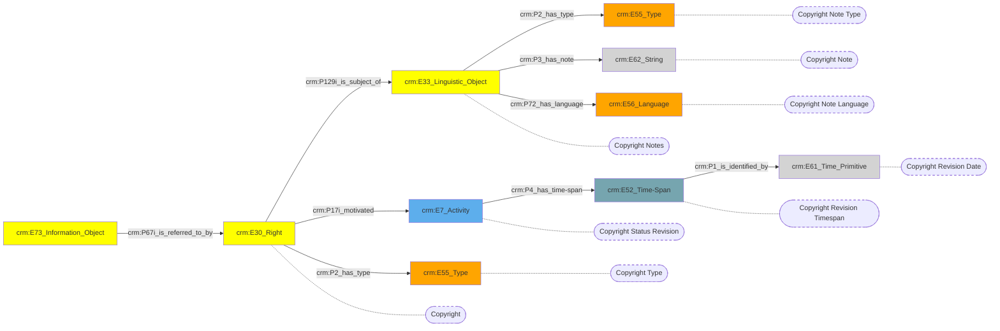

```mermaid
graph LR
2f62906e-a5fe-11ec-b19f-9cf387da2c40["crm:E30_Right"]-->|"crm:P129i_is_subject_of"|2f6361ec-a5fe-11ec-b19f-9cf387da2c40["crm:E33_Linguistic_Object"]
2f62906e-a5fe-11ec-b19f-9cf387da2c40["crm:E30_Right"]-->|"crm:P17i_motivated"|2f637ca4-a5fe-11ec-b19f-9cf387da2c40["crm:E7_Activity"]
2f62906e-a5fe-11ec-b19f-9cf387da2c40["crm:E30_Right"]-->|"crm:P2_has_type"|2f637c0e-a5fe-11ec-b19f-9cf387da2c40["crm:E55_Type"]
2f6361ec-a5fe-11ec-b19f-9cf387da2c40["crm:E33_Linguistic_Object"]-->|"crm:P2_has_type"|2f63ad8c-a5fe-11ec-b19f-9cf387da2c40["crm:E55_Type"]
2f6361ec-a5fe-11ec-b19f-9cf387da2c40["crm:E33_Linguistic_Object"]-->|"crm:P3_has_note"|2f6365ca-a5fe-11ec-b19f-9cf387da2c40["crm:E62_String"]
2f6361ec-a5fe-11ec-b19f-9cf387da2c40["crm:E33_Linguistic_Object"]-->|"crm:P72_has_language"|2f6371d2-a5fe-11ec-b19f-9cf387da2c40["crm:E56_Language"]
2f637ca4-a5fe-11ec-b19f-9cf387da2c40["crm:E7_Activity"]-->|"crm:P4_has_time-span"|2f637d3a-a5fe-11ec-b19f-9cf387da2c40["crm:E52_Time-Span"]
2f637d3a-a5fe-11ec-b19f-9cf387da2c40["crm:E52_Time-Span"]-->|"crm:P1_is_identified_by"|2f637dd0-a5fe-11ec-b19f-9cf387da2c40["crm:E61_Time_Primitive"]
2f63ae40-a5fe-11ec-b19f-9cf387da2c40["crm:E73_Information_Object"]-->|"crm:P67i_is_referred_to_by"|2f62906e-a5fe-11ec-b19f-9cf387da2c40["crm:E30_Right"]
2f6361ec-a5fe-11ec-b19f-9cf387da2c40["crm:E33_Linguistic_Object"]-.-2f6361ec-a5fe-11ec-b19f-9cf387da2c40_s(["Copyright Notes"])
2f637ca4-a5fe-11ec-b19f-9cf387da2c40["crm:E7_Activity"]-.-2f637ca4-a5fe-11ec-b19f-9cf387da2c40_s(["Copyright Status Revision"])
2f637c0e-a5fe-11ec-b19f-9cf387da2c40["crm:E55_Type"]-.-2f637c0e-a5fe-11ec-b19f-9cf387da2c40_s(["Copyright Type"])
2f63ad8c-a5fe-11ec-b19f-9cf387da2c40["crm:E55_Type"]-.-2f63ad8c-a5fe-11ec-b19f-9cf387da2c40_s(["Copyright Note Type"])
2f6365ca-a5fe-11ec-b19f-9cf387da2c40["crm:E62_String"]-.-2f6365ca-a5fe-11ec-b19f-9cf387da2c40_s(["Copyright Note"])
2f6371d2-a5fe-11ec-b19f-9cf387da2c40["crm:E56_Language"]-.-2f6371d2-a5fe-11ec-b19f-9cf387da2c40_s(["Copyright Note Language"])
2f637d3a-a5fe-11ec-b19f-9cf387da2c40["crm:E52_Time-Span"]-.-2f637d3a-a5fe-11ec-b19f-9cf387da2c40_s(["Copyright Revision Timespan"])
2f637dd0-a5fe-11ec-b19f-9cf387da2c40["crm:E61_Time_Primitive"]-.-2f637dd0-a5fe-11ec-b19f-9cf387da2c40_s(["Copyright Revision Date"])
2f62906e-a5fe-11ec-b19f-9cf387da2c40["crm:E30_Right"]-.-2f62906e-a5fe-11ec-b19f-9cf387da2c40_s(["Copyright"])
style 2f6361ec-a5fe-11ec-b19f-9cf387da2c40_s stroke-dasharray: 5
style 2f637ca4-a5fe-11ec-b19f-9cf387da2c40_s stroke-dasharray: 5
style 2f637c0e-a5fe-11ec-b19f-9cf387da2c40_s stroke-dasharray: 5
style 2f63ad8c-a5fe-11ec-b19f-9cf387da2c40_s stroke-dasharray: 5
style 2f6365ca-a5fe-11ec-b19f-9cf387da2c40_s stroke-dasharray: 5
style 2f6371d2-a5fe-11ec-b19f-9cf387da2c40_s stroke-dasharray: 5
style 2f637d3a-a5fe-11ec-b19f-9cf387da2c40_s stroke-dasharray: 5
style 2f637dd0-a5fe-11ec-b19f-9cf387da2c40_s stroke-dasharray: 5
style 2f62906e-a5fe-11ec-b19f-9cf387da2c40_s stroke-dasharray: 5
style 2f62906e-a5fe-11ec-b19f-9cf387da2c40 fill:#ffff00
style 2f6361ec-a5fe-11ec-b19f-9cf387da2c40 fill:#ffff00
style 2f6365ca-a5fe-11ec-b19f-9cf387da2c40 fill:#D3D3D3
style 2f6371d2-a5fe-11ec-b19f-9cf387da2c40 fill:#ffa500
style 2f637c0e-a5fe-11ec-b19f-9cf387da2c40 fill:#ffa500
style 2f637ca4-a5fe-11ec-b19f-9cf387da2c40 fill:#5DAEEC
style 2f637d3a-a5fe-11ec-b19f-9cf387da2c40 fill:#76A5AF
style 2f637dd0-a5fe-11ec-b19f-9cf387da2c40 fill:#D3D3D3
style 2f63ad8c-a5fe-11ec-b19f-9cf387da2c40 fill:#ffa500
style 2f63ae40-a5fe-11ec-b19f-9cf387da2c40 fill:#ffff00
```
