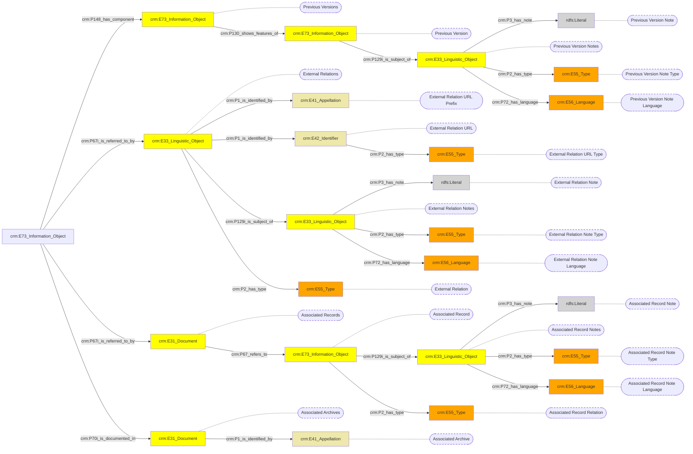

```mermaid
graph LR
2f6362b4-a5fe-11ec-b19f-9cf387da2c40["crm:E33_Linguistic_Object"]-->|"crm:P3_has_note"|2f63ab8e-a5fe-11ec-b19f-9cf387da2c40(rdfs:Literal)
2f63743e-a5fe-11ec-b19f-9cf387da2c40["crm:E33_Linguistic_Object"]-->|"crm:P3_has_note"|2f63772c-a5fe-11ec-b19f-9cf387da2c40(rdfs:Literal)
8031c762-a923-11ec-b19f-9cf387da2c40["crm:E33_Linguistic_Object"]-->|"crm:P3_has_note"|8031cd20-a923-11ec-b19f-9cf387da2c40(rdfs:Literal)
8031c762-a923-11ec-b19f-9cf387da2c40["crm:E33_Linguistic_Object"]-.-8031c762-a923-11ec-b19f-9cf387da2c40_s(["Previous Version Notes"])
0cba7466-af4d-11ec-b19f-9cf387da2c40["crm:E41_Appellation"]-.-0cba7466-af4d-11ec-b19f-9cf387da2c40_s(["External Relation URL Prefix"])
2f6374de-a5fe-11ec-b19f-9cf387da2c40["crm:E42_Identifier"]-.-2f6374de-a5fe-11ec-b19f-9cf387da2c40_s(["External Relation URL"])
2f63743e-a5fe-11ec-b19f-9cf387da2c40["crm:E33_Linguistic_Object"]-.-2f63743e-a5fe-11ec-b19f-9cf387da2c40_s(["External Relation Notes"])
2f63760a-a5fe-11ec-b19f-9cf387da2c40["crm:E55_Type"]-.-2f63760a-a5fe-11ec-b19f-9cf387da2c40_s(["External Relation"])
2f63611a-a5fe-11ec-b19f-9cf387da2c40["crm:E41_Appellation"]-.-2f63611a-a5fe-11ec-b19f-9cf387da2c40_s(["Associated Archive"])
2f63ac38-a5fe-11ec-b19f-9cf387da2c40["crm:E73_Information_Object"]-.-2f63ac38-a5fe-11ec-b19f-9cf387da2c40_s(["Associated Record"])
2f635f76-a5fe-11ec-b19f-9cf387da2c40["crm:E55_Type"]-.-2f635f76-a5fe-11ec-b19f-9cf387da2c40_s(["Associated Record Note Type"])
2f63ab8e-a5fe-11ec-b19f-9cf387da2c40["rdfs:Literal"]-.-2f63ab8e-a5fe-11ec-b19f-9cf387da2c40_s(["Associated Record Note"])
2f635e86-a5fe-11ec-b19f-9cf387da2c40["crm:E56_Language"]-.-2f635e86-a5fe-11ec-b19f-9cf387da2c40_s(["Associated Record Note Language"])
2f637696-a5fe-11ec-b19f-9cf387da2c40["crm:E55_Type"]-.-2f637696-a5fe-11ec-b19f-9cf387da2c40_s(["External Relation Note Type"])
2f63772c-a5fe-11ec-b19f-9cf387da2c40["rdfs:Literal"]-.-2f63772c-a5fe-11ec-b19f-9cf387da2c40_s(["External Relation Note"])
2f6377c2-a5fe-11ec-b19f-9cf387da2c40["crm:E56_Language"]-.-2f6377c2-a5fe-11ec-b19f-9cf387da2c40_s(["External Relation Note Language"])
2f63756a-a5fe-11ec-b19f-9cf387da2c40["crm:E55_Type"]-.-2f63756a-a5fe-11ec-b19f-9cf387da2c40_s(["External Relation URL Type"])
2f6362b4-a5fe-11ec-b19f-9cf387da2c40["crm:E33_Linguistic_Object"]-.-2f6362b4-a5fe-11ec-b19f-9cf387da2c40_s(["Associated Record Notes"])
2f63637c-a5fe-11ec-b19f-9cf387da2c40["crm:E55_Type"]-.-2f63637c-a5fe-11ec-b19f-9cf387da2c40_s(["Associated Record Relation"])
edeadcb8-a922-11ec-b19f-9cf387da2c40["crm:E73_Information_Object"]-.-edeadcb8-a922-11ec-b19f-9cf387da2c40_s(["Previous Versions"])
2f627066-a5fe-11ec-b19f-9cf387da2c40["crm:E33_Linguistic_Object"]-.-2f627066-a5fe-11ec-b19f-9cf387da2c40_s(["External Relations"])
2f634fd6-a5fe-11ec-b19f-9cf387da2c40["crm:E31_Document"]-.-2f634fd6-a5fe-11ec-b19f-9cf387da2c40_s(["Associated Records"])
2f632c68-a5fe-11ec-b19f-9cf387da2c40["crm:E31_Document"]-.-2f632c68-a5fe-11ec-b19f-9cf387da2c40_s(["Associated Archives"])
8031cc6c-a923-11ec-b19f-9cf387da2c40["crm:E55_Type"]-.-8031cc6c-a923-11ec-b19f-9cf387da2c40_s(["Previous Version Note Type"])
8031cd20-a923-11ec-b19f-9cf387da2c40["rdfs:Literal"]-.-8031cd20-a923-11ec-b19f-9cf387da2c40_s(["Previous Version Note"])
8031cb72-a923-11ec-b19f-9cf387da2c40["crm:E56_Language"]-.-8031cb72-a923-11ec-b19f-9cf387da2c40_s(["Previous Version Note Language"])
2ba397f2-a923-11ec-b19f-9cf387da2c40["crm:E73_Information_Object"]-.-2ba397f2-a923-11ec-b19f-9cf387da2c40_s(["Previous Version"])
2ba397f2-a923-11ec-b19f-9cf387da2c40["crm:E73_Information_Object"]-->|"crm:P129i_is_subject_of"|8031c762-a923-11ec-b19f-9cf387da2c40["crm:E33_Linguistic_Object"]
2f627066-a5fe-11ec-b19f-9cf387da2c40["crm:E33_Linguistic_Object"]-->|"crm:P1_is_identified_by"|0cba7466-af4d-11ec-b19f-9cf387da2c40["crm:E41_Appellation"]
2f627066-a5fe-11ec-b19f-9cf387da2c40["crm:E33_Linguistic_Object"]-->|"crm:P1_is_identified_by"|2f6374de-a5fe-11ec-b19f-9cf387da2c40["crm:E42_Identifier"]
2f627066-a5fe-11ec-b19f-9cf387da2c40["crm:E33_Linguistic_Object"]-->|"crm:P129i_is_subject_of"|2f63743e-a5fe-11ec-b19f-9cf387da2c40["crm:E33_Linguistic_Object"]
2f627066-a5fe-11ec-b19f-9cf387da2c40["crm:E33_Linguistic_Object"]-->|"crm:P2_has_type"|2f63760a-a5fe-11ec-b19f-9cf387da2c40["crm:E55_Type"]
2f632c68-a5fe-11ec-b19f-9cf387da2c40["crm:E31_Document"]-->|"crm:P1_is_identified_by"|2f63611a-a5fe-11ec-b19f-9cf387da2c40["crm:E41_Appellation"]
2f634fd6-a5fe-11ec-b19f-9cf387da2c40["crm:E31_Document"]-->|"crm:P67_refers_to"|2f63ac38-a5fe-11ec-b19f-9cf387da2c40["crm:E73_Information_Object"]
2f6362b4-a5fe-11ec-b19f-9cf387da2c40["crm:E33_Linguistic_Object"]-->|"crm:P2_has_type"|2f635f76-a5fe-11ec-b19f-9cf387da2c40["crm:E55_Type"]
2f6362b4-a5fe-11ec-b19f-9cf387da2c40["crm:E33_Linguistic_Object"]-->|"crm:P72_has_language"|2f635e86-a5fe-11ec-b19f-9cf387da2c40["crm:E56_Language"]
2f63743e-a5fe-11ec-b19f-9cf387da2c40["crm:E33_Linguistic_Object"]-->|"crm:P2_has_type"|2f637696-a5fe-11ec-b19f-9cf387da2c40["crm:E55_Type"]
2f63743e-a5fe-11ec-b19f-9cf387da2c40["crm:E33_Linguistic_Object"]-->|"crm:P72_has_language"|2f6377c2-a5fe-11ec-b19f-9cf387da2c40["crm:E56_Language"]
2f6374de-a5fe-11ec-b19f-9cf387da2c40["crm:E42_Identifier"]-->|"crm:P2_has_type"|2f63756a-a5fe-11ec-b19f-9cf387da2c40["crm:E55_Type"]
2f63ac38-a5fe-11ec-b19f-9cf387da2c40["crm:E73_Information_Object"]-->|"crm:P129i_is_subject_of"|2f6362b4-a5fe-11ec-b19f-9cf387da2c40["crm:E33_Linguistic_Object"]
2f63ac38-a5fe-11ec-b19f-9cf387da2c40["crm:E73_Information_Object"]-->|"crm:P2_has_type"|2f63637c-a5fe-11ec-b19f-9cf387da2c40["crm:E55_Type"]
2f63ae40-a5fe-11ec-b19f-9cf387da2c40["crm:E73_Information_Object"]-->|"crm:P148_has_component"|edeadcb8-a922-11ec-b19f-9cf387da2c40["crm:E73_Information_Object"]
2f63ae40-a5fe-11ec-b19f-9cf387da2c40["crm:E73_Information_Object"]-->|"crm:P67i_is_referred_to_by"|2f627066-a5fe-11ec-b19f-9cf387da2c40["crm:E33_Linguistic_Object"]
2f63ae40-a5fe-11ec-b19f-9cf387da2c40["crm:E73_Information_Object"]-->|"crm:P67i_is_referred_to_by"|2f634fd6-a5fe-11ec-b19f-9cf387da2c40["crm:E31_Document"]
2f63ae40-a5fe-11ec-b19f-9cf387da2c40["crm:E73_Information_Object"]-->|"crm:P70i_is_documented_in"|2f632c68-a5fe-11ec-b19f-9cf387da2c40["crm:E31_Document"]
8031c762-a923-11ec-b19f-9cf387da2c40["crm:E33_Linguistic_Object"]-->|"crm:P2_has_type"|8031cc6c-a923-11ec-b19f-9cf387da2c40["crm:E55_Type"]
8031c762-a923-11ec-b19f-9cf387da2c40["crm:E33_Linguistic_Object"]-->|"crm:P72_has_language"|8031cb72-a923-11ec-b19f-9cf387da2c40["crm:E56_Language"]
edeadcb8-a922-11ec-b19f-9cf387da2c40["crm:E73_Information_Object"]-->|"crm:P130_shows_features_of"|2ba397f2-a923-11ec-b19f-9cf387da2c40["crm:E73_Information_Object"]
style 0cba7466-af4d-11ec-b19f-9cf387da2c40 fill:#EEE8AA
style 2ba397f2-a923-11ec-b19f-9cf387da2c40 fill:#ffff00
style 2f627066-a5fe-11ec-b19f-9cf387da2c40 fill:#ffff00
style 2f632c68-a5fe-11ec-b19f-9cf387da2c40 fill:#ffff00
style 2f634fd6-a5fe-11ec-b19f-9cf387da2c40 fill:#ffff00
style 2f635e86-a5fe-11ec-b19f-9cf387da2c40 fill:#ffa500
style 2f635f76-a5fe-11ec-b19f-9cf387da2c40 fill:#ffa500
style 2f63611a-a5fe-11ec-b19f-9cf387da2c40 fill:#EEE8AA
style 2f6362b4-a5fe-11ec-b19f-9cf387da2c40 fill:#ffff00
style 2f63637c-a5fe-11ec-b19f-9cf387da2c40 fill:#ffa500
style 2f63743e-a5fe-11ec-b19f-9cf387da2c40 fill:#ffff00
style 2f6374de-a5fe-11ec-b19f-9cf387da2c40 fill:#EEE8AA
style 2f63756a-a5fe-11ec-b19f-9cf387da2c40 fill:#ffa500
style 2f63760a-a5fe-11ec-b19f-9cf387da2c40 fill:#ffa500
style 2f637696-a5fe-11ec-b19f-9cf387da2c40 fill:#ffa500
style 2f63772c-a5fe-11ec-b19f-9cf387da2c40 fill:#D3D3D3
style 2f6377c2-a5fe-11ec-b19f-9cf387da2c40 fill:#ffa500
style 2f63ab8e-a5fe-11ec-b19f-9cf387da2c40 fill:#D3D3D3
style 2f63ac38-a5fe-11ec-b19f-9cf387da2c40 fill:#ffff00
style 8031c762-a923-11ec-b19f-9cf387da2c40 fill:#ffff00
style 8031cb72-a923-11ec-b19f-9cf387da2c40 fill:#ffa500
style 8031cc6c-a923-11ec-b19f-9cf387da2c40 fill:#ffa500
style 8031cd20-a923-11ec-b19f-9cf387da2c40 fill:#D3D3D3
style edeadcb8-a922-11ec-b19f-9cf387da2c40 fill:#ffff00
style 8031c762-a923-11ec-b19f-9cf387da2c40_s stroke-dasharray: 5
style 0cba7466-af4d-11ec-b19f-9cf387da2c40_s stroke-dasharray: 5
style 2f6374de-a5fe-11ec-b19f-9cf387da2c40_s stroke-dasharray: 5
style 2f63743e-a5fe-11ec-b19f-9cf387da2c40_s stroke-dasharray: 5
style 2f63760a-a5fe-11ec-b19f-9cf387da2c40_s stroke-dasharray: 5
style 2f63611a-a5fe-11ec-b19f-9cf387da2c40_s stroke-dasharray: 5
style 2f63ac38-a5fe-11ec-b19f-9cf387da2c40_s stroke-dasharray: 5
style 2f635f76-a5fe-11ec-b19f-9cf387da2c40_s stroke-dasharray: 5
style 2f63ab8e-a5fe-11ec-b19f-9cf387da2c40_s stroke-dasharray: 5
style 2f635e86-a5fe-11ec-b19f-9cf387da2c40_s stroke-dasharray: 5
style 2f637696-a5fe-11ec-b19f-9cf387da2c40_s stroke-dasharray: 5
style 2f63772c-a5fe-11ec-b19f-9cf387da2c40_s stroke-dasharray: 5
style 2f6377c2-a5fe-11ec-b19f-9cf387da2c40_s stroke-dasharray: 5
style 2f63756a-a5fe-11ec-b19f-9cf387da2c40_s stroke-dasharray: 5
style 2f6362b4-a5fe-11ec-b19f-9cf387da2c40_s stroke-dasharray: 5
style 2f63637c-a5fe-11ec-b19f-9cf387da2c40_s stroke-dasharray: 5
style edeadcb8-a922-11ec-b19f-9cf387da2c40_s stroke-dasharray: 5
style 2f627066-a5fe-11ec-b19f-9cf387da2c40_s stroke-dasharray: 5
style 2f634fd6-a5fe-11ec-b19f-9cf387da2c40_s stroke-dasharray: 5
style 2f632c68-a5fe-11ec-b19f-9cf387da2c40_s stroke-dasharray: 5
style 8031cc6c-a923-11ec-b19f-9cf387da2c40_s stroke-dasharray: 5
style 8031cd20-a923-11ec-b19f-9cf387da2c40_s stroke-dasharray: 5
style 8031cb72-a923-11ec-b19f-9cf387da2c40_s stroke-dasharray: 5
style 2ba397f2-a923-11ec-b19f-9cf387da2c40_s stroke-dasharray: 5
```
