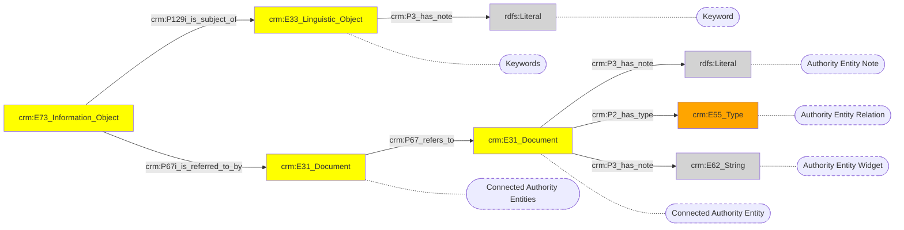

```mermaid
graph LR
2f625068-a5fe-11ec-b19f-9cf387da2c40["crm:E33_Linguistic_Object"]-->|"crm:P3_has_note"|2f6366e2-a5fe-11ec-b19f-9cf387da2c40(rdfs:Literal)
2f636b1a-a5fe-11ec-b19f-9cf387da2c40["crm:E31_Document"]-->|"crm:P3_has_note"|2f636444-a5fe-11ec-b19f-9cf387da2c40(rdfs:Literal)
2f62327c-a5fe-11ec-b19f-9cf387da2c40["crm:E31_Document"]-->|"crm:P67_refers_to"|2f636b1a-a5fe-11ec-b19f-9cf387da2c40["crm:E31_Document"]
2f636b1a-a5fe-11ec-b19f-9cf387da2c40["crm:E31_Document"]-->|"crm:P2_has_type"|2f636a48-a5fe-11ec-b19f-9cf387da2c40["crm:E55_Type"]
2f636b1a-a5fe-11ec-b19f-9cf387da2c40["crm:E31_Document"]-->|"crm:P3_has_note"|2f636502-a5fe-11ec-b19f-9cf387da2c40["crm:E62_String"]
2f63ae40-a5fe-11ec-b19f-9cf387da2c40["crm:E73_Information_Object"]-->|"crm:P129i_is_subject_of"|2f625068-a5fe-11ec-b19f-9cf387da2c40["crm:E33_Linguistic_Object"]
2f63ae40-a5fe-11ec-b19f-9cf387da2c40["crm:E73_Information_Object"]-->|"crm:P67i_is_referred_to_by"|2f62327c-a5fe-11ec-b19f-9cf387da2c40["crm:E31_Document"]
2f636b1a-a5fe-11ec-b19f-9cf387da2c40["crm:E31_Document"]-.-2f636b1a-a5fe-11ec-b19f-9cf387da2c40_s(["Connected Authority Entity"])
2f6366e2-a5fe-11ec-b19f-9cf387da2c40["rdfs:Literal"]-.-2f6366e2-a5fe-11ec-b19f-9cf387da2c40_s(["Keyword"])
2f636a48-a5fe-11ec-b19f-9cf387da2c40["crm:E55_Type"]-.-2f636a48-a5fe-11ec-b19f-9cf387da2c40_s(["Authority Entity Relation"])
2f636444-a5fe-11ec-b19f-9cf387da2c40["rdfs:Literal"]-.-2f636444-a5fe-11ec-b19f-9cf387da2c40_s(["Authority Entity Note"])
2f636502-a5fe-11ec-b19f-9cf387da2c40["crm:E62_String"]-.-2f636502-a5fe-11ec-b19f-9cf387da2c40_s(["Authority Entity Widget"])
2f625068-a5fe-11ec-b19f-9cf387da2c40["crm:E33_Linguistic_Object"]-.-2f625068-a5fe-11ec-b19f-9cf387da2c40_s(["Keywords"])
2f62327c-a5fe-11ec-b19f-9cf387da2c40["crm:E31_Document"]-.-2f62327c-a5fe-11ec-b19f-9cf387da2c40_s(["Connected Authority Entities"])
style 2f636b1a-a5fe-11ec-b19f-9cf387da2c40_s stroke-dasharray: 5
style 2f6366e2-a5fe-11ec-b19f-9cf387da2c40_s stroke-dasharray: 5
style 2f636a48-a5fe-11ec-b19f-9cf387da2c40_s stroke-dasharray: 5
style 2f636444-a5fe-11ec-b19f-9cf387da2c40_s stroke-dasharray: 5
style 2f636502-a5fe-11ec-b19f-9cf387da2c40_s stroke-dasharray: 5
style 2f625068-a5fe-11ec-b19f-9cf387da2c40_s stroke-dasharray: 5
style 2f62327c-a5fe-11ec-b19f-9cf387da2c40_s stroke-dasharray: 5
style 2f62327c-a5fe-11ec-b19f-9cf387da2c40 fill:#ffff00
style 2f625068-a5fe-11ec-b19f-9cf387da2c40 fill:#ffff00
style 2f636444-a5fe-11ec-b19f-9cf387da2c40 fill:#D3D3D3
style 2f636502-a5fe-11ec-b19f-9cf387da2c40 fill:#D3D3D3
style 2f6366e2-a5fe-11ec-b19f-9cf387da2c40 fill:#D3D3D3
style 2f636a48-a5fe-11ec-b19f-9cf387da2c40 fill:#ffa500
style 2f636b1a-a5fe-11ec-b19f-9cf387da2c40 fill:#ffff00
style 2f63ae40-a5fe-11ec-b19f-9cf387da2c40 fill:#ffff00
```
