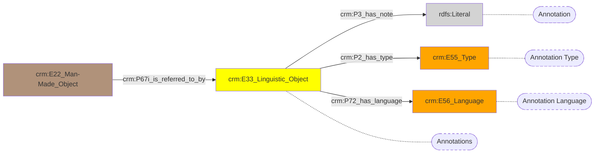

```mermaid
graph LR
d1dcd598-a5fe-11ec-b19f-9cf387da2c40["crm:E33_Linguistic_Object"]-->|"crm:P3_has_note"|d1de1a0c-a5fe-11ec-b19f-9cf387da2c40(rdfs:Literal)
d1dcd598-a5fe-11ec-b19f-9cf387da2c40["crm:E33_Linguistic_Object"]-->|"crm:P2_has_type"|d1de2cfe-a5fe-11ec-b19f-9cf387da2c40["crm:E55_Type"]
d1dcd598-a5fe-11ec-b19f-9cf387da2c40["crm:E33_Linguistic_Object"]-->|"crm:P72_has_language"|d1de1746-a5fe-11ec-b19f-9cf387da2c40["crm:E56_Language"]
d1dd96e0-a5fe-11ec-b19f-9cf387da2c40["crm:E22_Man-Made_Object"]-->|"crm:P67i_is_referred_to_by"|d1dcd598-a5fe-11ec-b19f-9cf387da2c40["crm:E33_Linguistic_Object"]
d1de2cfe-a5fe-11ec-b19f-9cf387da2c40["crm:E55_Type"]-.-d1de2cfe-a5fe-11ec-b19f-9cf387da2c40_s(["Annotation Type"])
d1de1a0c-a5fe-11ec-b19f-9cf387da2c40["rdfs:Literal"]-.-d1de1a0c-a5fe-11ec-b19f-9cf387da2c40_s(["Annotation"])
d1de1746-a5fe-11ec-b19f-9cf387da2c40["crm:E56_Language"]-.-d1de1746-a5fe-11ec-b19f-9cf387da2c40_s(["Annotation Language"])
d1dcd598-a5fe-11ec-b19f-9cf387da2c40["crm:E33_Linguistic_Object"]-.-d1dcd598-a5fe-11ec-b19f-9cf387da2c40_s(["Annotations"])
style d1de2cfe-a5fe-11ec-b19f-9cf387da2c40_s stroke-dasharray: 5
style d1de1a0c-a5fe-11ec-b19f-9cf387da2c40_s stroke-dasharray: 5
style d1de1746-a5fe-11ec-b19f-9cf387da2c40_s stroke-dasharray: 5
style d1dcd598-a5fe-11ec-b19f-9cf387da2c40_s stroke-dasharray: 5
style d1dcd598-a5fe-11ec-b19f-9cf387da2c40 fill:#ffff00
style d1dd96e0-a5fe-11ec-b19f-9cf387da2c40 fill:#B0927A
style d1de1746-a5fe-11ec-b19f-9cf387da2c40 fill:#ffa500
style d1de1a0c-a5fe-11ec-b19f-9cf387da2c40 fill:#D3D3D3
style d1de2cfe-a5fe-11ec-b19f-9cf387da2c40 fill:#ffa500
```
