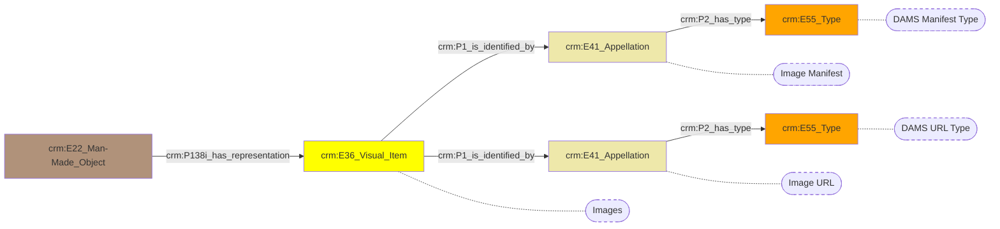

```mermaid
graph LR
02571136-e53f-11ed-b522-96a6d245525a["crm:E41_Appellation"]-->|"crm:P2_has_type"|02571564-e53f-11ed-b522-96a6d245525a["crm:E55_Type"]
02571302-e53f-11ed-b522-96a6d245525a["crm:E36_Visual_Item"]-->|"crm:P1_is_identified_by"|02571136-e53f-11ed-b522-96a6d245525a["crm:E41_Appellation"]
02571302-e53f-11ed-b522-96a6d245525a["crm:E36_Visual_Item"]-->|"crm:P1_is_identified_by"|0257146a-e53f-11ed-b522-96a6d245525a["crm:E41_Appellation"]
0257146a-e53f-11ed-b522-96a6d245525a["crm:E41_Appellation"]-->|"crm:P2_has_type"|025714f6-e53f-11ed-b522-96a6d245525a["crm:E55_Type"]
d1dd96e0-a5fe-11ec-b19f-9cf387da2c40["crm:E22_Man-Made_Object"]-->|"crm:P138i_has_representation"|02571302-e53f-11ed-b522-96a6d245525a["crm:E36_Visual_Item"]
02571564-e53f-11ed-b522-96a6d245525a["crm:E55_Type"]-.-02571564-e53f-11ed-b522-96a6d245525a_s(["DAMS Manifest Type"])
02571136-e53f-11ed-b522-96a6d245525a["crm:E41_Appellation"]-.-02571136-e53f-11ed-b522-96a6d245525a_s(["Image Manifest"])
0257146a-e53f-11ed-b522-96a6d245525a["crm:E41_Appellation"]-.-0257146a-e53f-11ed-b522-96a6d245525a_s(["Image URL"])
025714f6-e53f-11ed-b522-96a6d245525a["crm:E55_Type"]-.-025714f6-e53f-11ed-b522-96a6d245525a_s(["DAMS URL Type"])
02571302-e53f-11ed-b522-96a6d245525a["crm:E36_Visual_Item"]-.-02571302-e53f-11ed-b522-96a6d245525a_s(["Images"])
style 02571564-e53f-11ed-b522-96a6d245525a_s stroke-dasharray: 5
style 02571136-e53f-11ed-b522-96a6d245525a_s stroke-dasharray: 5
style 0257146a-e53f-11ed-b522-96a6d245525a_s stroke-dasharray: 5
style 025714f6-e53f-11ed-b522-96a6d245525a_s stroke-dasharray: 5
style 02571302-e53f-11ed-b522-96a6d245525a_s stroke-dasharray: 5
style 02571136-e53f-11ed-b522-96a6d245525a fill:#EEE8AA
style 02571302-e53f-11ed-b522-96a6d245525a fill:#ffff00
style 0257146a-e53f-11ed-b522-96a6d245525a fill:#EEE8AA
style 025714f6-e53f-11ed-b522-96a6d245525a fill:#ffa500
style 02571564-e53f-11ed-b522-96a6d245525a fill:#ffa500
style d1dd96e0-a5fe-11ec-b19f-9cf387da2c40 fill:#B0927A
```
