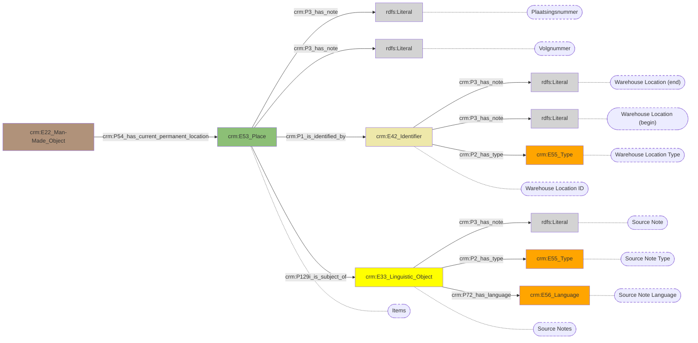

```mermaid
graph LR
f166cdf6-b053-11ec-b19f-9cf387da2c40["crm:E53_Place"]-->|"crm:P3_has_note"|f166d3aa-b053-11ec-b19f-9cf387da2c40(rdfs:Literal)
f166cdf6-b053-11ec-b19f-9cf387da2c40["crm:E53_Place"]-->|"crm:P3_has_note"|f166d6ac-b053-11ec-b19f-9cf387da2c40(rdfs:Literal)
f166d4e0-b053-11ec-b19f-9cf387da2c40["crm:E42_Identifier"]-->|"crm:P3_has_note"|f166d5d0-b053-11ec-b19f-9cf387da2c40(rdfs:Literal)
f166d4e0-b053-11ec-b19f-9cf387da2c40["crm:E42_Identifier"]-->|"crm:P3_has_note"|f166d77e-b053-11ec-b19f-9cf387da2c40(rdfs:Literal)
f166d92c-b053-11ec-b19f-9cf387da2c40["crm:E33_Linguistic_Object"]-->|"crm:P3_has_note"|f166db7a-b053-11ec-b19f-9cf387da2c40(rdfs:Literal)
d1dd96e0-a5fe-11ec-b19f-9cf387da2c40["crm:E22_Man-Made_Object"]-->|"crm:P54_has_current_permanent_location"|f166cdf6-b053-11ec-b19f-9cf387da2c40["crm:E53_Place"]
f166cdf6-b053-11ec-b19f-9cf387da2c40["crm:E53_Place"]-->|"crm:P1_is_identified_by"|f166d4e0-b053-11ec-b19f-9cf387da2c40["crm:E42_Identifier"]
f166cdf6-b053-11ec-b19f-9cf387da2c40["crm:E53_Place"]-->|"crm:P129i_is_subject_of"|f166d92c-b053-11ec-b19f-9cf387da2c40["crm:E33_Linguistic_Object"]
f166d4e0-b053-11ec-b19f-9cf387da2c40["crm:E42_Identifier"]-->|"crm:P2_has_type"|f166d9f4-b053-11ec-b19f-9cf387da2c40["crm:E55_Type"]
f166d92c-b053-11ec-b19f-9cf387da2c40["crm:E33_Linguistic_Object"]-->|"crm:P2_has_type"|f166dabc-b053-11ec-b19f-9cf387da2c40["crm:E55_Type"]
f166d92c-b053-11ec-b19f-9cf387da2c40["crm:E33_Linguistic_Object"]-->|"crm:P72_has_language"|f166d85a-b053-11ec-b19f-9cf387da2c40["crm:E56_Language"]
f166cdf6-b053-11ec-b19f-9cf387da2c40["crm:E53_Place"]-.-f166cdf6-b053-11ec-b19f-9cf387da2c40_s(["Items"])
f166d4e0-b053-11ec-b19f-9cf387da2c40["crm:E42_Identifier"]-.-f166d4e0-b053-11ec-b19f-9cf387da2c40_s(["Warehouse Location ID"])
f166d92c-b053-11ec-b19f-9cf387da2c40["crm:E33_Linguistic_Object"]-.-f166d92c-b053-11ec-b19f-9cf387da2c40_s(["Source Notes"])
f166d3aa-b053-11ec-b19f-9cf387da2c40["rdfs:Literal"]-.-f166d3aa-b053-11ec-b19f-9cf387da2c40_s(["Plaatsingsnummer"])
f166d6ac-b053-11ec-b19f-9cf387da2c40["rdfs:Literal"]-.-f166d6ac-b053-11ec-b19f-9cf387da2c40_s(["Volgnummer"])
f166d9f4-b053-11ec-b19f-9cf387da2c40["crm:E55_Type"]-.-f166d9f4-b053-11ec-b19f-9cf387da2c40_s(["Warehouse Location Type"])
f166d5d0-b053-11ec-b19f-9cf387da2c40["rdfs:Literal"]-.-f166d5d0-b053-11ec-b19f-9cf387da2c40_s(["Warehouse Location (end)"])
f166d77e-b053-11ec-b19f-9cf387da2c40["rdfs:Literal"]-.-f166d77e-b053-11ec-b19f-9cf387da2c40_s(["Warehouse Location (begin)"])
f166dabc-b053-11ec-b19f-9cf387da2c40["crm:E55_Type"]-.-f166dabc-b053-11ec-b19f-9cf387da2c40_s(["Source Note Type"])
f166db7a-b053-11ec-b19f-9cf387da2c40["rdfs:Literal"]-.-f166db7a-b053-11ec-b19f-9cf387da2c40_s(["Source Note"])
f166d85a-b053-11ec-b19f-9cf387da2c40["crm:E56_Language"]-.-f166d85a-b053-11ec-b19f-9cf387da2c40_s(["Source Note Language"])
style f166cdf6-b053-11ec-b19f-9cf387da2c40_s stroke-dasharray: 5
style f166d4e0-b053-11ec-b19f-9cf387da2c40_s stroke-dasharray: 5
style f166d92c-b053-11ec-b19f-9cf387da2c40_s stroke-dasharray: 5
style f166d3aa-b053-11ec-b19f-9cf387da2c40_s stroke-dasharray: 5
style f166d6ac-b053-11ec-b19f-9cf387da2c40_s stroke-dasharray: 5
style f166d9f4-b053-11ec-b19f-9cf387da2c40_s stroke-dasharray: 5
style f166d5d0-b053-11ec-b19f-9cf387da2c40_s stroke-dasharray: 5
style f166d77e-b053-11ec-b19f-9cf387da2c40_s stroke-dasharray: 5
style f166dabc-b053-11ec-b19f-9cf387da2c40_s stroke-dasharray: 5
style f166db7a-b053-11ec-b19f-9cf387da2c40_s stroke-dasharray: 5
style f166d85a-b053-11ec-b19f-9cf387da2c40_s stroke-dasharray: 5
style d1dd96e0-a5fe-11ec-b19f-9cf387da2c40 fill:#B0927A
style f166cdf6-b053-11ec-b19f-9cf387da2c40 fill:#8CBF76
style f166d3aa-b053-11ec-b19f-9cf387da2c40 fill:#D3D3D3
style f166d4e0-b053-11ec-b19f-9cf387da2c40 fill:#EEE8AA
style f166d5d0-b053-11ec-b19f-9cf387da2c40 fill:#D3D3D3
style f166d6ac-b053-11ec-b19f-9cf387da2c40 fill:#D3D3D3
style f166d77e-b053-11ec-b19f-9cf387da2c40 fill:#D3D3D3
style f166d85a-b053-11ec-b19f-9cf387da2c40 fill:#ffa500
style f166d92c-b053-11ec-b19f-9cf387da2c40 fill:#ffff00
style f166d9f4-b053-11ec-b19f-9cf387da2c40 fill:#ffa500
style f166dabc-b053-11ec-b19f-9cf387da2c40 fill:#ffa500
style f166db7a-b053-11ec-b19f-9cf387da2c40 fill:#D3D3D3
```
