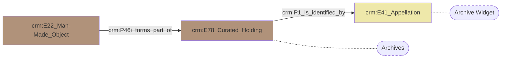

```mermaid
graph LR
d1dc46aa-a5fe-11ec-b19f-9cf387da2c40["crm:E78_Curated_Holding"]-->|"crm:P1_is_identified_by"|d1dd8b50-a5fe-11ec-b19f-9cf387da2c40["crm:E41_Appellation"]
d1dd96e0-a5fe-11ec-b19f-9cf387da2c40["crm:E22_Man-Made_Object"]-->|"crm:P46i_forms_part_of"|d1dc46aa-a5fe-11ec-b19f-9cf387da2c40["crm:E78_Curated_Holding"]
d1dd8b50-a5fe-11ec-b19f-9cf387da2c40["crm:E41_Appellation"]-.-d1dd8b50-a5fe-11ec-b19f-9cf387da2c40_s(["Archive Widget"])
d1dc46aa-a5fe-11ec-b19f-9cf387da2c40["crm:E78_Curated_Holding"]-.-d1dc46aa-a5fe-11ec-b19f-9cf387da2c40_s(["Archives"])
style d1dd8b50-a5fe-11ec-b19f-9cf387da2c40_s stroke-dasharray: 5
style d1dc46aa-a5fe-11ec-b19f-9cf387da2c40_s stroke-dasharray: 5
style d1dc46aa-a5fe-11ec-b19f-9cf387da2c40 fill:#B0927A
style d1dd8b50-a5fe-11ec-b19f-9cf387da2c40 fill:#EEE8AA
style d1dd96e0-a5fe-11ec-b19f-9cf387da2c40 fill:#B0927A
```
