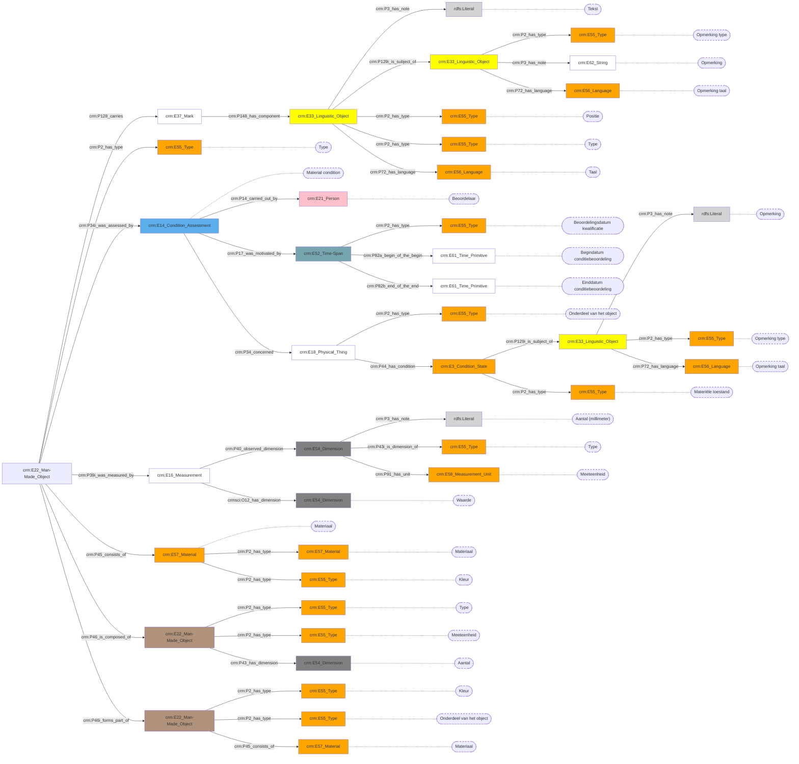

```mermaid
graph LR
2b3bdfe4-b054-11ec-b19f-9cf387da2c40["crm:E33_Linguistic_Object"]-->|"crm:P3_has_note"|2b3beafc-b054-11ec-b19f-9cf387da2c40(rdfs:Literal)
d1dccb84-a5fe-11ec-b19f-9cf387da2c40["crm:E54_Dimension"]-->|"crm:P3_has_note"|d1de38de-a5fe-11ec-b19f-9cf387da2c40(rdfs:Literal)
d1de1958-a5fe-11ec-b19f-9cf387da2c40["crm:E33_Linguistic_Object"]-->|"crm:P3_has_note"|d1de1b60-a5fe-11ec-b19f-9cf387da2c40(rdfs:Literal)
2b3beb9c-b054-11ec-b19f-9cf387da2c40["crm:E55_Type"]-.-2b3beb9c-b054-11ec-b19f-9cf387da2c40_s(["Positie"])
2b3bec46-b054-11ec-b19f-9cf387da2c40["crm:E55_Type"]-.-2b3bec46-b054-11ec-b19f-9cf387da2c40_s(["Type"])
2b3beafc-b054-11ec-b19f-9cf387da2c40["rdfs:Literal"]-.-2b3beafc-b054-11ec-b19f-9cf387da2c40_s(["Tekst"])
2b3bea52-b054-11ec-b19f-9cf387da2c40["crm:E56_Language"]-.-2b3bea52-b054-11ec-b19f-9cf387da2c40_s(["Taal"])
2b3be750-b054-11ec-b19f-9cf387da2c40["crm:E55_Type"]-.-2b3be750-b054-11ec-b19f-9cf387da2c40_s(["Opmerking type"])
2b3be8fe-b054-11ec-b19f-9cf387da2c40["crm:E62_String"]-.-2b3be8fe-b054-11ec-b19f-9cf387da2c40_s(["Opmerking"])
2b3be9a8-b054-11ec-b19f-9cf387da2c40["crm:E56_Language"]-.-2b3be9a8-b054-11ec-b19f-9cf387da2c40_s(["Opmerking taal"])
d1dd983e-a5fe-11ec-b19f-9cf387da2c40["crm:E21_Person"]-.-d1dd983e-a5fe-11ec-b19f-9cf387da2c40_s(["Beoordelaar"])
d1de12d2-a5fe-11ec-b19f-9cf387da2c40["crm:E57_Material"]-.-d1de12d2-a5fe-11ec-b19f-9cf387da2c40_s(["Materiaal"])
d1de1430-a5fe-11ec-b19f-9cf387da2c40["crm:E55_Type"]-.-d1de1430-a5fe-11ec-b19f-9cf387da2c40_s(["Kleur"])
d1de15a2-a5fe-11ec-b19f-9cf387da2c40["crm:E55_Type"]-.-d1de15a2-a5fe-11ec-b19f-9cf387da2c40_s(["Kleur"])
d1de2330-a5fe-11ec-b19f-9cf387da2c40["crm:E55_Type"]-.-d1de2330-a5fe-11ec-b19f-9cf387da2c40_s(["Onderdeel van het object"])
d1de1692-a5fe-11ec-b19f-9cf387da2c40["crm:E57_Material"]-.-d1de1692-a5fe-11ec-b19f-9cf387da2c40_s(["Materiaal"])
d1de38de-a5fe-11ec-b19f-9cf387da2c40["rdfs:Literal"]-.-d1de38de-a5fe-11ec-b19f-9cf387da2c40_s(["Aantal (millimeter)"])
d1de17fa-a5fe-11ec-b19f-9cf387da2c40["crm:E55_Type"]-.-d1de17fa-a5fe-11ec-b19f-9cf387da2c40_s(["Type"])
d1de1dc2-a5fe-11ec-b19f-9cf387da2c40["crm:E58_Measurement_Unit"]-.-d1de1dc2-a5fe-11ec-b19f-9cf387da2c40_s(["Meeteenheid"])
0a60de7c-abb9-11ec-b19f-9cf387da2c40["crm:E54_Dimension"]-.-0a60de7c-abb9-11ec-b19f-9cf387da2c40_s(["Waarde"])
d1dd91fe-a5fe-11ec-b19f-9cf387da2c40["crm:E55_Type"]-.-d1dd91fe-a5fe-11ec-b19f-9cf387da2c40_s(["Type"])
d1dd93ac-a5fe-11ec-b19f-9cf387da2c40["crm:E55_Type"]-.-d1dd93ac-a5fe-11ec-b19f-9cf387da2c40_s(["Meeteenheid"])
d1dd8df8-a5fe-11ec-b19f-9cf387da2c40["crm:E54_Dimension"]-.-d1dd8df8-a5fe-11ec-b19f-9cf387da2c40_s(["Aantal"])
d1dc9128-a5fe-11ec-b19f-9cf387da2c40["crm:E55_Type"]-.-d1dc9128-a5fe-11ec-b19f-9cf387da2c40_s(["Type"])
d1dcb0fe-a5fe-11ec-b19f-9cf387da2c40["crm:E14_Condition_Assessment"]-.-d1dcb0fe-a5fe-11ec-b19f-9cf387da2c40_s(["Material condition"])
d1dcbcb6-a5fe-11ec-b19f-9cf387da2c40["crm:E57_Material"]-.-d1dcbcb6-a5fe-11ec-b19f-9cf387da2c40_s(["Materiaal"])
d1de3028-a5fe-11ec-b19f-9cf387da2c40["crm:E55_Type"]-.-d1de3028-a5fe-11ec-b19f-9cf387da2c40_s(["Opmerking type"])
d1de1b60-a5fe-11ec-b19f-9cf387da2c40["rdfs:Literal"]-.-d1de1b60-a5fe-11ec-b19f-9cf387da2c40_s(["Opmerking"])
d1de1d18-a5fe-11ec-b19f-9cf387da2c40["crm:E56_Language"]-.-d1de1d18-a5fe-11ec-b19f-9cf387da2c40_s(["Opmerking taal"])
d1de1c78-a5fe-11ec-b19f-9cf387da2c40["crm:E55_Type"]-.-d1de1c78-a5fe-11ec-b19f-9cf387da2c40_s(["Onderdeel van het object"])
d1de1fc0-a5fe-11ec-b19f-9cf387da2c40["crm:E55_Type"]-.-d1de1fc0-a5fe-11ec-b19f-9cf387da2c40_s(["Materiële toestand"])
d1de379e-a5fe-11ec-b19f-9cf387da2c40["crm:E55_Type"]-.-d1de379e-a5fe-11ec-b19f-9cf387da2c40_s(["Beoordelingsdatum kwalificatie"])
d1de211e-a5fe-11ec-b19f-9cf387da2c40["crm:E61_Time_Primitive"]-.-d1de211e-a5fe-11ec-b19f-9cf387da2c40_s(["Begindatum conditiebeoordeling"])
d1de25b0-a5fe-11ec-b19f-9cf387da2c40["crm:E61_Time_Primitive"]-.-d1de25b0-a5fe-11ec-b19f-9cf387da2c40_s(["Einddatum conditiebeoordeling"])
style 2b3beb9c-b054-11ec-b19f-9cf387da2c40_s stroke-dasharray: 5
style 2b3bec46-b054-11ec-b19f-9cf387da2c40_s stroke-dasharray: 5
style 2b3beafc-b054-11ec-b19f-9cf387da2c40_s stroke-dasharray: 5
style 2b3bea52-b054-11ec-b19f-9cf387da2c40_s stroke-dasharray: 5
style 2b3be750-b054-11ec-b19f-9cf387da2c40_s stroke-dasharray: 5
style 2b3be8fe-b054-11ec-b19f-9cf387da2c40_s stroke-dasharray: 5
style 2b3be9a8-b054-11ec-b19f-9cf387da2c40_s stroke-dasharray: 5
style d1dd983e-a5fe-11ec-b19f-9cf387da2c40_s stroke-dasharray: 5
style d1de12d2-a5fe-11ec-b19f-9cf387da2c40_s stroke-dasharray: 5
style d1de1430-a5fe-11ec-b19f-9cf387da2c40_s stroke-dasharray: 5
style d1de15a2-a5fe-11ec-b19f-9cf387da2c40_s stroke-dasharray: 5
style d1de2330-a5fe-11ec-b19f-9cf387da2c40_s stroke-dasharray: 5
style d1de1692-a5fe-11ec-b19f-9cf387da2c40_s stroke-dasharray: 5
style d1de38de-a5fe-11ec-b19f-9cf387da2c40_s stroke-dasharray: 5
style d1de17fa-a5fe-11ec-b19f-9cf387da2c40_s stroke-dasharray: 5
style d1de1dc2-a5fe-11ec-b19f-9cf387da2c40_s stroke-dasharray: 5
style 0a60de7c-abb9-11ec-b19f-9cf387da2c40_s stroke-dasharray: 5
style d1dd91fe-a5fe-11ec-b19f-9cf387da2c40_s stroke-dasharray: 5
style d1dd93ac-a5fe-11ec-b19f-9cf387da2c40_s stroke-dasharray: 5
style d1dd8df8-a5fe-11ec-b19f-9cf387da2c40_s stroke-dasharray: 5
style d1dc9128-a5fe-11ec-b19f-9cf387da2c40_s stroke-dasharray: 5
style d1dcb0fe-a5fe-11ec-b19f-9cf387da2c40_s stroke-dasharray: 5
style d1dcbcb6-a5fe-11ec-b19f-9cf387da2c40_s stroke-dasharray: 5
style d1de3028-a5fe-11ec-b19f-9cf387da2c40_s stroke-dasharray: 5
style d1de1b60-a5fe-11ec-b19f-9cf387da2c40_s stroke-dasharray: 5
style d1de1d18-a5fe-11ec-b19f-9cf387da2c40_s stroke-dasharray: 5
style d1de1c78-a5fe-11ec-b19f-9cf387da2c40_s stroke-dasharray: 5
style d1de1fc0-a5fe-11ec-b19f-9cf387da2c40_s stroke-dasharray: 5
style d1de379e-a5fe-11ec-b19f-9cf387da2c40_s stroke-dasharray: 5
style d1de211e-a5fe-11ec-b19f-9cf387da2c40_s stroke-dasharray: 5
style d1de25b0-a5fe-11ec-b19f-9cf387da2c40_s stroke-dasharray: 5
2b3bdfe4-b054-11ec-b19f-9cf387da2c40["crm:E33_Linguistic_Object"]-->|"crm:P129i_is_subject_of"|2b3be840-b054-11ec-b19f-9cf387da2c40["crm:E33_Linguistic_Object"]
2b3bdfe4-b054-11ec-b19f-9cf387da2c40["crm:E33_Linguistic_Object"]-->|"crm:P2_has_type"|2b3beb9c-b054-11ec-b19f-9cf387da2c40["crm:E55_Type"]
2b3bdfe4-b054-11ec-b19f-9cf387da2c40["crm:E33_Linguistic_Object"]-->|"crm:P2_has_type"|2b3bec46-b054-11ec-b19f-9cf387da2c40["crm:E55_Type"]
2b3bdfe4-b054-11ec-b19f-9cf387da2c40["crm:E33_Linguistic_Object"]-->|"crm:P72_has_language"|2b3bea52-b054-11ec-b19f-9cf387da2c40["crm:E56_Language"]
2b3be49e-b054-11ec-b19f-9cf387da2c40["crm:E37_Mark"]-->|"crm:P148_has_component"|2b3bdfe4-b054-11ec-b19f-9cf387da2c40["crm:E33_Linguistic_Object"]
2b3be840-b054-11ec-b19f-9cf387da2c40["crm:E33_Linguistic_Object"]-->|"crm:P2_has_type"|2b3be750-b054-11ec-b19f-9cf387da2c40["crm:E55_Type"]
2b3be840-b054-11ec-b19f-9cf387da2c40["crm:E33_Linguistic_Object"]-->|"crm:P3_has_note"|2b3be8fe-b054-11ec-b19f-9cf387da2c40["crm:E62_String"]
2b3be840-b054-11ec-b19f-9cf387da2c40["crm:E33_Linguistic_Object"]-->|"crm:P72_has_language"|2b3be9a8-b054-11ec-b19f-9cf387da2c40["crm:E56_Language"]
d1dcb0fe-a5fe-11ec-b19f-9cf387da2c40["crm:E14_Condition_Assessment"]-->|"crm:P14_carried_out_by"|d1dd983e-a5fe-11ec-b19f-9cf387da2c40["crm:E21_Person"]
d1dcb0fe-a5fe-11ec-b19f-9cf387da2c40["crm:E14_Condition_Assessment"]-->|"crm:P17_was_motivated_by"|d1de317c-a5fe-11ec-b19f-9cf387da2c40["crm:E52_Time-Span"]
d1dcb0fe-a5fe-11ec-b19f-9cf387da2c40["crm:E14_Condition_Assessment"]-->|"crm:P34_concerned"|d1de2218-a5fe-11ec-b19f-9cf387da2c40["crm:E18_Physical_Thing"]
d1dcbcb6-a5fe-11ec-b19f-9cf387da2c40["crm:E57_Material"]-->|"crm:P2_has_type"|d1de12d2-a5fe-11ec-b19f-9cf387da2c40["crm:E57_Material"]
d1dcbcb6-a5fe-11ec-b19f-9cf387da2c40["crm:E57_Material"]-->|"crm:P2_has_type"|d1de1430-a5fe-11ec-b19f-9cf387da2c40["crm:E55_Type"]
d1dcc1ac-a5fe-11ec-b19f-9cf387da2c40["crm:E22_Man-Made_Object"]-->|"crm:P2_has_type"|d1de15a2-a5fe-11ec-b19f-9cf387da2c40["crm:E55_Type"]
d1dcc1ac-a5fe-11ec-b19f-9cf387da2c40["crm:E22_Man-Made_Object"]-->|"crm:P2_has_type"|d1de2330-a5fe-11ec-b19f-9cf387da2c40["crm:E55_Type"]
d1dcc1ac-a5fe-11ec-b19f-9cf387da2c40["crm:E22_Man-Made_Object"]-->|"crm:P45_consists_of"|d1de1692-a5fe-11ec-b19f-9cf387da2c40["crm:E57_Material"]
d1dccb84-a5fe-11ec-b19f-9cf387da2c40["crm:E54_Dimension"]-->|"crm:P43i_is_dimension_of"|d1de17fa-a5fe-11ec-b19f-9cf387da2c40["crm:E55_Type"]
d1dccb84-a5fe-11ec-b19f-9cf387da2c40["crm:E54_Dimension"]-->|"crm:P91_has_unit"|d1de1dc2-a5fe-11ec-b19f-9cf387da2c40["crm:E58_Measurement_Unit"]
d1dcd0b6-a5fe-11ec-b19f-9cf387da2c40["crm:E16_Measurement"]-->|"crm:P40_observed_dimension"|d1dccb84-a5fe-11ec-b19f-9cf387da2c40["crm:E54_Dimension"]
d1dcd0b6-a5fe-11ec-b19f-9cf387da2c40["crm:E16_Measurement"]-->|"crmsci:O12_has_dimension"|0a60de7c-abb9-11ec-b19f-9cf387da2c40["crm:E54_Dimension"]
d1dd2e4e-a5fe-11ec-b19f-9cf387da2c40["crm:E22_Man-Made_Object"]-->|"crm:P2_has_type"|d1dd91fe-a5fe-11ec-b19f-9cf387da2c40["crm:E55_Type"]
d1dd2e4e-a5fe-11ec-b19f-9cf387da2c40["crm:E22_Man-Made_Object"]-->|"crm:P2_has_type"|d1dd93ac-a5fe-11ec-b19f-9cf387da2c40["crm:E55_Type"]
d1dd2e4e-a5fe-11ec-b19f-9cf387da2c40["crm:E22_Man-Made_Object"]-->|"crm:P43_has_dimension"|d1dd8df8-a5fe-11ec-b19f-9cf387da2c40["crm:E54_Dimension"]
d1dd96e0-a5fe-11ec-b19f-9cf387da2c40["crm:E22_Man-Made_Object"]-->|"crm:P128_carries"|2b3be49e-b054-11ec-b19f-9cf387da2c40["crm:E37_Mark"]
d1dd96e0-a5fe-11ec-b19f-9cf387da2c40["crm:E22_Man-Made_Object"]-->|"crm:P2_has_type"|d1dc9128-a5fe-11ec-b19f-9cf387da2c40["crm:E55_Type"]
d1dd96e0-a5fe-11ec-b19f-9cf387da2c40["crm:E22_Man-Made_Object"]-->|"crm:P34i_was_assessed_by"|d1dcb0fe-a5fe-11ec-b19f-9cf387da2c40["crm:E14_Condition_Assessment"]
d1dd96e0-a5fe-11ec-b19f-9cf387da2c40["crm:E22_Man-Made_Object"]-->|"crm:P39i_was_measured_by"|d1dcd0b6-a5fe-11ec-b19f-9cf387da2c40["crm:E16_Measurement"]
d1dd96e0-a5fe-11ec-b19f-9cf387da2c40["crm:E22_Man-Made_Object"]-->|"crm:P45_consists_of"|d1dcbcb6-a5fe-11ec-b19f-9cf387da2c40["crm:E57_Material"]
d1dd96e0-a5fe-11ec-b19f-9cf387da2c40["crm:E22_Man-Made_Object"]-->|"crm:P46_is_composed_of"|d1dd2e4e-a5fe-11ec-b19f-9cf387da2c40["crm:E22_Man-Made_Object"]
d1dd96e0-a5fe-11ec-b19f-9cf387da2c40["crm:E22_Man-Made_Object"]-->|"crm:P46i_forms_part_of"|d1dcc1ac-a5fe-11ec-b19f-9cf387da2c40["crm:E22_Man-Made_Object"]
d1de1958-a5fe-11ec-b19f-9cf387da2c40["crm:E33_Linguistic_Object"]-->|"crm:P2_has_type"|d1de3028-a5fe-11ec-b19f-9cf387da2c40["crm:E55_Type"]
d1de1958-a5fe-11ec-b19f-9cf387da2c40["crm:E33_Linguistic_Object"]-->|"crm:P72_has_language"|d1de1d18-a5fe-11ec-b19f-9cf387da2c40["crm:E56_Language"]
d1de2218-a5fe-11ec-b19f-9cf387da2c40["crm:E18_Physical_Thing"]-->|"crm:P2_has_type"|d1de1c78-a5fe-11ec-b19f-9cf387da2c40["crm:E55_Type"]
d1de2218-a5fe-11ec-b19f-9cf387da2c40["crm:E18_Physical_Thing"]-->|"crm:P44_has_condition"|d1de26f0-a5fe-11ec-b19f-9cf387da2c40["crm:E3_Condition_State"]
d1de26f0-a5fe-11ec-b19f-9cf387da2c40["crm:E3_Condition_State"]-->|"crm:P129i_is_subject_of"|d1de1958-a5fe-11ec-b19f-9cf387da2c40["crm:E33_Linguistic_Object"]
d1de26f0-a5fe-11ec-b19f-9cf387da2c40["crm:E3_Condition_State"]-->|"crm:P2_has_type"|d1de1fc0-a5fe-11ec-b19f-9cf387da2c40["crm:E55_Type"]
d1de317c-a5fe-11ec-b19f-9cf387da2c40["crm:E52_Time-Span"]-->|"crm:P2_has_type"|d1de379e-a5fe-11ec-b19f-9cf387da2c40["crm:E55_Type"]
d1de317c-a5fe-11ec-b19f-9cf387da2c40["crm:E52_Time-Span"]-->|"crm:P82a_begin_of_the_begin"|d1de211e-a5fe-11ec-b19f-9cf387da2c40["crm:E61_Time_Primitive"]
d1de317c-a5fe-11ec-b19f-9cf387da2c40["crm:E52_Time-Span"]-->|"crm:P82b_end_of_the_end"|d1de25b0-a5fe-11ec-b19f-9cf387da2c40["crm:E61_Time_Primitive"]
style 0a60de7c-abb9-11ec-b19f-9cf387da2c40 fill:#808080
style 2b3bdfe4-b054-11ec-b19f-9cf387da2c40 fill:#ffff00
style 2b3be49e-b054-11ec-b19f-9cf387da2c40 fill:#ffffff
style 2b3be750-b054-11ec-b19f-9cf387da2c40 fill:#ffa500
style 2b3be840-b054-11ec-b19f-9cf387da2c40 fill:#ffff00
style 2b3be8fe-b054-11ec-b19f-9cf387da2c40 fill:#ffffff
style 2b3be9a8-b054-11ec-b19f-9cf387da2c40 fill:#ffa500
style 2b3bea52-b054-11ec-b19f-9cf387da2c40 fill:#ffa500
style 2b3beafc-b054-11ec-b19f-9cf387da2c40 fill:#D3D3D3
style 2b3beb9c-b054-11ec-b19f-9cf387da2c40 fill:#ffa500
style 2b3bec46-b054-11ec-b19f-9cf387da2c40 fill:#ffa500
style d1dc9128-a5fe-11ec-b19f-9cf387da2c40 fill:#ffa500
style d1dcb0fe-a5fe-11ec-b19f-9cf387da2c40 fill:#5DAEEC
style d1dcbcb6-a5fe-11ec-b19f-9cf387da2c40 fill:#ffa500
style d1dcc1ac-a5fe-11ec-b19f-9cf387da2c40 fill:#B0927A
style d1dccb84-a5fe-11ec-b19f-9cf387da2c40 fill:#808080
style d1dcd0b6-a5fe-11ec-b19f-9cf387da2c40 fill:#ffffff
style d1dd2e4e-a5fe-11ec-b19f-9cf387da2c40 fill:#B0927A
style d1dd8df8-a5fe-11ec-b19f-9cf387da2c40 fill:#808080
style d1dd91fe-a5fe-11ec-b19f-9cf387da2c40 fill:#ffa500
style d1dd93ac-a5fe-11ec-b19f-9cf387da2c40 fill:#ffa500
style d1dd983e-a5fe-11ec-b19f-9cf387da2c40 fill:#ffc0cb
style d1de12d2-a5fe-11ec-b19f-9cf387da2c40 fill:#ffa500
style d1de1430-a5fe-11ec-b19f-9cf387da2c40 fill:#ffa500
style d1de15a2-a5fe-11ec-b19f-9cf387da2c40 fill:#ffa500
style d1de1692-a5fe-11ec-b19f-9cf387da2c40 fill:#ffa500
style d1de17fa-a5fe-11ec-b19f-9cf387da2c40 fill:#ffa500
style d1de1958-a5fe-11ec-b19f-9cf387da2c40 fill:#ffff00
style d1de1b60-a5fe-11ec-b19f-9cf387da2c40 fill:#D3D3D3
style d1de1c78-a5fe-11ec-b19f-9cf387da2c40 fill:#ffa500
style d1de1d18-a5fe-11ec-b19f-9cf387da2c40 fill:#ffa500
style d1de1dc2-a5fe-11ec-b19f-9cf387da2c40 fill:#ffa500
style d1de1fc0-a5fe-11ec-b19f-9cf387da2c40 fill:#ffa500
style d1de211e-a5fe-11ec-b19f-9cf387da2c40 fill:#ffffff
style d1de2218-a5fe-11ec-b19f-9cf387da2c40 fill:#ffffff
style d1de2330-a5fe-11ec-b19f-9cf387da2c40 fill:#ffa500
style d1de25b0-a5fe-11ec-b19f-9cf387da2c40 fill:#ffffff
style d1de26f0-a5fe-11ec-b19f-9cf387da2c40 fill:#ffa500
style d1de3028-a5fe-11ec-b19f-9cf387da2c40 fill:#ffa500
style d1de317c-a5fe-11ec-b19f-9cf387da2c40 fill:#76A5AF
style d1de379e-a5fe-11ec-b19f-9cf387da2c40 fill:#ffa500
style d1de38de-a5fe-11ec-b19f-9cf387da2c40 fill:#D3D3D3
```
