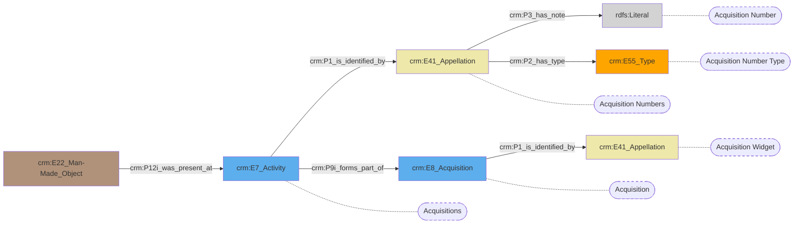

```mermaid
graph LR
3dd7317e-b4e3-11ec-9349-9cf387da2c40["crm:E41_Appellation"]-->|"crm:P3_has_note"|52db2ac6-b4e3-11ec-9349-9cf387da2c40(rdfs:Literal)
076d1fc2-b4e3-11ec-9349-9cf387da2c40["crm:E8_Acquisition"]-->|"crm:P1_is_identified_by"|1dcf1ebe-b4e3-11ec-9349-9cf387da2c40["crm:E41_Appellation"]
3dd7317e-b4e3-11ec-9349-9cf387da2c40["crm:E41_Appellation"]-->|"crm:P2_has_type"|6da8f02c-b4e3-11ec-9349-9cf387da2c40["crm:E55_Type"]
cb619fd0-b4e2-11ec-9349-9cf387da2c40["crm:E7_Activity"]-->|"crm:P1_is_identified_by"|3dd7317e-b4e3-11ec-9349-9cf387da2c40["crm:E41_Appellation"]
cb619fd0-b4e2-11ec-9349-9cf387da2c40["crm:E7_Activity"]-->|"crm:P9i_forms_part_of"|076d1fc2-b4e3-11ec-9349-9cf387da2c40["crm:E8_Acquisition"]
d1dd96e0-a5fe-11ec-b19f-9cf387da2c40["crm:E22_Man-Made_Object"]-->|"crm:P12i_was_present_at"|cb619fd0-b4e2-11ec-9349-9cf387da2c40["crm:E7_Activity"]
1dcf1ebe-b4e3-11ec-9349-9cf387da2c40["crm:E41_Appellation"]-.-1dcf1ebe-b4e3-11ec-9349-9cf387da2c40_s(["Acquisition Widget"])
6da8f02c-b4e3-11ec-9349-9cf387da2c40["crm:E55_Type"]-.-6da8f02c-b4e3-11ec-9349-9cf387da2c40_s(["Acquisition Number Type"])
52db2ac6-b4e3-11ec-9349-9cf387da2c40["rdfs:Literal"]-.-52db2ac6-b4e3-11ec-9349-9cf387da2c40_s(["Acquisition Number"])
3dd7317e-b4e3-11ec-9349-9cf387da2c40["crm:E41_Appellation"]-.-3dd7317e-b4e3-11ec-9349-9cf387da2c40_s(["Acquisition Numbers"])
076d1fc2-b4e3-11ec-9349-9cf387da2c40["crm:E8_Acquisition"]-.-076d1fc2-b4e3-11ec-9349-9cf387da2c40_s(["Acquisition"])
cb619fd0-b4e2-11ec-9349-9cf387da2c40["crm:E7_Activity"]-.-cb619fd0-b4e2-11ec-9349-9cf387da2c40_s(["Acquisitions"])
style 1dcf1ebe-b4e3-11ec-9349-9cf387da2c40_s stroke-dasharray: 5
style 6da8f02c-b4e3-11ec-9349-9cf387da2c40_s stroke-dasharray: 5
style 52db2ac6-b4e3-11ec-9349-9cf387da2c40_s stroke-dasharray: 5
style 3dd7317e-b4e3-11ec-9349-9cf387da2c40_s stroke-dasharray: 5
style 076d1fc2-b4e3-11ec-9349-9cf387da2c40_s stroke-dasharray: 5
style cb619fd0-b4e2-11ec-9349-9cf387da2c40_s stroke-dasharray: 5
style 076d1fc2-b4e3-11ec-9349-9cf387da2c40 fill:#5DAEEC
style 1dcf1ebe-b4e3-11ec-9349-9cf387da2c40 fill:#EEE8AA
style 3dd7317e-b4e3-11ec-9349-9cf387da2c40 fill:#EEE8AA
style 52db2ac6-b4e3-11ec-9349-9cf387da2c40 fill:#D3D3D3
style 6da8f02c-b4e3-11ec-9349-9cf387da2c40 fill:#ffa500
style cb619fd0-b4e2-11ec-9349-9cf387da2c40 fill:#5DAEEC
style d1dd96e0-a5fe-11ec-b19f-9cf387da2c40 fill:#B0927A
```
