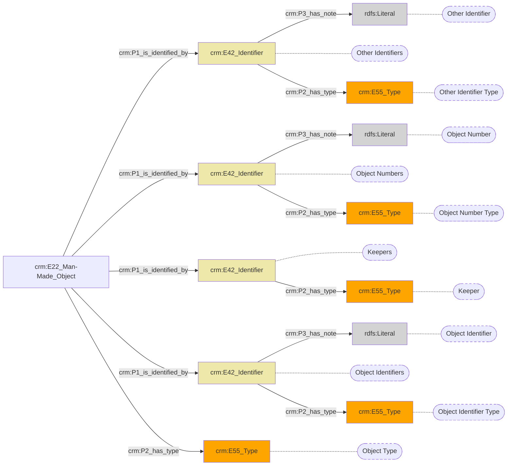

```mermaid
graph LR
d1dc33e0-a5fe-11ec-b19f-9cf387da2c40["crm:E42_Identifier"]-->|"crm:P3_has_note"|d1de206a-a5fe-11ec-b19f-9cf387da2c40(rdfs:Literal)
d1dc4bdc-a5fe-11ec-b19f-9cf387da2c40["crm:E42_Identifier"]-->|"crm:P3_has_note"|d1ddc232-a5fe-11ec-b19f-9cf387da2c40(rdfs:Literal)
d1dca05a-a5fe-11ec-b19f-9cf387da2c40["crm:E42_Identifier"]-->|"crm:P3_has_note"|d1de2e66-a5fe-11ec-b19f-9cf387da2c40(rdfs:Literal)
d1de32bc-a5fe-11ec-b19f-9cf387da2c40["crm:E55_Type"]-.-d1de32bc-a5fe-11ec-b19f-9cf387da2c40_s(["Other Identifier Type"])
d1de206a-a5fe-11ec-b19f-9cf387da2c40["rdfs:Literal"]-.-d1de206a-a5fe-11ec-b19f-9cf387da2c40_s(["Other Identifier"])
d1de1214-a5fe-11ec-b19f-9cf387da2c40["crm:E55_Type"]-.-d1de1214-a5fe-11ec-b19f-9cf387da2c40_s(["Object Number Type"])
d1ddc232-a5fe-11ec-b19f-9cf387da2c40["rdfs:Literal"]-.-d1ddc232-a5fe-11ec-b19f-9cf387da2c40_s(["Object Number"])
d1dd9000-a5fe-11ec-b19f-9cf387da2c40["crm:E55_Type"]-.-d1dd9000-a5fe-11ec-b19f-9cf387da2c40_s(["Keeper"])
d1de1ab6-a5fe-11ec-b19f-9cf387da2c40["crm:E55_Type"]-.-d1de1ab6-a5fe-11ec-b19f-9cf387da2c40_s(["Object Identifier Type"])
d1de2e66-a5fe-11ec-b19f-9cf387da2c40["rdfs:Literal"]-.-d1de2e66-a5fe-11ec-b19f-9cf387da2c40_s(["Object Identifier"])
d1dc33e0-a5fe-11ec-b19f-9cf387da2c40["crm:E42_Identifier"]-.-d1dc33e0-a5fe-11ec-b19f-9cf387da2c40_s(["Other Identifiers"])
d1dc4bdc-a5fe-11ec-b19f-9cf387da2c40["crm:E42_Identifier"]-.-d1dc4bdc-a5fe-11ec-b19f-9cf387da2c40_s(["Object Numbers"])
d1dc8570-a5fe-11ec-b19f-9cf387da2c40["crm:E42_Identifier"]-.-d1dc8570-a5fe-11ec-b19f-9cf387da2c40_s(["Keepers"])
d1dca05a-a5fe-11ec-b19f-9cf387da2c40["crm:E42_Identifier"]-.-d1dca05a-a5fe-11ec-b19f-9cf387da2c40_s(["Object Identifiers"])
d1dcb6c6-a5fe-11ec-b19f-9cf387da2c40["crm:E55_Type"]-.-d1dcb6c6-a5fe-11ec-b19f-9cf387da2c40_s(["Object Type"])
d1dc33e0-a5fe-11ec-b19f-9cf387da2c40["crm:E42_Identifier"]-->|"crm:P2_has_type"|d1de32bc-a5fe-11ec-b19f-9cf387da2c40["crm:E55_Type"]
d1dc4bdc-a5fe-11ec-b19f-9cf387da2c40["crm:E42_Identifier"]-->|"crm:P2_has_type"|d1de1214-a5fe-11ec-b19f-9cf387da2c40["crm:E55_Type"]
d1dc8570-a5fe-11ec-b19f-9cf387da2c40["crm:E42_Identifier"]-->|"crm:P2_has_type"|d1dd9000-a5fe-11ec-b19f-9cf387da2c40["crm:E55_Type"]
d1dca05a-a5fe-11ec-b19f-9cf387da2c40["crm:E42_Identifier"]-->|"crm:P2_has_type"|d1de1ab6-a5fe-11ec-b19f-9cf387da2c40["crm:E55_Type"]
d1dd96e0-a5fe-11ec-b19f-9cf387da2c40["crm:E22_Man-Made_Object"]-->|"crm:P1_is_identified_by"|d1dc33e0-a5fe-11ec-b19f-9cf387da2c40["crm:E42_Identifier"]
d1dd96e0-a5fe-11ec-b19f-9cf387da2c40["crm:E22_Man-Made_Object"]-->|"crm:P1_is_identified_by"|d1dc4bdc-a5fe-11ec-b19f-9cf387da2c40["crm:E42_Identifier"]
d1dd96e0-a5fe-11ec-b19f-9cf387da2c40["crm:E22_Man-Made_Object"]-->|"crm:P1_is_identified_by"|d1dc8570-a5fe-11ec-b19f-9cf387da2c40["crm:E42_Identifier"]
d1dd96e0-a5fe-11ec-b19f-9cf387da2c40["crm:E22_Man-Made_Object"]-->|"crm:P1_is_identified_by"|d1dca05a-a5fe-11ec-b19f-9cf387da2c40["crm:E42_Identifier"]
d1dd96e0-a5fe-11ec-b19f-9cf387da2c40["crm:E22_Man-Made_Object"]-->|"crm:P2_has_type"|d1dcb6c6-a5fe-11ec-b19f-9cf387da2c40["crm:E55_Type"]
style d1dc33e0-a5fe-11ec-b19f-9cf387da2c40 fill:#EEE8AA
style d1dc4bdc-a5fe-11ec-b19f-9cf387da2c40 fill:#EEE8AA
style d1dc8570-a5fe-11ec-b19f-9cf387da2c40 fill:#EEE8AA
style d1dca05a-a5fe-11ec-b19f-9cf387da2c40 fill:#EEE8AA
style d1dcb6c6-a5fe-11ec-b19f-9cf387da2c40 fill:#ffa500
style d1dd9000-a5fe-11ec-b19f-9cf387da2c40 fill:#ffa500
style d1ddc232-a5fe-11ec-b19f-9cf387da2c40 fill:#D3D3D3
style d1de1214-a5fe-11ec-b19f-9cf387da2c40 fill:#ffa500
style d1de1ab6-a5fe-11ec-b19f-9cf387da2c40 fill:#ffa500
style d1de206a-a5fe-11ec-b19f-9cf387da2c40 fill:#D3D3D3
style d1de2e66-a5fe-11ec-b19f-9cf387da2c40 fill:#D3D3D3
style d1de32bc-a5fe-11ec-b19f-9cf387da2c40 fill:#ffa500
style d1de32bc-a5fe-11ec-b19f-9cf387da2c40_s stroke-dasharray: 5
style d1de206a-a5fe-11ec-b19f-9cf387da2c40_s stroke-dasharray: 5
style d1de1214-a5fe-11ec-b19f-9cf387da2c40_s stroke-dasharray: 5
style d1ddc232-a5fe-11ec-b19f-9cf387da2c40_s stroke-dasharray: 5
style d1dd9000-a5fe-11ec-b19f-9cf387da2c40_s stroke-dasharray: 5
style d1de1ab6-a5fe-11ec-b19f-9cf387da2c40_s stroke-dasharray: 5
style d1de2e66-a5fe-11ec-b19f-9cf387da2c40_s stroke-dasharray: 5
style d1dc33e0-a5fe-11ec-b19f-9cf387da2c40_s stroke-dasharray: 5
style d1dc4bdc-a5fe-11ec-b19f-9cf387da2c40_s stroke-dasharray: 5
style d1dc8570-a5fe-11ec-b19f-9cf387da2c40_s stroke-dasharray: 5
style d1dca05a-a5fe-11ec-b19f-9cf387da2c40_s stroke-dasharray: 5
style d1dcb6c6-a5fe-11ec-b19f-9cf387da2c40_s stroke-dasharray: 5
```
