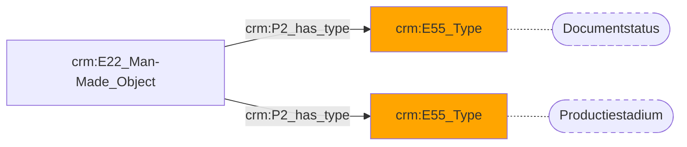

```mermaid
graph LR
d1dd3f56-a5fe-11ec-b19f-9cf387da2c40["crm:E55_Type"]-.-d1dd3f56-a5fe-11ec-b19f-9cf387da2c40_s(["Documentstatus"])
d1dd7caa-a5fe-11ec-b19f-9cf387da2c40["crm:E55_Type"]-.-d1dd7caa-a5fe-11ec-b19f-9cf387da2c40_s(["Productiestadium"])
style d1dd3f56-a5fe-11ec-b19f-9cf387da2c40_s stroke-dasharray: 5
style d1dd7caa-a5fe-11ec-b19f-9cf387da2c40_s stroke-dasharray: 5
d1dd96e0-a5fe-11ec-b19f-9cf387da2c40["crm:E22_Man-Made_Object"]-->|"crm:P2_has_type"|d1dd3f56-a5fe-11ec-b19f-9cf387da2c40["crm:E55_Type"]
d1dd96e0-a5fe-11ec-b19f-9cf387da2c40["crm:E22_Man-Made_Object"]-->|"crm:P2_has_type"|d1dd7caa-a5fe-11ec-b19f-9cf387da2c40["crm:E55_Type"]
style d1dd3f56-a5fe-11ec-b19f-9cf387da2c40 fill:#ffa500
style d1dd7caa-a5fe-11ec-b19f-9cf387da2c40 fill:#ffa500
```
