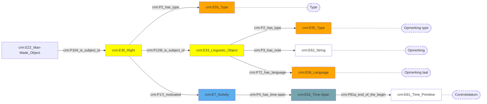

```mermaid
graph LR
d1ddd54c-a5fe-11ec-b19f-9cf387da2c40["crm:E55_Type"]-.-d1ddd54c-a5fe-11ec-b19f-9cf387da2c40_s(["Type"])
d1de0d5a-a5fe-11ec-b19f-9cf387da2c40["crm:E55_Type"]-.-d1de0d5a-a5fe-11ec-b19f-9cf387da2c40_s(["Opmerking type"])
d1de0e04-a5fe-11ec-b19f-9cf387da2c40["crm:E62_String"]-.-d1de0e04-a5fe-11ec-b19f-9cf387da2c40_s(["Opmerking"])
d1de0eae-a5fe-11ec-b19f-9cf387da2c40["crm:E56_Language"]-.-d1de0eae-a5fe-11ec-b19f-9cf387da2c40_s(["Opmerking taal"])
d1de0bfc-a5fe-11ec-b19f-9cf387da2c40["crm:E61_Time_Primitive"]-.-d1de0bfc-a5fe-11ec-b19f-9cf387da2c40_s(["Controledatum"])
style d1ddd54c-a5fe-11ec-b19f-9cf387da2c40_s stroke-dasharray: 5
style d1de0d5a-a5fe-11ec-b19f-9cf387da2c40_s stroke-dasharray: 5
style d1de0e04-a5fe-11ec-b19f-9cf387da2c40_s stroke-dasharray: 5
style d1de0eae-a5fe-11ec-b19f-9cf387da2c40_s stroke-dasharray: 5
style d1de0bfc-a5fe-11ec-b19f-9cf387da2c40_s stroke-dasharray: 5
d1dc50fa-a5fe-11ec-b19f-9cf387da2c40["crm:E30_Right"]-->|"crm:P129i_is_subject_of"|d1de0cba-a5fe-11ec-b19f-9cf387da2c40["crm:E33_Linguistic_Object"]
d1dc50fa-a5fe-11ec-b19f-9cf387da2c40["crm:E30_Right"]-->|"crm:P17i_motivated"|d1dd9e2e-a5fe-11ec-b19f-9cf387da2c40["crm:E7_Activity"]
d1dc50fa-a5fe-11ec-b19f-9cf387da2c40["crm:E30_Right"]-->|"crm:P2_has_type"|d1ddd54c-a5fe-11ec-b19f-9cf387da2c40["crm:E55_Type"]
d1dd96e0-a5fe-11ec-b19f-9cf387da2c40["crm:E22_Man-Made_Object"]-->|"crm:P104_is_subject_to"|d1dc50fa-a5fe-11ec-b19f-9cf387da2c40["crm:E30_Right"]
d1dd9e2e-a5fe-11ec-b19f-9cf387da2c40["crm:E7_Activity"]-->|"crm:P4_has_time-span"|d1de1386-a5fe-11ec-b19f-9cf387da2c40["crm:E52_Time-Span"]
d1de0cba-a5fe-11ec-b19f-9cf387da2c40["crm:E33_Linguistic_Object"]-->|"crm:P2_has_type"|d1de0d5a-a5fe-11ec-b19f-9cf387da2c40["crm:E55_Type"]
d1de0cba-a5fe-11ec-b19f-9cf387da2c40["crm:E33_Linguistic_Object"]-->|"crm:P3_has_note"|d1de0e04-a5fe-11ec-b19f-9cf387da2c40["crm:E62_String"]
d1de0cba-a5fe-11ec-b19f-9cf387da2c40["crm:E33_Linguistic_Object"]-->|"crm:P72_has_language"|d1de0eae-a5fe-11ec-b19f-9cf387da2c40["crm:E56_Language"]
d1de1386-a5fe-11ec-b19f-9cf387da2c40["crm:E52_Time-Span"]-->|"crm:P81a_end_of_the_begin"|d1de0bfc-a5fe-11ec-b19f-9cf387da2c40["crm:E61_Time_Primitive"]
style d1dc50fa-a5fe-11ec-b19f-9cf387da2c40 fill:#ffff00
style d1dd9e2e-a5fe-11ec-b19f-9cf387da2c40 fill:#5DAEEC
style d1ddd54c-a5fe-11ec-b19f-9cf387da2c40 fill:#ffa500
style d1de0bfc-a5fe-11ec-b19f-9cf387da2c40 fill:#ffffff
style d1de0cba-a5fe-11ec-b19f-9cf387da2c40 fill:#ffff00
style d1de0d5a-a5fe-11ec-b19f-9cf387da2c40 fill:#ffa500
style d1de0e04-a5fe-11ec-b19f-9cf387da2c40 fill:#ffffff
style d1de0eae-a5fe-11ec-b19f-9cf387da2c40 fill:#ffa500
style d1de1386-a5fe-11ec-b19f-9cf387da2c40 fill:#76A5AF
```
