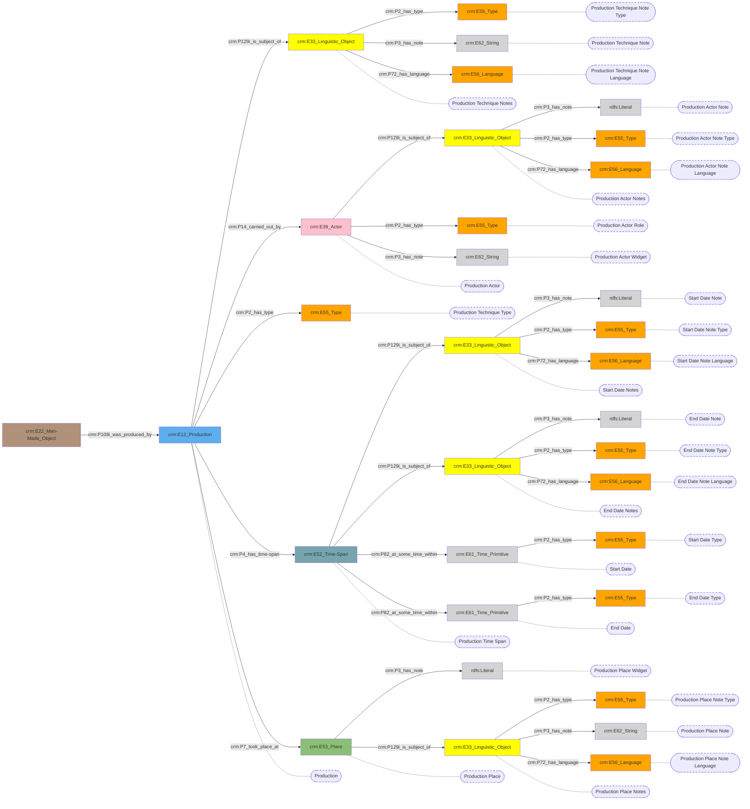

```mermaid
graph LR
d1dc5c58-a5fe-11ec-b19f-9cf387da2c40["crm:E53_Place"]-->|"crm:P3_has_note"|d1de033c-a5fe-11ec-b19f-9cf387da2c40(rdfs:Literal)
d1dde0dc-a5fe-11ec-b19f-9cf387da2c40["crm:E33_Linguistic_Object"]-->|"crm:P3_has_note"|d1de09ea-a5fe-11ec-b19f-9cf387da2c40(rdfs:Literal)
d1ddfdec-a5fe-11ec-b19f-9cf387da2c40["crm:E33_Linguistic_Object"]-->|"crm:P3_has_note"|d1ddfc66-a5fe-11ec-b19f-9cf387da2c40(rdfs:Literal)
d1de0940-a5fe-11ec-b19f-9cf387da2c40["crm:E33_Linguistic_Object"]-->|"crm:P3_has_note"|d1de062a-a5fe-11ec-b19f-9cf387da2c40(rdfs:Literal)
d1dc56d6-a5fe-11ec-b19f-9cf387da2c40["crm:E39_Actor"]-->|"crm:P129i_is_subject_of"|d1ddfdec-a5fe-11ec-b19f-9cf387da2c40["crm:E33_Linguistic_Object"]
d1dc56d6-a5fe-11ec-b19f-9cf387da2c40["crm:E39_Actor"]-->|"crm:P2_has_type"|d1ddfec8-a5fe-11ec-b19f-9cf387da2c40["crm:E55_Type"]
d1dc56d6-a5fe-11ec-b19f-9cf387da2c40["crm:E39_Actor"]-->|"crm:P3_has_note"|d1dde56e-a5fe-11ec-b19f-9cf387da2c40["crm:E62_String"]
d1dc5c58-a5fe-11ec-b19f-9cf387da2c40["crm:E53_Place"]-->|"crm:P129i_is_subject_of"|d1de0292-a5fe-11ec-b19f-9cf387da2c40["crm:E33_Linguistic_Object"]
d1dc61bc-a5fe-11ec-b19f-9cf387da2c40["crm:E33_Linguistic_Object"]-->|"crm:P2_has_type"|d1de03fa-a5fe-11ec-b19f-9cf387da2c40["crm:E55_Type"]
d1dc61bc-a5fe-11ec-b19f-9cf387da2c40["crm:E33_Linguistic_Object"]-->|"crm:P3_has_note"|d1de04b8-a5fe-11ec-b19f-9cf387da2c40["crm:E62_String"]
d1dc61bc-a5fe-11ec-b19f-9cf387da2c40["crm:E33_Linguistic_Object"]-->|"crm:P72_has_language"|d1de056c-a5fe-11ec-b19f-9cf387da2c40["crm:E56_Language"]
d1dc6e96-a5fe-11ec-b19f-9cf387da2c40["crm:E52_Time-Span"]-->|"crm:P129i_is_subject_of"|d1dde0dc-a5fe-11ec-b19f-9cf387da2c40["crm:E33_Linguistic_Object"]
d1dc6e96-a5fe-11ec-b19f-9cf387da2c40["crm:E52_Time-Span"]-->|"crm:P129i_is_subject_of"|d1de0940-a5fe-11ec-b19f-9cf387da2c40["crm:E33_Linguistic_Object"]
d1dc6e96-a5fe-11ec-b19f-9cf387da2c40["crm:E52_Time-Span"]-->|"crm:P82_at_some_time_within"|d1ddd934-a5fe-11ec-b19f-9cf387da2c40["crm:E61_Time_Primitive"]
d1dc6e96-a5fe-11ec-b19f-9cf387da2c40["crm:E52_Time-Span"]-->|"crm:P82_at_some_time_within"|d1de0a9e-a5fe-11ec-b19f-9cf387da2c40["crm:E61_Time_Primitive"]
d1dc742c-a5fe-11ec-b19f-9cf387da2c40["crm:E12_Production"]-->|"crm:P129i_is_subject_of"|d1dc61bc-a5fe-11ec-b19f-9cf387da2c40["crm:E33_Linguistic_Object"]
d1dc742c-a5fe-11ec-b19f-9cf387da2c40["crm:E12_Production"]-->|"crm:P14_carried_out_by"|d1dc56d6-a5fe-11ec-b19f-9cf387da2c40["crm:E39_Actor"]
d1dc742c-a5fe-11ec-b19f-9cf387da2c40["crm:E12_Production"]-->|"crm:P2_has_type"|d1dc68d8-a5fe-11ec-b19f-9cf387da2c40["crm:E55_Type"]
d1dc742c-a5fe-11ec-b19f-9cf387da2c40["crm:E12_Production"]-->|"crm:P4_has_time-span"|d1dc6e96-a5fe-11ec-b19f-9cf387da2c40["crm:E52_Time-Span"]
d1dc742c-a5fe-11ec-b19f-9cf387da2c40["crm:E12_Production"]-->|"crm:P7_took_place_at"|d1dc5c58-a5fe-11ec-b19f-9cf387da2c40["crm:E53_Place"]
d1dd96e0-a5fe-11ec-b19f-9cf387da2c40["crm:E22_Man-Made_Object"]-->|"crm:P108i_was_produced_by"|d1dc742c-a5fe-11ec-b19f-9cf387da2c40["crm:E12_Production"]
d1ddd934-a5fe-11ec-b19f-9cf387da2c40["crm:E61_Time_Primitive"]-->|"crm:P2_has_type"|d1de0896-a5fe-11ec-b19f-9cf387da2c40["crm:E55_Type"]
d1dde0dc-a5fe-11ec-b19f-9cf387da2c40["crm:E33_Linguistic_Object"]-->|"crm:P2_has_type"|d1dddc0e-a5fe-11ec-b19f-9cf387da2c40["crm:E55_Type"]
d1dde0dc-a5fe-11ec-b19f-9cf387da2c40["crm:E33_Linguistic_Object"]-->|"crm:P72_has_language"|d1de0b3e-a5fe-11ec-b19f-9cf387da2c40["crm:E56_Language"]
d1ddfdec-a5fe-11ec-b19f-9cf387da2c40["crm:E33_Linguistic_Object"]-->|"crm:P2_has_type"|d1ddff90-a5fe-11ec-b19f-9cf387da2c40["crm:E55_Type"]
d1ddfdec-a5fe-11ec-b19f-9cf387da2c40["crm:E33_Linguistic_Object"]-->|"crm:P72_has_language"|d1dde33e-a5fe-11ec-b19f-9cf387da2c40["crm:E56_Language"]
d1de0292-a5fe-11ec-b19f-9cf387da2c40["crm:E33_Linguistic_Object"]-->|"crm:P2_has_type"|d1de0120-a5fe-11ec-b19f-9cf387da2c40["crm:E55_Type"]
d1de0292-a5fe-11ec-b19f-9cf387da2c40["crm:E33_Linguistic_Object"]-->|"crm:P3_has_note"|d1de0058-a5fe-11ec-b19f-9cf387da2c40["crm:E62_String"]
d1de0292-a5fe-11ec-b19f-9cf387da2c40["crm:E33_Linguistic_Object"]-->|"crm:P72_has_language"|d1de01de-a5fe-11ec-b19f-9cf387da2c40["crm:E56_Language"]
d1de0940-a5fe-11ec-b19f-9cf387da2c40["crm:E33_Linguistic_Object"]-->|"crm:P2_has_type"|d1de074c-a5fe-11ec-b19f-9cf387da2c40["crm:E55_Type"]
d1de0940-a5fe-11ec-b19f-9cf387da2c40["crm:E33_Linguistic_Object"]-->|"crm:P72_has_language"|d1de07f6-a5fe-11ec-b19f-9cf387da2c40["crm:E56_Language"]
d1de0a9e-a5fe-11ec-b19f-9cf387da2c40["crm:E61_Time_Primitive"]-->|"crm:P2_has_type"|d1dddea2-a5fe-11ec-b19f-9cf387da2c40["crm:E55_Type"]
d1ddfdec-a5fe-11ec-b19f-9cf387da2c40["crm:E33_Linguistic_Object"]-.-d1ddfdec-a5fe-11ec-b19f-9cf387da2c40_s(["Production Actor Notes"])
d1ddfec8-a5fe-11ec-b19f-9cf387da2c40["crm:E55_Type"]-.-d1ddfec8-a5fe-11ec-b19f-9cf387da2c40_s(["Production Actor Role"])
d1dde56e-a5fe-11ec-b19f-9cf387da2c40["crm:E62_String"]-.-d1dde56e-a5fe-11ec-b19f-9cf387da2c40_s(["Production Actor Widget"])
d1de0292-a5fe-11ec-b19f-9cf387da2c40["crm:E33_Linguistic_Object"]-.-d1de0292-a5fe-11ec-b19f-9cf387da2c40_s(["Production Place Notes"])
d1de033c-a5fe-11ec-b19f-9cf387da2c40["rdfs:Literal"]-.-d1de033c-a5fe-11ec-b19f-9cf387da2c40_s(["Production Place Widget"])
d1de03fa-a5fe-11ec-b19f-9cf387da2c40["crm:E55_Type"]-.-d1de03fa-a5fe-11ec-b19f-9cf387da2c40_s(["Production Technique Note Type"])
d1de04b8-a5fe-11ec-b19f-9cf387da2c40["crm:E62_String"]-.-d1de04b8-a5fe-11ec-b19f-9cf387da2c40_s(["Production Technique Note"])
d1de056c-a5fe-11ec-b19f-9cf387da2c40["crm:E56_Language"]-.-d1de056c-a5fe-11ec-b19f-9cf387da2c40_s(["Production Technique Note Language"])
d1dde0dc-a5fe-11ec-b19f-9cf387da2c40["crm:E33_Linguistic_Object"]-.-d1dde0dc-a5fe-11ec-b19f-9cf387da2c40_s(["Start Date Notes"])
d1de0940-a5fe-11ec-b19f-9cf387da2c40["crm:E33_Linguistic_Object"]-.-d1de0940-a5fe-11ec-b19f-9cf387da2c40_s(["End Date Notes"])
d1ddd934-a5fe-11ec-b19f-9cf387da2c40["crm:E61_Time_Primitive"]-.-d1ddd934-a5fe-11ec-b19f-9cf387da2c40_s(["Start Date"])
d1de0a9e-a5fe-11ec-b19f-9cf387da2c40["crm:E61_Time_Primitive"]-.-d1de0a9e-a5fe-11ec-b19f-9cf387da2c40_s(["End Date"])
d1dc61bc-a5fe-11ec-b19f-9cf387da2c40["crm:E33_Linguistic_Object"]-.-d1dc61bc-a5fe-11ec-b19f-9cf387da2c40_s(["Production Technique Notes"])
d1dc56d6-a5fe-11ec-b19f-9cf387da2c40["crm:E39_Actor"]-.-d1dc56d6-a5fe-11ec-b19f-9cf387da2c40_s(["Production Actor"])
d1dc68d8-a5fe-11ec-b19f-9cf387da2c40["crm:E55_Type"]-.-d1dc68d8-a5fe-11ec-b19f-9cf387da2c40_s(["Production Technique Type"])
d1dc6e96-a5fe-11ec-b19f-9cf387da2c40["crm:E52_Time-Span"]-.-d1dc6e96-a5fe-11ec-b19f-9cf387da2c40_s(["Production Time Span"])
d1dc5c58-a5fe-11ec-b19f-9cf387da2c40["crm:E53_Place"]-.-d1dc5c58-a5fe-11ec-b19f-9cf387da2c40_s(["Production Place"])
d1dc742c-a5fe-11ec-b19f-9cf387da2c40["crm:E12_Production"]-.-d1dc742c-a5fe-11ec-b19f-9cf387da2c40_s(["Production"])
d1de0896-a5fe-11ec-b19f-9cf387da2c40["crm:E55_Type"]-.-d1de0896-a5fe-11ec-b19f-9cf387da2c40_s(["Start Date Type"])
d1dddc0e-a5fe-11ec-b19f-9cf387da2c40["crm:E55_Type"]-.-d1dddc0e-a5fe-11ec-b19f-9cf387da2c40_s(["Start Date Note Type"])
d1de09ea-a5fe-11ec-b19f-9cf387da2c40["rdfs:Literal"]-.-d1de09ea-a5fe-11ec-b19f-9cf387da2c40_s(["Start Date Note"])
d1de0b3e-a5fe-11ec-b19f-9cf387da2c40["crm:E56_Language"]-.-d1de0b3e-a5fe-11ec-b19f-9cf387da2c40_s(["Start Date Note Language"])
d1ddff90-a5fe-11ec-b19f-9cf387da2c40["crm:E55_Type"]-.-d1ddff90-a5fe-11ec-b19f-9cf387da2c40_s(["Production Actor Note Type"])
d1ddfc66-a5fe-11ec-b19f-9cf387da2c40["rdfs:Literal"]-.-d1ddfc66-a5fe-11ec-b19f-9cf387da2c40_s(["Production Actor Note"])
d1dde33e-a5fe-11ec-b19f-9cf387da2c40["crm:E56_Language"]-.-d1dde33e-a5fe-11ec-b19f-9cf387da2c40_s(["Production Actor Note Language"])
d1de0120-a5fe-11ec-b19f-9cf387da2c40["crm:E55_Type"]-.-d1de0120-a5fe-11ec-b19f-9cf387da2c40_s(["Production Place Note Type"])
d1de0058-a5fe-11ec-b19f-9cf387da2c40["crm:E62_String"]-.-d1de0058-a5fe-11ec-b19f-9cf387da2c40_s(["Production Place Note"])
d1de01de-a5fe-11ec-b19f-9cf387da2c40["crm:E56_Language"]-.-d1de01de-a5fe-11ec-b19f-9cf387da2c40_s(["Production Place Note Language"])
d1de074c-a5fe-11ec-b19f-9cf387da2c40["crm:E55_Type"]-.-d1de074c-a5fe-11ec-b19f-9cf387da2c40_s(["End Date Note Type"])
d1de062a-a5fe-11ec-b19f-9cf387da2c40["rdfs:Literal"]-.-d1de062a-a5fe-11ec-b19f-9cf387da2c40_s(["End Date Note"])
d1de07f6-a5fe-11ec-b19f-9cf387da2c40["crm:E56_Language"]-.-d1de07f6-a5fe-11ec-b19f-9cf387da2c40_s(["End Date Note Language"])
d1dddea2-a5fe-11ec-b19f-9cf387da2c40["crm:E55_Type"]-.-d1dddea2-a5fe-11ec-b19f-9cf387da2c40_s(["End Date Type"])
style d1ddfdec-a5fe-11ec-b19f-9cf387da2c40_s stroke-dasharray: 5
style d1ddfec8-a5fe-11ec-b19f-9cf387da2c40_s stroke-dasharray: 5
style d1dde56e-a5fe-11ec-b19f-9cf387da2c40_s stroke-dasharray: 5
style d1de0292-a5fe-11ec-b19f-9cf387da2c40_s stroke-dasharray: 5
style d1de033c-a5fe-11ec-b19f-9cf387da2c40_s stroke-dasharray: 5
style d1de03fa-a5fe-11ec-b19f-9cf387da2c40_s stroke-dasharray: 5
style d1de04b8-a5fe-11ec-b19f-9cf387da2c40_s stroke-dasharray: 5
style d1de056c-a5fe-11ec-b19f-9cf387da2c40_s stroke-dasharray: 5
style d1dde0dc-a5fe-11ec-b19f-9cf387da2c40_s stroke-dasharray: 5
style d1de0940-a5fe-11ec-b19f-9cf387da2c40_s stroke-dasharray: 5
style d1ddd934-a5fe-11ec-b19f-9cf387da2c40_s stroke-dasharray: 5
style d1de0a9e-a5fe-11ec-b19f-9cf387da2c40_s stroke-dasharray: 5
style d1dc61bc-a5fe-11ec-b19f-9cf387da2c40_s stroke-dasharray: 5
style d1dc56d6-a5fe-11ec-b19f-9cf387da2c40_s stroke-dasharray: 5
style d1dc68d8-a5fe-11ec-b19f-9cf387da2c40_s stroke-dasharray: 5
style d1dc6e96-a5fe-11ec-b19f-9cf387da2c40_s stroke-dasharray: 5
style d1dc5c58-a5fe-11ec-b19f-9cf387da2c40_s stroke-dasharray: 5
style d1dc742c-a5fe-11ec-b19f-9cf387da2c40_s stroke-dasharray: 5
style d1de0896-a5fe-11ec-b19f-9cf387da2c40_s stroke-dasharray: 5
style d1dddc0e-a5fe-11ec-b19f-9cf387da2c40_s stroke-dasharray: 5
style d1de09ea-a5fe-11ec-b19f-9cf387da2c40_s stroke-dasharray: 5
style d1de0b3e-a5fe-11ec-b19f-9cf387da2c40_s stroke-dasharray: 5
style d1ddff90-a5fe-11ec-b19f-9cf387da2c40_s stroke-dasharray: 5
style d1ddfc66-a5fe-11ec-b19f-9cf387da2c40_s stroke-dasharray: 5
style d1dde33e-a5fe-11ec-b19f-9cf387da2c40_s stroke-dasharray: 5
style d1de0120-a5fe-11ec-b19f-9cf387da2c40_s stroke-dasharray: 5
style d1de0058-a5fe-11ec-b19f-9cf387da2c40_s stroke-dasharray: 5
style d1de01de-a5fe-11ec-b19f-9cf387da2c40_s stroke-dasharray: 5
style d1de074c-a5fe-11ec-b19f-9cf387da2c40_s stroke-dasharray: 5
style d1de062a-a5fe-11ec-b19f-9cf387da2c40_s stroke-dasharray: 5
style d1de07f6-a5fe-11ec-b19f-9cf387da2c40_s stroke-dasharray: 5
style d1dddea2-a5fe-11ec-b19f-9cf387da2c40_s stroke-dasharray: 5
style d1dc56d6-a5fe-11ec-b19f-9cf387da2c40 fill:#ffc0cb
style d1dc5c58-a5fe-11ec-b19f-9cf387da2c40 fill:#8CBF76
style d1dc61bc-a5fe-11ec-b19f-9cf387da2c40 fill:#ffff00
style d1dc68d8-a5fe-11ec-b19f-9cf387da2c40 fill:#ffa500
style d1dc6e96-a5fe-11ec-b19f-9cf387da2c40 fill:#76A5AF
style d1dc742c-a5fe-11ec-b19f-9cf387da2c40 fill:#5DAEEC
style d1dd96e0-a5fe-11ec-b19f-9cf387da2c40 fill:#B0927A
style d1ddd934-a5fe-11ec-b19f-9cf387da2c40 fill:#D3D3D3
style d1dddc0e-a5fe-11ec-b19f-9cf387da2c40 fill:#ffa500
style d1dddea2-a5fe-11ec-b19f-9cf387da2c40 fill:#ffa500
style d1dde0dc-a5fe-11ec-b19f-9cf387da2c40 fill:#ffff00
style d1dde33e-a5fe-11ec-b19f-9cf387da2c40 fill:#ffa500
style d1dde56e-a5fe-11ec-b19f-9cf387da2c40 fill:#D3D3D3
style d1ddfc66-a5fe-11ec-b19f-9cf387da2c40 fill:#D3D3D3
style d1ddfdec-a5fe-11ec-b19f-9cf387da2c40 fill:#ffff00
style d1ddfec8-a5fe-11ec-b19f-9cf387da2c40 fill:#ffa500
style d1ddff90-a5fe-11ec-b19f-9cf387da2c40 fill:#ffa500
style d1de0058-a5fe-11ec-b19f-9cf387da2c40 fill:#D3D3D3
style d1de0120-a5fe-11ec-b19f-9cf387da2c40 fill:#ffa500
style d1de01de-a5fe-11ec-b19f-9cf387da2c40 fill:#ffa500
style d1de0292-a5fe-11ec-b19f-9cf387da2c40 fill:#ffff00
style d1de033c-a5fe-11ec-b19f-9cf387da2c40 fill:#D3D3D3
style d1de03fa-a5fe-11ec-b19f-9cf387da2c40 fill:#ffa500
style d1de04b8-a5fe-11ec-b19f-9cf387da2c40 fill:#D3D3D3
style d1de056c-a5fe-11ec-b19f-9cf387da2c40 fill:#ffa500
style d1de062a-a5fe-11ec-b19f-9cf387da2c40 fill:#D3D3D3
style d1de074c-a5fe-11ec-b19f-9cf387da2c40 fill:#ffa500
style d1de07f6-a5fe-11ec-b19f-9cf387da2c40 fill:#ffa500
style d1de0896-a5fe-11ec-b19f-9cf387da2c40 fill:#ffa500
style d1de0940-a5fe-11ec-b19f-9cf387da2c40 fill:#ffff00
style d1de09ea-a5fe-11ec-b19f-9cf387da2c40 fill:#D3D3D3
style d1de0a9e-a5fe-11ec-b19f-9cf387da2c40 fill:#D3D3D3
style d1de0b3e-a5fe-11ec-b19f-9cf387da2c40 fill:#ffa500
```
