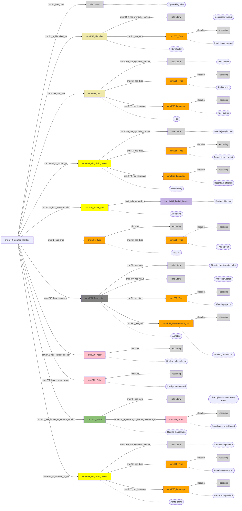

```mermaid
graph LR
3b2194d8-04fb-11ee-9497-96a6d2455259["crm:E39_Actor"]-->|"rdfs:label"|3b21a662-04fb-11ee-9497-96a6d2455259(xsd:string)
3b219744-04fb-11ee-9497-96a6d2455259["crm:E39_Actor"]-->|"rdfs:label"|3b21a6e4-04fb-11ee-9497-96a6d2455259(xsd:string)
3b2198de-04fb-11ee-9497-96a6d2455259["crm:E33_Linguistic_Object"]-->|"crm:P190_has_symbolic_content"|3b21a7d4-04fb-11ee-9497-96a6d2455259(rdfs:Literal)
3b219a8c-04fb-11ee-9497-96a6d2455259["crm:E53_Place"]-->|"crm:P3_has_note"|3b21a91e-04fb-11ee-9497-96a6d2455259(rdfs:Literal)
3b219c08-04fb-11ee-9497-96a6d2455259["crm:E54_Dimension"]-->|"crm:P3_has_note"|3b21ab62-04fb-11ee-9497-96a6d2455259(rdfs:Literal)
3b219c08-04fb-11ee-9497-96a6d2455259["crm:E54_Dimension"]-->|"crm:P90_has_value"|3b21aac2-04fb-11ee-9497-96a6d2455259(rdfs:Literal)
3b219d7a-04fb-11ee-9497-96a6d2455259["crm:E42_Identifier"]-->|"crm:P190_has_symbolic_content"|3b21ac02-04fb-11ee-9497-96a6d2455259(rdfs:Literal)
3b21a068-04fb-11ee-9497-96a6d2455259["crm:E35_Title"]-->|"crm:P190_has_symbolic_content"|3b21ade2-04fb-11ee-9497-96a6d2455259(rdfs:Literal)
3b21a1da-04fb-11ee-9497-96a6d2455259["crm:E55_Type"]-->|"rdfs:label"|3b21af22-04fb-11ee-9497-96a6d2455259(xsd:string)
3b21a34c-04fb-11ee-9497-96a6d2455259["crm:E33_Linguistic_Object"]-->|"crm:P190_has_symbolic_content"|3b21b012-04fb-11ee-9497-96a6d2455259(rdfs:Literal)
3b21a73e-04fb-11ee-9497-96a6d2455259["crm:E78_Curated_Holding"]-->|"crm:P3_has_note"|3b219eec-04fb-11ee-9497-96a6d2455259(rdfs:Literal)
3b21a82e-04fb-11ee-9497-96a6d2455259["crm:E55_Type"]-->|"rdfs:label"|3b21a784-04fb-11ee-9497-96a6d2455259(xsd:string)
3b21a87e-04fb-11ee-9497-96a6d2455259["crm:E56_Language"]-->|"rdfs:label"|3b21a8ce-04fb-11ee-9497-96a6d2455259(xsd:string)
3b21a978-04fb-11ee-9497-96a6d2455259["crm:E39_Actor"]-->|"rdfs:label"|3b21a9c8-04fb-11ee-9497-96a6d2455259(xsd:string)
3b21ab12-04fb-11ee-9497-96a6d2455259["crm:E58_Measurement_Unit"]-->|"rdfs:label"|3b21aa72-04fb-11ee-9497-96a6d2455259(xsd:string)
3b21abb2-04fb-11ee-9497-96a6d2455259["crm:E55_Type"]-->|"rdfs:label"|3b21aa22-04fb-11ee-9497-96a6d2455259(xsd:string)
3b21ac52-04fb-11ee-9497-96a6d2455259["crm:E55_Type"]-->|"rdfs:label"|3b21aca2-04fb-11ee-9497-96a6d2455259(xsd:string)
3b21acf2-04fb-11ee-9497-96a6d2455259["crm:E56_Language"]-->|"rdfs:label"|3b21ae32-04fb-11ee-9497-96a6d2455259(xsd:string)
3b21ad92-04fb-11ee-9497-96a6d2455259["crm:E55_Type"]-->|"rdfs:label"|3b21ad42-04fb-11ee-9497-96a6d2455259(xsd:string)
3b21ae82-04fb-11ee-9497-96a6d2455259["crm:E55_Type"]-->|"rdfs:label"|3b21aed2-04fb-11ee-9497-96a6d2455259(xsd:string)
3b21af72-04fb-11ee-9497-96a6d2455259["crm:E55_Type"]-->|"rdfs:label"|3b21b0bc-04fb-11ee-9497-96a6d2455259(xsd:string)
3b21afc2-04fb-11ee-9497-96a6d2455259["crm:E56_Language"]-->|"rdfs:label"|3b21b062-04fb-11ee-9497-96a6d2455259(xsd:string)
3b2198de-04fb-11ee-9497-96a6d2455259["crm:E33_Linguistic_Object"]-->|"crm:P2_has_type"|3b21a82e-04fb-11ee-9497-96a6d2455259["crm:E55_Type"]
3b2198de-04fb-11ee-9497-96a6d2455259["crm:E33_Linguistic_Object"]-->|"crm:P72_has_language"|3b21a87e-04fb-11ee-9497-96a6d2455259["crm:E56_Language"]
3b219a8c-04fb-11ee-9497-96a6d2455259["crm:E53_Place"]-->|"crm:P74i_is_current_or_former_residence_of"|3b21a978-04fb-11ee-9497-96a6d2455259["crm:E39_Actor"]
3b219c08-04fb-11ee-9497-96a6d2455259["crm:E54_Dimension"]-->|"crm:P2_has_type"|3b21abb2-04fb-11ee-9497-96a6d2455259["crm:E55_Type"]
3b219c08-04fb-11ee-9497-96a6d2455259["crm:E54_Dimension"]-->|"crm:P91_has_unit"|3b21ab12-04fb-11ee-9497-96a6d2455259["crm:E58_Measurement_Unit"]
3b219d7a-04fb-11ee-9497-96a6d2455259["crm:E42_Identifier"]-->|"crm:P2_has_type"|3b21ac52-04fb-11ee-9497-96a6d2455259["crm:E55_Type"]
3b21a068-04fb-11ee-9497-96a6d2455259["crm:E35_Title"]-->|"crm:P2_has_type"|3b21ad92-04fb-11ee-9497-96a6d2455259["crm:E55_Type"]
3b21a068-04fb-11ee-9497-96a6d2455259["crm:E35_Title"]-->|"crm:P72_has_language"|3b21acf2-04fb-11ee-9497-96a6d2455259["crm:E56_Language"]
3b21a1da-04fb-11ee-9497-96a6d2455259["crm:E55_Type"]-->|"crm:P2_has_type"|3b21ae82-04fb-11ee-9497-96a6d2455259["crm:E55_Type"]
3b21a34c-04fb-11ee-9497-96a6d2455259["crm:E33_Linguistic_Object"]-->|"crm:P2_has_type"|3b21af72-04fb-11ee-9497-96a6d2455259["crm:E55_Type"]
3b21a34c-04fb-11ee-9497-96a6d2455259["crm:E33_Linguistic_Object"]-->|"crm:P72_has_language"|3b21afc2-04fb-11ee-9497-96a6d2455259["crm:E56_Language"]
3b21a4e6-04fb-11ee-9497-96a6d2455259["crm:E36_Visual_Item"]-->|"la:digitally_carried_by"|3b21b10c-04fb-11ee-9497-96a6d2455259["crmdig:D1_Digital_Object"]
3b21a73e-04fb-11ee-9497-96a6d2455259["crm:E78_Curated_Holding"]-->|"crm:P1_is_identified_by"|3b219d7a-04fb-11ee-9497-96a6d2455259["crm:E42_Identifier"]
3b21a73e-04fb-11ee-9497-96a6d2455259["crm:E78_Curated_Holding"]-->|"crm:P102_has_title"|3b21a068-04fb-11ee-9497-96a6d2455259["crm:E35_Title"]
3b21a73e-04fb-11ee-9497-96a6d2455259["crm:E78_Curated_Holding"]-->|"crm:P129i_is_subject_of"|3b2198de-04fb-11ee-9497-96a6d2455259["crm:E33_Linguistic_Object"]
3b21a73e-04fb-11ee-9497-96a6d2455259["crm:E78_Curated_Holding"]-->|"crm:P138i_has_representation"|3b21a4e6-04fb-11ee-9497-96a6d2455259["crm:E36_Visual_Item"]
3b21a73e-04fb-11ee-9497-96a6d2455259["crm:E78_Curated_Holding"]-->|"crm:P2_has_type"|3b21a1da-04fb-11ee-9497-96a6d2455259["crm:E55_Type"]
3b21a73e-04fb-11ee-9497-96a6d2455259["crm:E78_Curated_Holding"]-->|"crm:P43_has_dimension"|3b219c08-04fb-11ee-9497-96a6d2455259["crm:E54_Dimension"]
3b21a73e-04fb-11ee-9497-96a6d2455259["crm:E78_Curated_Holding"]-->|"crm:P50_has_current_keeper"|3b2194d8-04fb-11ee-9497-96a6d2455259["crm:E39_Actor"]
3b21a73e-04fb-11ee-9497-96a6d2455259["crm:E78_Curated_Holding"]-->|"crm:P52_has_current_owner"|3b219744-04fb-11ee-9497-96a6d2455259["crm:E39_Actor"]
3b21a73e-04fb-11ee-9497-96a6d2455259["crm:E78_Curated_Holding"]-->|"crm:P53_has_former_or_current_location"|3b219a8c-04fb-11ee-9497-96a6d2455259["crm:E53_Place"]
3b21a73e-04fb-11ee-9497-96a6d2455259["crm:E78_Curated_Holding"]-->|"crm:P67i_is_referred_to_by"|3b21a34c-04fb-11ee-9497-96a6d2455259["crm:E33_Linguistic_Object"]
style 3b21a7d4-04fb-11ee-9497-96a6d2455259_s stroke-dasharray: 5
style 3b21a82e-04fb-11ee-9497-96a6d2455259_s stroke-dasharray: 5
style 3b21a87e-04fb-11ee-9497-96a6d2455259_s stroke-dasharray: 5
style 3b21a91e-04fb-11ee-9497-96a6d2455259_s stroke-dasharray: 5
style 3b21a978-04fb-11ee-9497-96a6d2455259_s stroke-dasharray: 5
style 3b21abb2-04fb-11ee-9497-96a6d2455259_s stroke-dasharray: 5
style 3b21ab62-04fb-11ee-9497-96a6d2455259_s stroke-dasharray: 5
style 3b21aac2-04fb-11ee-9497-96a6d2455259_s stroke-dasharray: 5
style 3b21ab12-04fb-11ee-9497-96a6d2455259_s stroke-dasharray: 5
style 3b21ac02-04fb-11ee-9497-96a6d2455259_s stroke-dasharray: 5
style 3b21ac52-04fb-11ee-9497-96a6d2455259_s stroke-dasharray: 5
style 3b21ade2-04fb-11ee-9497-96a6d2455259_s stroke-dasharray: 5
style 3b21ad92-04fb-11ee-9497-96a6d2455259_s stroke-dasharray: 5
style 3b21acf2-04fb-11ee-9497-96a6d2455259_s stroke-dasharray: 5
style 3b21ae82-04fb-11ee-9497-96a6d2455259_s stroke-dasharray: 5
style 3b21b012-04fb-11ee-9497-96a6d2455259_s stroke-dasharray: 5
style 3b21af72-04fb-11ee-9497-96a6d2455259_s stroke-dasharray: 5
style 3b21afc2-04fb-11ee-9497-96a6d2455259_s stroke-dasharray: 5
style 3b21b10c-04fb-11ee-9497-96a6d2455259_s stroke-dasharray: 5
style 3b219d7a-04fb-11ee-9497-96a6d2455259_s stroke-dasharray: 5
style 3b21a068-04fb-11ee-9497-96a6d2455259_s stroke-dasharray: 5
style 3b2198de-04fb-11ee-9497-96a6d2455259_s stroke-dasharray: 5
style 3b21a4e6-04fb-11ee-9497-96a6d2455259_s stroke-dasharray: 5
style 3b21a1da-04fb-11ee-9497-96a6d2455259_s stroke-dasharray: 5
style 3b219eec-04fb-11ee-9497-96a6d2455259_s stroke-dasharray: 5
style 3b219c08-04fb-11ee-9497-96a6d2455259_s stroke-dasharray: 5
style 3b2194d8-04fb-11ee-9497-96a6d2455259_s stroke-dasharray: 5
style 3b219744-04fb-11ee-9497-96a6d2455259_s stroke-dasharray: 5
style 3b219a8c-04fb-11ee-9497-96a6d2455259_s stroke-dasharray: 5
style 3b21a34c-04fb-11ee-9497-96a6d2455259_s stroke-dasharray: 5
3b21a7d4-04fb-11ee-9497-96a6d2455259["rdfs:Literal"]-.-3b21a7d4-04fb-11ee-9497-96a6d2455259_s(["Beschrijving inhoud"])
3b21a82e-04fb-11ee-9497-96a6d2455259["crm:E55_Type"]-.-3b21a82e-04fb-11ee-9497-96a6d2455259_s(["Beschrijving type uri"])
3b21a87e-04fb-11ee-9497-96a6d2455259["crm:E56_Language"]-.-3b21a87e-04fb-11ee-9497-96a6d2455259_s(["Beschrijving taal uri"])
3b21a91e-04fb-11ee-9497-96a6d2455259["rdfs:Literal"]-.-3b21a91e-04fb-11ee-9497-96a6d2455259_s(["Standplaats aantekening tekst"])
3b21a978-04fb-11ee-9497-96a6d2455259["crm:E39_Actor"]-.-3b21a978-04fb-11ee-9497-96a6d2455259_s(["Standplaats instelling uri"])
3b21abb2-04fb-11ee-9497-96a6d2455259["crm:E55_Type"]-.-3b21abb2-04fb-11ee-9497-96a6d2455259_s(["Afmeting type uri"])
3b21ab62-04fb-11ee-9497-96a6d2455259["rdfs:Literal"]-.-3b21ab62-04fb-11ee-9497-96a6d2455259_s(["Afmeting aantekening tekst"])
3b21aac2-04fb-11ee-9497-96a6d2455259["rdfs:Literal"]-.-3b21aac2-04fb-11ee-9497-96a6d2455259_s(["Afmeting waarde"])
3b21ab12-04fb-11ee-9497-96a6d2455259["crm:E58_Measurement_Unit"]-.-3b21ab12-04fb-11ee-9497-96a6d2455259_s(["Afmeting eenheid uri"])
3b21ac02-04fb-11ee-9497-96a6d2455259["rdfs:Literal"]-.-3b21ac02-04fb-11ee-9497-96a6d2455259_s(["Identificator inhoud"])
3b21ac52-04fb-11ee-9497-96a6d2455259["crm:E55_Type"]-.-3b21ac52-04fb-11ee-9497-96a6d2455259_s(["Identificator type uri"])
3b21ade2-04fb-11ee-9497-96a6d2455259["rdfs:Literal"]-.-3b21ade2-04fb-11ee-9497-96a6d2455259_s(["Titel inhoud"])
3b21ad92-04fb-11ee-9497-96a6d2455259["crm:E55_Type"]-.-3b21ad92-04fb-11ee-9497-96a6d2455259_s(["Titel type uri"])
3b21acf2-04fb-11ee-9497-96a6d2455259["crm:E56_Language"]-.-3b21acf2-04fb-11ee-9497-96a6d2455259_s(["Titel taal uri"])
3b21ae82-04fb-11ee-9497-96a6d2455259["crm:E55_Type"]-.-3b21ae82-04fb-11ee-9497-96a6d2455259_s(["Type type uri"])
3b21b012-04fb-11ee-9497-96a6d2455259["rdfs:Literal"]-.-3b21b012-04fb-11ee-9497-96a6d2455259_s(["Aantekening inhoud"])
3b21af72-04fb-11ee-9497-96a6d2455259["crm:E55_Type"]-.-3b21af72-04fb-11ee-9497-96a6d2455259_s(["Aantekening type uri"])
3b21afc2-04fb-11ee-9497-96a6d2455259["crm:E56_Language"]-.-3b21afc2-04fb-11ee-9497-96a6d2455259_s(["Aantekening taal uri"])
3b21b10c-04fb-11ee-9497-96a6d2455259["crmdig:D1_Digital_Object"]-.-3b21b10c-04fb-11ee-9497-96a6d2455259_s(["Digitaal object uri"])
3b219d7a-04fb-11ee-9497-96a6d2455259["crm:E42_Identifier"]-.-3b219d7a-04fb-11ee-9497-96a6d2455259_s(["Identificator"])
3b21a068-04fb-11ee-9497-96a6d2455259["crm:E35_Title"]-.-3b21a068-04fb-11ee-9497-96a6d2455259_s(["Titel"])
3b2198de-04fb-11ee-9497-96a6d2455259["crm:E33_Linguistic_Object"]-.-3b2198de-04fb-11ee-9497-96a6d2455259_s(["Beschrijving"])
3b21a4e6-04fb-11ee-9497-96a6d2455259["crm:E36_Visual_Item"]-.-3b21a4e6-04fb-11ee-9497-96a6d2455259_s(["Afbeelding"])
3b21a1da-04fb-11ee-9497-96a6d2455259["crm:E55_Type"]-.-3b21a1da-04fb-11ee-9497-96a6d2455259_s(["Type uri"])
3b219eec-04fb-11ee-9497-96a6d2455259["rdfs:Literal"]-.-3b219eec-04fb-11ee-9497-96a6d2455259_s(["Opmerking tekst"])
3b219c08-04fb-11ee-9497-96a6d2455259["crm:E54_Dimension"]-.-3b219c08-04fb-11ee-9497-96a6d2455259_s(["Afmeting"])
3b2194d8-04fb-11ee-9497-96a6d2455259["crm:E39_Actor"]-.-3b2194d8-04fb-11ee-9497-96a6d2455259_s(["Huidige beheerder uri"])
3b219744-04fb-11ee-9497-96a6d2455259["crm:E39_Actor"]-.-3b219744-04fb-11ee-9497-96a6d2455259_s(["Huidige eigenaar uri"])
3b219a8c-04fb-11ee-9497-96a6d2455259["crm:E53_Place"]-.-3b219a8c-04fb-11ee-9497-96a6d2455259_s(["Huidige standplaats"])
3b21a34c-04fb-11ee-9497-96a6d2455259["crm:E33_Linguistic_Object"]-.-3b21a34c-04fb-11ee-9497-96a6d2455259_s(["Aantekening"])
style 3b2194d8-04fb-11ee-9497-96a6d2455259 fill:#ffc0cb
style 3b219744-04fb-11ee-9497-96a6d2455259 fill:#ffc0cb
style 3b2198de-04fb-11ee-9497-96a6d2455259 fill:#ffff00
style 3b219a8c-04fb-11ee-9497-96a6d2455259 fill:#8CBF76
style 3b219c08-04fb-11ee-9497-96a6d2455259 fill:#808080
style 3b219d7a-04fb-11ee-9497-96a6d2455259 fill:#EEE8AA
style 3b219eec-04fb-11ee-9497-96a6d2455259 fill:#D3D3D3
style 3b21a068-04fb-11ee-9497-96a6d2455259 fill:#EEE8AA
style 3b21a1da-04fb-11ee-9497-96a6d2455259 fill:#ffa500
style 3b21a34c-04fb-11ee-9497-96a6d2455259 fill:#ffff00
style 3b21a4e6-04fb-11ee-9497-96a6d2455259 fill:#ffff00
style 3b21a662-04fb-11ee-9497-96a6d2455259 fill:#D3D3D3
style 3b21a6e4-04fb-11ee-9497-96a6d2455259 fill:#D3D3D3
style 3b21a784-04fb-11ee-9497-96a6d2455259 fill:#D3D3D3
style 3b21a7d4-04fb-11ee-9497-96a6d2455259 fill:#D3D3D3
style 3b21a82e-04fb-11ee-9497-96a6d2455259 fill:#ffa500
style 3b21a87e-04fb-11ee-9497-96a6d2455259 fill:#ffa500
style 3b21a8ce-04fb-11ee-9497-96a6d2455259 fill:#D3D3D3
style 3b21a91e-04fb-11ee-9497-96a6d2455259 fill:#D3D3D3
style 3b21a978-04fb-11ee-9497-96a6d2455259 fill:#ffc0cb
style 3b21a9c8-04fb-11ee-9497-96a6d2455259 fill:#D3D3D3
style 3b21aa22-04fb-11ee-9497-96a6d2455259 fill:#D3D3D3
style 3b21aa72-04fb-11ee-9497-96a6d2455259 fill:#D3D3D3
style 3b21aac2-04fb-11ee-9497-96a6d2455259 fill:#D3D3D3
style 3b21ab12-04fb-11ee-9497-96a6d2455259 fill:#ffa500
style 3b21ab62-04fb-11ee-9497-96a6d2455259 fill:#D3D3D3
style 3b21abb2-04fb-11ee-9497-96a6d2455259 fill:#ffa500
style 3b21ac02-04fb-11ee-9497-96a6d2455259 fill:#D3D3D3
style 3b21ac52-04fb-11ee-9497-96a6d2455259 fill:#ffa500
style 3b21aca2-04fb-11ee-9497-96a6d2455259 fill:#D3D3D3
style 3b21acf2-04fb-11ee-9497-96a6d2455259 fill:#ffa500
style 3b21ad42-04fb-11ee-9497-96a6d2455259 fill:#D3D3D3
style 3b21ad92-04fb-11ee-9497-96a6d2455259 fill:#ffa500
style 3b21ade2-04fb-11ee-9497-96a6d2455259 fill:#D3D3D3
style 3b21ae32-04fb-11ee-9497-96a6d2455259 fill:#D3D3D3
style 3b21ae82-04fb-11ee-9497-96a6d2455259 fill:#ffa500
style 3b21aed2-04fb-11ee-9497-96a6d2455259 fill:#D3D3D3
style 3b21af22-04fb-11ee-9497-96a6d2455259 fill:#D3D3D3
style 3b21af72-04fb-11ee-9497-96a6d2455259 fill:#ffa500
style 3b21afc2-04fb-11ee-9497-96a6d2455259 fill:#ffa500
style 3b21b012-04fb-11ee-9497-96a6d2455259 fill:#D3D3D3
style 3b21b062-04fb-11ee-9497-96a6d2455259 fill:#D3D3D3
style 3b21b0bc-04fb-11ee-9497-96a6d2455259 fill:#D3D3D3
style 3b21b10c-04fb-11ee-9497-96a6d2455259 fill:#C5B4E3
```
