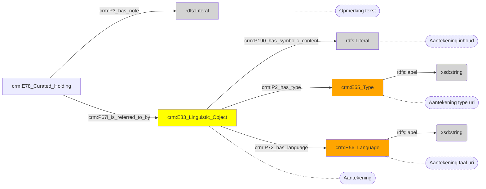

```mermaid
graph LR
3b21a34c-04fb-11ee-9497-96a6d2455259["crm:E33_Linguistic_Object"]-->|"crm:P190_has_symbolic_content"|3b21b012-04fb-11ee-9497-96a6d2455259(rdfs:Literal)
3b21a73e-04fb-11ee-9497-96a6d2455259["crm:E78_Curated_Holding"]-->|"crm:P3_has_note"|3b219eec-04fb-11ee-9497-96a6d2455259(rdfs:Literal)
3b21af72-04fb-11ee-9497-96a6d2455259["crm:E55_Type"]-->|"rdfs:label"|3b21b0bc-04fb-11ee-9497-96a6d2455259(xsd:string)
3b21afc2-04fb-11ee-9497-96a6d2455259["crm:E56_Language"]-->|"rdfs:label"|3b21b062-04fb-11ee-9497-96a6d2455259(xsd:string)
3b21a34c-04fb-11ee-9497-96a6d2455259["crm:E33_Linguistic_Object"]-->|"crm:P2_has_type"|3b21af72-04fb-11ee-9497-96a6d2455259["crm:E55_Type"]
3b21a34c-04fb-11ee-9497-96a6d2455259["crm:E33_Linguistic_Object"]-->|"crm:P72_has_language"|3b21afc2-04fb-11ee-9497-96a6d2455259["crm:E56_Language"]
3b21a73e-04fb-11ee-9497-96a6d2455259["crm:E78_Curated_Holding"]-->|"crm:P67i_is_referred_to_by"|3b21a34c-04fb-11ee-9497-96a6d2455259["crm:E33_Linguistic_Object"]
style 3b21b012-04fb-11ee-9497-96a6d2455259_s stroke-dasharray: 5
style 3b21af72-04fb-11ee-9497-96a6d2455259_s stroke-dasharray: 5
style 3b21afc2-04fb-11ee-9497-96a6d2455259_s stroke-dasharray: 5
style 3b219eec-04fb-11ee-9497-96a6d2455259_s stroke-dasharray: 5
style 3b21a34c-04fb-11ee-9497-96a6d2455259_s stroke-dasharray: 5
3b21b012-04fb-11ee-9497-96a6d2455259["rdfs:Literal"]-.-3b21b012-04fb-11ee-9497-96a6d2455259_s(["Aantekening inhoud"])
3b21af72-04fb-11ee-9497-96a6d2455259["crm:E55_Type"]-.-3b21af72-04fb-11ee-9497-96a6d2455259_s(["Aantekening type uri"])
3b21afc2-04fb-11ee-9497-96a6d2455259["crm:E56_Language"]-.-3b21afc2-04fb-11ee-9497-96a6d2455259_s(["Aantekening taal uri"])
3b219eec-04fb-11ee-9497-96a6d2455259["rdfs:Literal"]-.-3b219eec-04fb-11ee-9497-96a6d2455259_s(["Opmerking tekst"])
3b21a34c-04fb-11ee-9497-96a6d2455259["crm:E33_Linguistic_Object"]-.-3b21a34c-04fb-11ee-9497-96a6d2455259_s(["Aantekening"])
style 3b219eec-04fb-11ee-9497-96a6d2455259 fill:#D3D3D3
style 3b21a34c-04fb-11ee-9497-96a6d2455259 fill:#ffff00
style 3b21af72-04fb-11ee-9497-96a6d2455259 fill:#ffa500
style 3b21afc2-04fb-11ee-9497-96a6d2455259 fill:#ffa500
style 3b21b012-04fb-11ee-9497-96a6d2455259 fill:#D3D3D3
style 3b21b062-04fb-11ee-9497-96a6d2455259 fill:#D3D3D3
style 3b21b0bc-04fb-11ee-9497-96a6d2455259 fill:#D3D3D3
```
