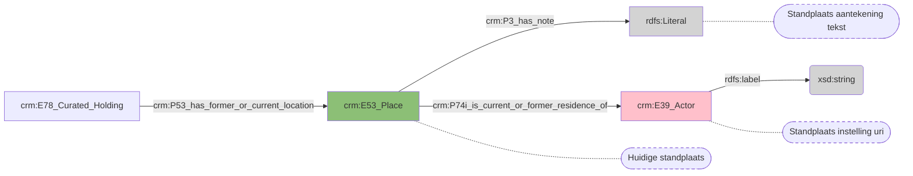

```mermaid
graph LR
3b219a8c-04fb-11ee-9497-96a6d2455259["crm:E53_Place"]-->|"crm:P3_has_note"|3b21a91e-04fb-11ee-9497-96a6d2455259(rdfs:Literal)
3b21a978-04fb-11ee-9497-96a6d2455259["crm:E39_Actor"]-->|"rdfs:label"|3b21a9c8-04fb-11ee-9497-96a6d2455259(xsd:string)
3b219a8c-04fb-11ee-9497-96a6d2455259["crm:E53_Place"]-->|"crm:P74i_is_current_or_former_residence_of"|3b21a978-04fb-11ee-9497-96a6d2455259["crm:E39_Actor"]
3b21a73e-04fb-11ee-9497-96a6d2455259["crm:E78_Curated_Holding"]-->|"crm:P53_has_former_or_current_location"|3b219a8c-04fb-11ee-9497-96a6d2455259["crm:E53_Place"]
style 3b21a91e-04fb-11ee-9497-96a6d2455259_s stroke-dasharray: 5
style 3b21a978-04fb-11ee-9497-96a6d2455259_s stroke-dasharray: 5
style 3b219a8c-04fb-11ee-9497-96a6d2455259_s stroke-dasharray: 5
3b21a91e-04fb-11ee-9497-96a6d2455259["rdfs:Literal"]-.-3b21a91e-04fb-11ee-9497-96a6d2455259_s(["Standplaats aantekening tekst"])
3b21a978-04fb-11ee-9497-96a6d2455259["crm:E39_Actor"]-.-3b21a978-04fb-11ee-9497-96a6d2455259_s(["Standplaats instelling uri"])
3b219a8c-04fb-11ee-9497-96a6d2455259["crm:E53_Place"]-.-3b219a8c-04fb-11ee-9497-96a6d2455259_s(["Huidige standplaats"])
style 3b219a8c-04fb-11ee-9497-96a6d2455259 fill:#8CBF76
style 3b21a91e-04fb-11ee-9497-96a6d2455259 fill:#D3D3D3
style 3b21a978-04fb-11ee-9497-96a6d2455259 fill:#ffc0cb
style 3b21a9c8-04fb-11ee-9497-96a6d2455259 fill:#D3D3D3
```
