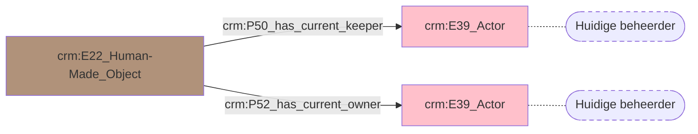

```mermaid
graph LR
style 116b550e-27f8-11ef-9309-960002548b4f fill:#ffc0cb
style 1fc1e45e-27f8-11ef-b550-960002548b4f fill:#ffc0cb
style f03920c2-27f7-11ef-8f92-960002548b4f fill:#B0927A
116b550e-27f8-11ef-9309-960002548b4f["crm:E39_Actor"]-.-116b550e-27f8-11ef-9309-960002548b4f_s(["Huidige beheerder"])
1fc1e45e-27f8-11ef-b550-960002548b4f["crm:E39_Actor"]-.-1fc1e45e-27f8-11ef-b550-960002548b4f_s(["Huidige beheerder"])
style 116b550e-27f8-11ef-9309-960002548b4f_s stroke-dasharray: 5
style 1fc1e45e-27f8-11ef-b550-960002548b4f_s stroke-dasharray: 5
f03920c2-27f7-11ef-8f92-960002548b4f["crm:E22_Human-Made_Object"]-->|"crm:P50_has_current_keeper"|116b550e-27f8-11ef-9309-960002548b4f["crm:E39_Actor"]
f03920c2-27f7-11ef-8f92-960002548b4f["crm:E22_Human-Made_Object"]-->|"crm:P52_has_current_owner"|1fc1e45e-27f8-11ef-b550-960002548b4f["crm:E39_Actor"]
```
