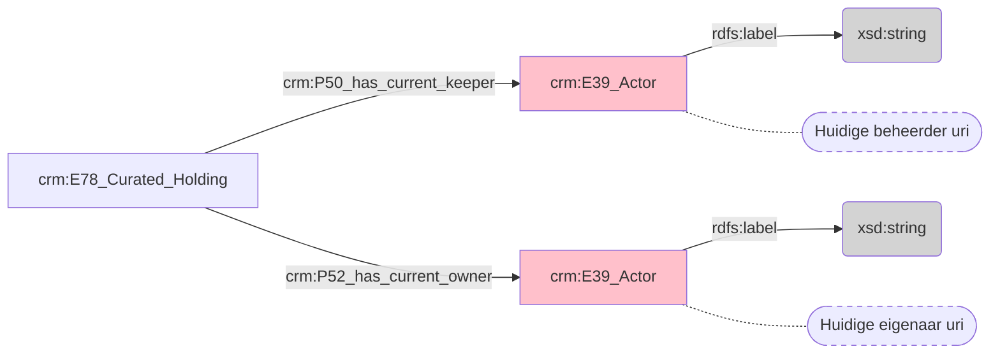

```mermaid
graph LR
3b2194d8-04fb-11ee-9497-96a6d2455259["crm:E39_Actor"]-->|"rdfs:label"|3b21a662-04fb-11ee-9497-96a6d2455259(xsd:string)
3b219744-04fb-11ee-9497-96a6d2455259["crm:E39_Actor"]-->|"rdfs:label"|3b21a6e4-04fb-11ee-9497-96a6d2455259(xsd:string)
3b21a73e-04fb-11ee-9497-96a6d2455259["crm:E78_Curated_Holding"]-->|"crm:P50_has_current_keeper"|3b2194d8-04fb-11ee-9497-96a6d2455259["crm:E39_Actor"]
3b21a73e-04fb-11ee-9497-96a6d2455259["crm:E78_Curated_Holding"]-->|"crm:P52_has_current_owner"|3b219744-04fb-11ee-9497-96a6d2455259["crm:E39_Actor"]
3b2194d8-04fb-11ee-9497-96a6d2455259["crm:E39_Actor"]-.-3b2194d8-04fb-11ee-9497-96a6d2455259_s(["Huidige beheerder uri"])
3b219744-04fb-11ee-9497-96a6d2455259["crm:E39_Actor"]-.-3b219744-04fb-11ee-9497-96a6d2455259_s(["Huidige eigenaar uri"])
style 3b2194d8-04fb-11ee-9497-96a6d2455259_s stroke-dasharray: 5
style 3b219744-04fb-11ee-9497-96a6d2455259_s stroke-dasharray: 5
style 3b2194d8-04fb-11ee-9497-96a6d2455259 fill:#ffc0cb
style 3b219744-04fb-11ee-9497-96a6d2455259 fill:#ffc0cb
style 3b21a662-04fb-11ee-9497-96a6d2455259 fill:#D3D3D3
style 3b21a6e4-04fb-11ee-9497-96a6d2455259 fill:#D3D3D3
```
