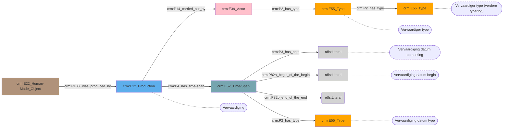

```mermaid
graph LR
style 62dfba21-27f9-11ef-91b5-960002548b4f fill:#5DAEEC
style 62dfbe11-27f9-11ef-881b-960002548b4f fill:#D3D3D3
style 62dfc214-27f9-11ef-b1fd-960002548b4f fill:#76A5AF
style 62dfc2f2-27f9-11ef-a9b3-960002548b4f fill:#D3D3D3
style 62dfc3cc-27f9-11ef-93ac-960002548b4f fill:#ffa500
style 62dfc577-27f9-11ef-9501-960002548b4f fill:#D3D3D3
style 8238ece3-27f9-11ef-9e3e-960002548b4f fill:#ffc0cb
style ac0d75af-27f9-11ef-8912-960002548b4f fill:#ffa500
style bd365bea-27f9-11ef-9484-960002548b4f fill:#ffa500
style f03920c2-27f7-11ef-8f92-960002548b4f fill:#B0927A
62dfc214-27f9-11ef-b1fd-960002548b4f["crm:E52_Time-Span"]-->|"crm:P3_has_note"|62dfc577-27f9-11ef-9501-960002548b4f(rdfs:Literal)
62dfc214-27f9-11ef-b1fd-960002548b4f["crm:E52_Time-Span"]-->|"crm:P82a_begin_of_the_begin"|62dfc2f2-27f9-11ef-a9b3-960002548b4f(rdfs:Literal)
62dfc214-27f9-11ef-b1fd-960002548b4f["crm:E52_Time-Span"]-->|"crm:P82b_end_of_the_end"|62dfbe11-27f9-11ef-881b-960002548b4f(rdfs:Literal)
62dfba21-27f9-11ef-91b5-960002548b4f["crm:E12_Production"]-->|"crm:P14_carried_out_by"|8238ece3-27f9-11ef-9e3e-960002548b4f["crm:E39_Actor"]
62dfba21-27f9-11ef-91b5-960002548b4f["crm:E12_Production"]-->|"crm:P4_has_time-span"|62dfc214-27f9-11ef-b1fd-960002548b4f["crm:E52_Time-Span"]
62dfc214-27f9-11ef-b1fd-960002548b4f["crm:E52_Time-Span"]-->|"crm:P2_has_type"|62dfc3cc-27f9-11ef-93ac-960002548b4f["crm:E55_Type"]
8238ece3-27f9-11ef-9e3e-960002548b4f["crm:E39_Actor"]-->|"crm:P2_has_type"|ac0d75af-27f9-11ef-8912-960002548b4f["crm:E55_Type"]
ac0d75af-27f9-11ef-8912-960002548b4f["crm:E55_Type"]-->|"crm:P2_has_type"|bd365bea-27f9-11ef-9484-960002548b4f["crm:E55_Type"]
f03920c2-27f7-11ef-8f92-960002548b4f["crm:E22_Human-Made_Object"]-->|"crm:P108i_was_produced_by"|62dfba21-27f9-11ef-91b5-960002548b4f["crm:E12_Production"]
style 62dfc3cc-27f9-11ef-93ac-960002548b4f_s stroke-dasharray: 5
style 62dfc577-27f9-11ef-9501-960002548b4f_s stroke-dasharray: 5
style 62dfc2f2-27f9-11ef-a9b3-960002548b4f_s stroke-dasharray: 5
style ac0d75af-27f9-11ef-8912-960002548b4f_s stroke-dasharray: 5
style bd365bea-27f9-11ef-9484-960002548b4f_s stroke-dasharray: 5
style 62dfba21-27f9-11ef-91b5-960002548b4f_s stroke-dasharray: 5
62dfc3cc-27f9-11ef-93ac-960002548b4f["crm:E55_Type"]-.-62dfc3cc-27f9-11ef-93ac-960002548b4f_s(["Vervaardiging datum type"])
62dfc577-27f9-11ef-9501-960002548b4f["rdfs:Literal"]-.-62dfc577-27f9-11ef-9501-960002548b4f_s(["Vervaardiging datum opmerking"])
62dfc2f2-27f9-11ef-a9b3-960002548b4f["rdfs:Literal"]-.-62dfc2f2-27f9-11ef-a9b3-960002548b4f_s(["Vervaardiging datum begin"])
ac0d75af-27f9-11ef-8912-960002548b4f["crm:E55_Type"]-.-ac0d75af-27f9-11ef-8912-960002548b4f_s(["Vervaardiger type"])
bd365bea-27f9-11ef-9484-960002548b4f["crm:E55_Type"]-.-bd365bea-27f9-11ef-9484-960002548b4f_s(["Vervaardiger type (verdere typering)"])
62dfba21-27f9-11ef-91b5-960002548b4f["crm:E12_Production"]-.-62dfba21-27f9-11ef-91b5-960002548b4f_s(["Vervaardiging"])
```
