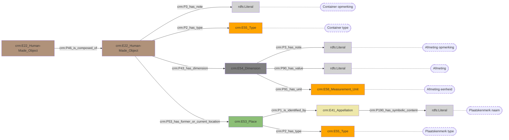

```mermaid
graph LR
style 80a1b22b-27f8-11ef-8728-960002548b4f fill:#B0927A
style 80a1b730-27f8-11ef-a4a6-960002548b4f fill:#ffa500
style 80a1ba44-27f8-11ef-9321-960002548b4f fill:#ffa500
style 80a1bb69-27f8-11ef-94fc-960002548b4f fill:#808080
style 80a1bc8c-27f8-11ef-9087-960002548b4f fill:#8CBF76
style 80a1becf-27f8-11ef-bb50-960002548b4f fill:#D3D3D3
style 80a1bfed-27f8-11ef-9cbe-960002548b4f fill:#EEE8AA
style 80a1c10e-27f8-11ef-9e19-960002548b4f fill:#D3D3D3
style 80a1c224-27f8-11ef-904b-960002548b4f fill:#ffa500
style 80a1c453-27f8-11ef-9a84-960002548b4f fill:#D3D3D3
style 80a1c565-27f8-11ef-ac98-960002548b4f fill:#D3D3D3
style f03920c2-27f7-11ef-8f92-960002548b4f fill:#B0927A
80a1b22b-27f8-11ef-8728-960002548b4f["crm:E22_Human-Made_Object"]-->|"crm:P3_has_note"|80a1c565-27f8-11ef-ac98-960002548b4f(rdfs:Literal)
80a1bb69-27f8-11ef-94fc-960002548b4f["crm:E54_Dimension"]-->|"crm:P3_has_note"|80a1becf-27f8-11ef-bb50-960002548b4f(rdfs:Literal)
80a1bb69-27f8-11ef-94fc-960002548b4f["crm:E54_Dimension"]-->|"crm:P90_has_value"|80a1c453-27f8-11ef-9a84-960002548b4f(rdfs:Literal)
80a1bfed-27f8-11ef-9cbe-960002548b4f["crm:E41_Appellation"]-->|"crm:P190_has_symbolic_content"|80a1c10e-27f8-11ef-9e19-960002548b4f(rdfs:Literal)
80a1b22b-27f8-11ef-8728-960002548b4f["crm:E22_Human-Made_Object"]-->|"crm:P2_has_type"|80a1b730-27f8-11ef-a4a6-960002548b4f["crm:E55_Type"]
80a1b22b-27f8-11ef-8728-960002548b4f["crm:E22_Human-Made_Object"]-->|"crm:P43_has_dimension"|80a1bb69-27f8-11ef-94fc-960002548b4f["crm:E54_Dimension"]
80a1b22b-27f8-11ef-8728-960002548b4f["crm:E22_Human-Made_Object"]-->|"crm:P53_has_former_or_current_location"|80a1bc8c-27f8-11ef-9087-960002548b4f["crm:E53_Place"]
80a1bb69-27f8-11ef-94fc-960002548b4f["crm:E54_Dimension"]-->|"crm:P91_has_unit"|80a1ba44-27f8-11ef-9321-960002548b4f["crm:E58_Measurement_Unit"]
80a1bc8c-27f8-11ef-9087-960002548b4f["crm:E53_Place"]-->|"crm:P1_is_identified_by"|80a1bfed-27f8-11ef-9cbe-960002548b4f["crm:E41_Appellation"]
80a1bc8c-27f8-11ef-9087-960002548b4f["crm:E53_Place"]-->|"crm:P2_has_type"|80a1c224-27f8-11ef-904b-960002548b4f["crm:E55_Type"]
f03920c2-27f7-11ef-8f92-960002548b4f["crm:E22_Human-Made_Object"]-->|"crm:P46_is_composed_of"|80a1b22b-27f8-11ef-8728-960002548b4f["crm:E22_Human-Made_Object"]
style 80a1b730-27f8-11ef-a4a6-960002548b4f_s stroke-dasharray: 5
style 80a1c565-27f8-11ef-ac98-960002548b4f_s stroke-dasharray: 5
style 80a1becf-27f8-11ef-bb50-960002548b4f_s stroke-dasharray: 5
style 80a1c453-27f8-11ef-9a84-960002548b4f_s stroke-dasharray: 5
style 80a1ba44-27f8-11ef-9321-960002548b4f_s stroke-dasharray: 5
style 80a1c224-27f8-11ef-904b-960002548b4f_s stroke-dasharray: 5
style 80a1c10e-27f8-11ef-9e19-960002548b4f_s stroke-dasharray: 5
80a1b730-27f8-11ef-a4a6-960002548b4f["crm:E55_Type"]-.-80a1b730-27f8-11ef-a4a6-960002548b4f_s(["Container type"])
80a1c565-27f8-11ef-ac98-960002548b4f["rdfs:Literal"]-.-80a1c565-27f8-11ef-ac98-960002548b4f_s(["Container opmerking"])
80a1becf-27f8-11ef-bb50-960002548b4f["rdfs:Literal"]-.-80a1becf-27f8-11ef-bb50-960002548b4f_s(["Afmeting opmerking"])
80a1c453-27f8-11ef-9a84-960002548b4f["rdfs:Literal"]-.-80a1c453-27f8-11ef-9a84-960002548b4f_s(["Afmeting"])
80a1ba44-27f8-11ef-9321-960002548b4f["crm:E58_Measurement_Unit"]-.-80a1ba44-27f8-11ef-9321-960002548b4f_s(["Afmeting eenheid"])
80a1c224-27f8-11ef-904b-960002548b4f["crm:E55_Type"]-.-80a1c224-27f8-11ef-904b-960002548b4f_s(["Plaatskenmerk type"])
80a1c10e-27f8-11ef-9e19-960002548b4f["rdfs:Literal"]-.-80a1c10e-27f8-11ef-9e19-960002548b4f_s(["Plaatskenmerk naam"])
```
