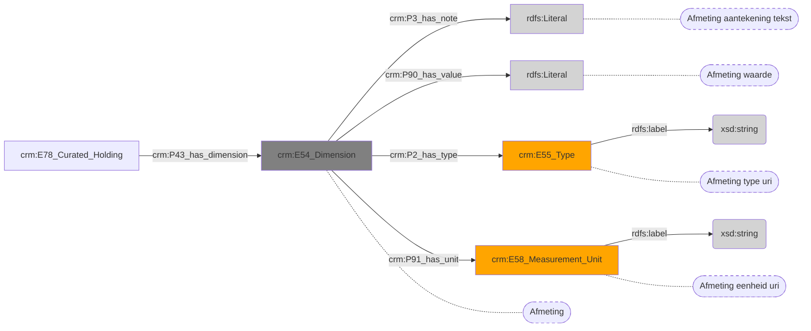

```mermaid
graph LR
3b219c08-04fb-11ee-9497-96a6d2455259["crm:E54_Dimension"]-->|"crm:P3_has_note"|3b21ab62-04fb-11ee-9497-96a6d2455259(rdfs:Literal)
3b219c08-04fb-11ee-9497-96a6d2455259["crm:E54_Dimension"]-->|"crm:P90_has_value"|3b21aac2-04fb-11ee-9497-96a6d2455259(rdfs:Literal)
3b21ab12-04fb-11ee-9497-96a6d2455259["crm:E58_Measurement_Unit"]-->|"rdfs:label"|3b21aa72-04fb-11ee-9497-96a6d2455259(xsd:string)
3b21abb2-04fb-11ee-9497-96a6d2455259["crm:E55_Type"]-->|"rdfs:label"|3b21aa22-04fb-11ee-9497-96a6d2455259(xsd:string)
3b219c08-04fb-11ee-9497-96a6d2455259["crm:E54_Dimension"]-->|"crm:P2_has_type"|3b21abb2-04fb-11ee-9497-96a6d2455259["crm:E55_Type"]
3b219c08-04fb-11ee-9497-96a6d2455259["crm:E54_Dimension"]-->|"crm:P91_has_unit"|3b21ab12-04fb-11ee-9497-96a6d2455259["crm:E58_Measurement_Unit"]
3b21a73e-04fb-11ee-9497-96a6d2455259["crm:E78_Curated_Holding"]-->|"crm:P43_has_dimension"|3b219c08-04fb-11ee-9497-96a6d2455259["crm:E54_Dimension"]
style 3b21abb2-04fb-11ee-9497-96a6d2455259_s stroke-dasharray: 5
style 3b21ab62-04fb-11ee-9497-96a6d2455259_s stroke-dasharray: 5
style 3b21aac2-04fb-11ee-9497-96a6d2455259_s stroke-dasharray: 5
style 3b21ab12-04fb-11ee-9497-96a6d2455259_s stroke-dasharray: 5
style 3b219c08-04fb-11ee-9497-96a6d2455259_s stroke-dasharray: 5
3b21abb2-04fb-11ee-9497-96a6d2455259["crm:E55_Type"]-.-3b21abb2-04fb-11ee-9497-96a6d2455259_s(["Afmeting type uri"])
3b21ab62-04fb-11ee-9497-96a6d2455259["rdfs:Literal"]-.-3b21ab62-04fb-11ee-9497-96a6d2455259_s(["Afmeting aantekening tekst"])
3b21aac2-04fb-11ee-9497-96a6d2455259["rdfs:Literal"]-.-3b21aac2-04fb-11ee-9497-96a6d2455259_s(["Afmeting waarde"])
3b21ab12-04fb-11ee-9497-96a6d2455259["crm:E58_Measurement_Unit"]-.-3b21ab12-04fb-11ee-9497-96a6d2455259_s(["Afmeting eenheid uri"])
3b219c08-04fb-11ee-9497-96a6d2455259["crm:E54_Dimension"]-.-3b219c08-04fb-11ee-9497-96a6d2455259_s(["Afmeting"])
style 3b219c08-04fb-11ee-9497-96a6d2455259 fill:#808080
style 3b21aa22-04fb-11ee-9497-96a6d2455259 fill:#D3D3D3
style 3b21aa72-04fb-11ee-9497-96a6d2455259 fill:#D3D3D3
style 3b21aac2-04fb-11ee-9497-96a6d2455259 fill:#D3D3D3
style 3b21ab12-04fb-11ee-9497-96a6d2455259 fill:#ffa500
style 3b21ab62-04fb-11ee-9497-96a6d2455259 fill:#D3D3D3
style 3b21abb2-04fb-11ee-9497-96a6d2455259 fill:#ffa500
```
