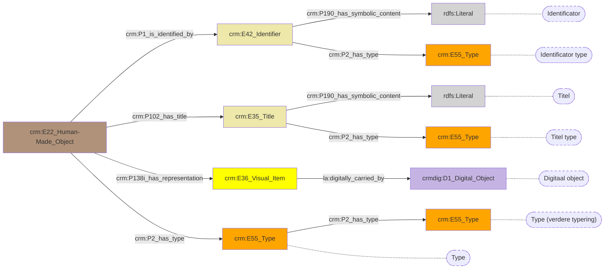

```mermaid
graph LR
style 11f54c3d-27fa-11ef-9d4a-960002548b4f fill:#ffa500
style 11f55040-27fa-11ef-b1b6-960002548b4f fill:#ffa500
style 3c6a4389-27fa-11ef-8dde-960002548b4f fill:#EEE8AA
style 3c6a4642-27fa-11ef-9cba-960002548b4f fill:#D3D3D3
style 3c6a46c4-27fa-11ef-a298-960002548b4f fill:#ffa500
style 4b5e7525-27f9-11ef-8a93-960002548b4f fill:#EEE8AA
style 4b5e7b75-27f9-11ef-bad6-960002548b4f fill:#ffa500
style 4b5e7f94-27f9-11ef-9ea7-960002548b4f fill:#D3D3D3
style bf6926f6-288b-11ef-b3a1-960002548b4f fill:#ffff00
style bf692c12-288b-11ef-9ed4-960002548b4f fill:#C5B4E3
style f03920c2-27f7-11ef-8f92-960002548b4f fill:#B0927A
3c6a4389-27fa-11ef-8dde-960002548b4f["crm:E42_Identifier"]-->|"crm:P190_has_symbolic_content"|3c6a4642-27fa-11ef-9cba-960002548b4f(rdfs:Literal)
4b5e7525-27f9-11ef-8a93-960002548b4f["crm:E35_Title"]-->|"crm:P190_has_symbolic_content"|4b5e7f94-27f9-11ef-9ea7-960002548b4f(rdfs:Literal)
11f54c3d-27fa-11ef-9d4a-960002548b4f["crm:E55_Type"]-->|"crm:P2_has_type"|11f55040-27fa-11ef-b1b6-960002548b4f["crm:E55_Type"]
3c6a4389-27fa-11ef-8dde-960002548b4f["crm:E42_Identifier"]-->|"crm:P2_has_type"|3c6a46c4-27fa-11ef-a298-960002548b4f["crm:E55_Type"]
4b5e7525-27f9-11ef-8a93-960002548b4f["crm:E35_Title"]-->|"crm:P2_has_type"|4b5e7b75-27f9-11ef-bad6-960002548b4f["crm:E55_Type"]
bf6926f6-288b-11ef-b3a1-960002548b4f["crm:E36_Visual_Item"]-->|"la:digitally_carried_by"|bf692c12-288b-11ef-9ed4-960002548b4f["crmdig:D1_Digital_Object"]
f03920c2-27f7-11ef-8f92-960002548b4f["crm:E22_Human-Made_Object"]-->|"crm:P1_is_identified_by"|3c6a4389-27fa-11ef-8dde-960002548b4f["crm:E42_Identifier"]
f03920c2-27f7-11ef-8f92-960002548b4f["crm:E22_Human-Made_Object"]-->|"crm:P102_has_title"|4b5e7525-27f9-11ef-8a93-960002548b4f["crm:E35_Title"]
f03920c2-27f7-11ef-8f92-960002548b4f["crm:E22_Human-Made_Object"]-->|"crm:P138i_has_representation"|bf6926f6-288b-11ef-b3a1-960002548b4f["crm:E36_Visual_Item"]
f03920c2-27f7-11ef-8f92-960002548b4f["crm:E22_Human-Made_Object"]-->|"crm:P2_has_type"|11f54c3d-27fa-11ef-9d4a-960002548b4f["crm:E55_Type"]
11f55040-27fa-11ef-b1b6-960002548b4f["crm:E55_Type"]-.-11f55040-27fa-11ef-b1b6-960002548b4f_s(["Type (verdere typering)"])
3c6a4642-27fa-11ef-9cba-960002548b4f["rdfs:Literal"]-.-3c6a4642-27fa-11ef-9cba-960002548b4f_s(["Identificator"])
3c6a46c4-27fa-11ef-a298-960002548b4f["crm:E55_Type"]-.-3c6a46c4-27fa-11ef-a298-960002548b4f_s(["Identificator type"])
4b5e7f94-27f9-11ef-9ea7-960002548b4f["rdfs:Literal"]-.-4b5e7f94-27f9-11ef-9ea7-960002548b4f_s(["Titel"])
4b5e7b75-27f9-11ef-bad6-960002548b4f["crm:E55_Type"]-.-4b5e7b75-27f9-11ef-bad6-960002548b4f_s(["Titel type"])
bf692c12-288b-11ef-9ed4-960002548b4f["crmdig:D1_Digital_Object"]-.-bf692c12-288b-11ef-9ed4-960002548b4f_s(["Digitaal object"])
11f54c3d-27fa-11ef-9d4a-960002548b4f["crm:E55_Type"]-.-11f54c3d-27fa-11ef-9d4a-960002548b4f_s(["Type"])
style 11f55040-27fa-11ef-b1b6-960002548b4f_s stroke-dasharray: 5
style 3c6a4642-27fa-11ef-9cba-960002548b4f_s stroke-dasharray: 5
style 3c6a46c4-27fa-11ef-a298-960002548b4f_s stroke-dasharray: 5
style 4b5e7f94-27f9-11ef-9ea7-960002548b4f_s stroke-dasharray: 5
style 4b5e7b75-27f9-11ef-bad6-960002548b4f_s stroke-dasharray: 5
style bf692c12-288b-11ef-9ed4-960002548b4f_s stroke-dasharray: 5
style 11f54c3d-27fa-11ef-9d4a-960002548b4f_s stroke-dasharray: 5
```
