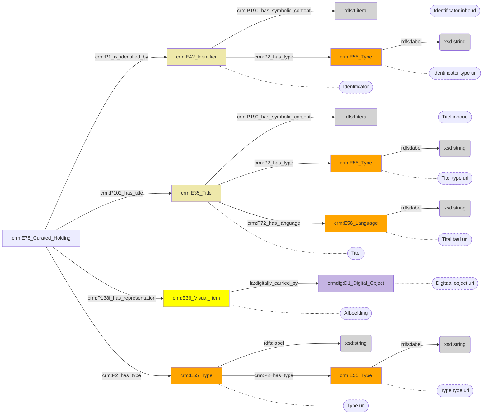

```mermaid
graph LR
3b219d7a-04fb-11ee-9497-96a6d2455259["crm:E42_Identifier"]-->|"crm:P190_has_symbolic_content"|3b21ac02-04fb-11ee-9497-96a6d2455259(rdfs:Literal)
3b21a068-04fb-11ee-9497-96a6d2455259["crm:E35_Title"]-->|"crm:P190_has_symbolic_content"|3b21ade2-04fb-11ee-9497-96a6d2455259(rdfs:Literal)
3b21a1da-04fb-11ee-9497-96a6d2455259["crm:E55_Type"]-->|"rdfs:label"|3b21af22-04fb-11ee-9497-96a6d2455259(xsd:string)
3b21ac52-04fb-11ee-9497-96a6d2455259["crm:E55_Type"]-->|"rdfs:label"|3b21aca2-04fb-11ee-9497-96a6d2455259(xsd:string)
3b21acf2-04fb-11ee-9497-96a6d2455259["crm:E56_Language"]-->|"rdfs:label"|3b21ae32-04fb-11ee-9497-96a6d2455259(xsd:string)
3b21ad92-04fb-11ee-9497-96a6d2455259["crm:E55_Type"]-->|"rdfs:label"|3b21ad42-04fb-11ee-9497-96a6d2455259(xsd:string)
3b21ae82-04fb-11ee-9497-96a6d2455259["crm:E55_Type"]-->|"rdfs:label"|3b21aed2-04fb-11ee-9497-96a6d2455259(xsd:string)
3b219d7a-04fb-11ee-9497-96a6d2455259["crm:E42_Identifier"]-->|"crm:P2_has_type"|3b21ac52-04fb-11ee-9497-96a6d2455259["crm:E55_Type"]
3b21a068-04fb-11ee-9497-96a6d2455259["crm:E35_Title"]-->|"crm:P2_has_type"|3b21ad92-04fb-11ee-9497-96a6d2455259["crm:E55_Type"]
3b21a068-04fb-11ee-9497-96a6d2455259["crm:E35_Title"]-->|"crm:P72_has_language"|3b21acf2-04fb-11ee-9497-96a6d2455259["crm:E56_Language"]
3b21a1da-04fb-11ee-9497-96a6d2455259["crm:E55_Type"]-->|"crm:P2_has_type"|3b21ae82-04fb-11ee-9497-96a6d2455259["crm:E55_Type"]
3b21a4e6-04fb-11ee-9497-96a6d2455259["crm:E36_Visual_Item"]-->|"la:digitally_carried_by"|3b21b10c-04fb-11ee-9497-96a6d2455259["crmdig:D1_Digital_Object"]
3b21a73e-04fb-11ee-9497-96a6d2455259["crm:E78_Curated_Holding"]-->|"crm:P1_is_identified_by"|3b219d7a-04fb-11ee-9497-96a6d2455259["crm:E42_Identifier"]
3b21a73e-04fb-11ee-9497-96a6d2455259["crm:E78_Curated_Holding"]-->|"crm:P102_has_title"|3b21a068-04fb-11ee-9497-96a6d2455259["crm:E35_Title"]
3b21a73e-04fb-11ee-9497-96a6d2455259["crm:E78_Curated_Holding"]-->|"crm:P138i_has_representation"|3b21a4e6-04fb-11ee-9497-96a6d2455259["crm:E36_Visual_Item"]
3b21a73e-04fb-11ee-9497-96a6d2455259["crm:E78_Curated_Holding"]-->|"crm:P2_has_type"|3b21a1da-04fb-11ee-9497-96a6d2455259["crm:E55_Type"]
3b21ac02-04fb-11ee-9497-96a6d2455259["rdfs:Literal"]-.-3b21ac02-04fb-11ee-9497-96a6d2455259_s(["Identificator inhoud"])
3b21ac52-04fb-11ee-9497-96a6d2455259["crm:E55_Type"]-.-3b21ac52-04fb-11ee-9497-96a6d2455259_s(["Identificator type uri"])
3b21ade2-04fb-11ee-9497-96a6d2455259["rdfs:Literal"]-.-3b21ade2-04fb-11ee-9497-96a6d2455259_s(["Titel inhoud"])
3b21ad92-04fb-11ee-9497-96a6d2455259["crm:E55_Type"]-.-3b21ad92-04fb-11ee-9497-96a6d2455259_s(["Titel type uri"])
3b21acf2-04fb-11ee-9497-96a6d2455259["crm:E56_Language"]-.-3b21acf2-04fb-11ee-9497-96a6d2455259_s(["Titel taal uri"])
3b21ae82-04fb-11ee-9497-96a6d2455259["crm:E55_Type"]-.-3b21ae82-04fb-11ee-9497-96a6d2455259_s(["Type type uri"])
3b21b10c-04fb-11ee-9497-96a6d2455259["crmdig:D1_Digital_Object"]-.-3b21b10c-04fb-11ee-9497-96a6d2455259_s(["Digitaal object uri"])
3b219d7a-04fb-11ee-9497-96a6d2455259["crm:E42_Identifier"]-.-3b219d7a-04fb-11ee-9497-96a6d2455259_s(["Identificator"])
3b21a068-04fb-11ee-9497-96a6d2455259["crm:E35_Title"]-.-3b21a068-04fb-11ee-9497-96a6d2455259_s(["Titel"])
3b21a4e6-04fb-11ee-9497-96a6d2455259["crm:E36_Visual_Item"]-.-3b21a4e6-04fb-11ee-9497-96a6d2455259_s(["Afbeelding"])
3b21a1da-04fb-11ee-9497-96a6d2455259["crm:E55_Type"]-.-3b21a1da-04fb-11ee-9497-96a6d2455259_s(["Type uri"])
style 3b21ac02-04fb-11ee-9497-96a6d2455259_s stroke-dasharray: 5
style 3b21ac52-04fb-11ee-9497-96a6d2455259_s stroke-dasharray: 5
style 3b21ade2-04fb-11ee-9497-96a6d2455259_s stroke-dasharray: 5
style 3b21ad92-04fb-11ee-9497-96a6d2455259_s stroke-dasharray: 5
style 3b21acf2-04fb-11ee-9497-96a6d2455259_s stroke-dasharray: 5
style 3b21ae82-04fb-11ee-9497-96a6d2455259_s stroke-dasharray: 5
style 3b21b10c-04fb-11ee-9497-96a6d2455259_s stroke-dasharray: 5
style 3b219d7a-04fb-11ee-9497-96a6d2455259_s stroke-dasharray: 5
style 3b21a068-04fb-11ee-9497-96a6d2455259_s stroke-dasharray: 5
style 3b21a4e6-04fb-11ee-9497-96a6d2455259_s stroke-dasharray: 5
style 3b21a1da-04fb-11ee-9497-96a6d2455259_s stroke-dasharray: 5
style 3b219d7a-04fb-11ee-9497-96a6d2455259 fill:#EEE8AA
style 3b21a068-04fb-11ee-9497-96a6d2455259 fill:#EEE8AA
style 3b21a1da-04fb-11ee-9497-96a6d2455259 fill:#ffa500
style 3b21a4e6-04fb-11ee-9497-96a6d2455259 fill:#ffff00
style 3b21ac02-04fb-11ee-9497-96a6d2455259 fill:#D3D3D3
style 3b21ac52-04fb-11ee-9497-96a6d2455259 fill:#ffa500
style 3b21aca2-04fb-11ee-9497-96a6d2455259 fill:#D3D3D3
style 3b21acf2-04fb-11ee-9497-96a6d2455259 fill:#ffa500
style 3b21ad42-04fb-11ee-9497-96a6d2455259 fill:#D3D3D3
style 3b21ad92-04fb-11ee-9497-96a6d2455259 fill:#ffa500
style 3b21ade2-04fb-11ee-9497-96a6d2455259 fill:#D3D3D3
style 3b21ae32-04fb-11ee-9497-96a6d2455259 fill:#D3D3D3
style 3b21ae82-04fb-11ee-9497-96a6d2455259 fill:#ffa500
style 3b21aed2-04fb-11ee-9497-96a6d2455259 fill:#D3D3D3
style 3b21af22-04fb-11ee-9497-96a6d2455259 fill:#D3D3D3
style 3b21b10c-04fb-11ee-9497-96a6d2455259 fill:#C5B4E3
```
