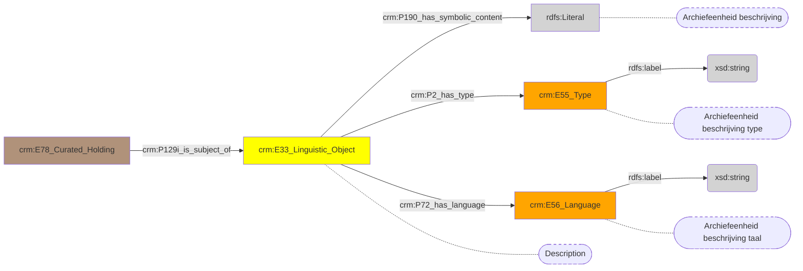

```mermaid
graph LR
3b2198de-04fb-11ee-9497-96a6d2455259["crm:E33_Linguistic_Object"]-->|"crm:P190_has_symbolic_content"|3b21a7d4-04fb-11ee-9497-96a6d2455259(rdfs:Literal)
3b21a82e-04fb-11ee-9497-96a6d2455259["crm:E55_Type"]-->|"rdfs:label"|3b21a784-04fb-11ee-9497-96a6d2455259(xsd:string)
3b21a87e-04fb-11ee-9497-96a6d2455259["crm:E56_Language"]-->|"rdfs:label"|3b21a8ce-04fb-11ee-9497-96a6d2455259(xsd:string)
3b2198de-04fb-11ee-9497-96a6d2455259["crm:E33_Linguistic_Object"]-->|"crm:P2_has_type"|3b21a82e-04fb-11ee-9497-96a6d2455259["crm:E55_Type"]
3b2198de-04fb-11ee-9497-96a6d2455259["crm:E33_Linguistic_Object"]-->|"crm:P72_has_language"|3b21a87e-04fb-11ee-9497-96a6d2455259["crm:E56_Language"]
3b21a73e-04fb-11ee-9497-96a6d2455259["crm:E78_Curated_Holding"]-->|"crm:P129i_is_subject_of"|3b2198de-04fb-11ee-9497-96a6d2455259["crm:E33_Linguistic_Object"]
3b21a7d4-04fb-11ee-9497-96a6d2455259["rdfs:Literal"]-.-3b21a7d4-04fb-11ee-9497-96a6d2455259_s(["Archiefeenheid beschrijving"])
3b21a82e-04fb-11ee-9497-96a6d2455259["crm:E55_Type"]-.-3b21a82e-04fb-11ee-9497-96a6d2455259_s(["Archiefeenheid beschrijving type"])
3b21a87e-04fb-11ee-9497-96a6d2455259["crm:E56_Language"]-.-3b21a87e-04fb-11ee-9497-96a6d2455259_s(["Archiefeenheid beschrijving taal"])
3b2198de-04fb-11ee-9497-96a6d2455259["crm:E33_Linguistic_Object"]-.-3b2198de-04fb-11ee-9497-96a6d2455259_s(["Description"])
style 3b21a7d4-04fb-11ee-9497-96a6d2455259_s stroke-dasharray: 5
style 3b21a82e-04fb-11ee-9497-96a6d2455259_s stroke-dasharray: 5
style 3b21a87e-04fb-11ee-9497-96a6d2455259_s stroke-dasharray: 5
style 3b2198de-04fb-11ee-9497-96a6d2455259_s stroke-dasharray: 5
style 3b2198de-04fb-11ee-9497-96a6d2455259 fill:#ffff00
style 3b21a73e-04fb-11ee-9497-96a6d2455259 fill:#B0927A
style 3b21a784-04fb-11ee-9497-96a6d2455259 fill:#D3D3D3
style 3b21a7d4-04fb-11ee-9497-96a6d2455259 fill:#D3D3D3
style 3b21a82e-04fb-11ee-9497-96a6d2455259 fill:#ffa500
style 3b21a87e-04fb-11ee-9497-96a6d2455259 fill:#ffa500
style 3b21a8ce-04fb-11ee-9497-96a6d2455259 fill:#D3D3D3
```
