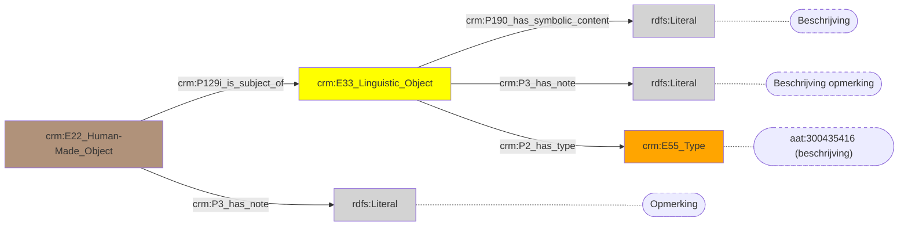

```mermaid
graph LR
style ea784bec-27fa-11ef-a1ae-960002548b4f fill:#D3D3D3
style f03920c2-27f7-11ef-8f92-960002548b4f fill:#B0927A
style fa393f01-27f9-11ef-95ef-960002548b4f fill:#ffff00
style fa394354-27f9-11ef-a5d3-960002548b4f fill:#D3D3D3
style fa3946a5-27f9-11ef-8575-960002548b4f fill:#D3D3D3
style fa3948ee-27f9-11ef-8067-960002548b4f fill:#ffa500
f03920c2-27f7-11ef-8f92-960002548b4f["crm:E22_Human-Made_Object"]-->|"crm:P3_has_note"|ea784bec-27fa-11ef-a1ae-960002548b4f(rdfs:Literal)
fa393f01-27f9-11ef-95ef-960002548b4f["crm:E33_Linguistic_Object"]-->|"crm:P190_has_symbolic_content"|fa3946a5-27f9-11ef-8575-960002548b4f(rdfs:Literal)
fa393f01-27f9-11ef-95ef-960002548b4f["crm:E33_Linguistic_Object"]-->|"crm:P3_has_note"|fa394354-27f9-11ef-a5d3-960002548b4f(rdfs:Literal)
f03920c2-27f7-11ef-8f92-960002548b4f["crm:E22_Human-Made_Object"]-->|"crm:P129i_is_subject_of"|fa393f01-27f9-11ef-95ef-960002548b4f["crm:E33_Linguistic_Object"]
fa393f01-27f9-11ef-95ef-960002548b4f["crm:E33_Linguistic_Object"]-->|"crm:P2_has_type"|fa3948ee-27f9-11ef-8067-960002548b4f["crm:E55_Type"]
ea784bec-27fa-11ef-a1ae-960002548b4f["rdfs:Literal"]-.-ea784bec-27fa-11ef-a1ae-960002548b4f_s(["Opmerking"])
fa3946a5-27f9-11ef-8575-960002548b4f["rdfs:Literal"]-.-fa3946a5-27f9-11ef-8575-960002548b4f_s(["Beschrijving"])
fa3948ee-27f9-11ef-8067-960002548b4f["crm:E55_Type"]-.-fa3948ee-27f9-11ef-8067-960002548b4f_s(["aat:300435416 (beschrijving)"])
fa394354-27f9-11ef-a5d3-960002548b4f["rdfs:Literal"]-.-fa394354-27f9-11ef-a5d3-960002548b4f_s(["Beschrijving opmerking"])
style ea784bec-27fa-11ef-a1ae-960002548b4f_s stroke-dasharray: 5
style fa3946a5-27f9-11ef-8575-960002548b4f_s stroke-dasharray: 5
style fa3948ee-27f9-11ef-8067-960002548b4f_s stroke-dasharray: 5
style fa394354-27f9-11ef-a5d3-960002548b4f_s stroke-dasharray: 5
```
