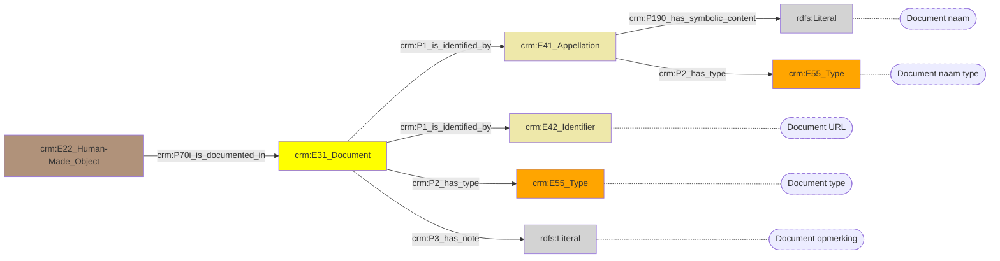

```mermaid
graph LR
style ec8425c5-27f9-11ef-a0a6-960002548b4f fill:#ffa500
style ec842a25-27f9-11ef-b340-960002548b4f fill:#ffa500
style ec842d55-27f9-11ef-a07a-960002548b4f fill:#EEE8AA
style ec84304d-27f9-11ef-a190-960002548b4f fill:#ffff00
style ec843319-27f9-11ef-be5e-960002548b4f fill:#D3D3D3
style ec843536-27f9-11ef-9f27-960002548b4f fill:#D3D3D3
style ec8436f9-27f9-11ef-baac-960002548b4f fill:#EEE8AA
style f03920c2-27f7-11ef-8f92-960002548b4f fill:#B0927A
ec842d55-27f9-11ef-a07a-960002548b4f["crm:E41_Appellation"]-->|"crm:P190_has_symbolic_content"|ec843319-27f9-11ef-be5e-960002548b4f(rdfs:Literal)
ec84304d-27f9-11ef-a190-960002548b4f["crm:E31_Document"]-->|"crm:P3_has_note"|ec843536-27f9-11ef-9f27-960002548b4f(rdfs:Literal)
style ec843319-27f9-11ef-be5e-960002548b4f_s stroke-dasharray: 5
style ec8425c5-27f9-11ef-a0a6-960002548b4f_s stroke-dasharray: 5
style ec8436f9-27f9-11ef-baac-960002548b4f_s stroke-dasharray: 5
style ec842a25-27f9-11ef-b340-960002548b4f_s stroke-dasharray: 5
style ec843536-27f9-11ef-9f27-960002548b4f_s stroke-dasharray: 5
ec843319-27f9-11ef-be5e-960002548b4f["rdfs:Literal"]-.-ec843319-27f9-11ef-be5e-960002548b4f_s(["Document naam"])
ec8425c5-27f9-11ef-a0a6-960002548b4f["crm:E55_Type"]-.-ec8425c5-27f9-11ef-a0a6-960002548b4f_s(["Document naam type"])
ec8436f9-27f9-11ef-baac-960002548b4f["crm:E42_Identifier"]-.-ec8436f9-27f9-11ef-baac-960002548b4f_s(["Document URL"])
ec842a25-27f9-11ef-b340-960002548b4f["crm:E55_Type"]-.-ec842a25-27f9-11ef-b340-960002548b4f_s(["Document type"])
ec843536-27f9-11ef-9f27-960002548b4f["rdfs:Literal"]-.-ec843536-27f9-11ef-9f27-960002548b4f_s(["Document opmerking"])
ec842d55-27f9-11ef-a07a-960002548b4f["crm:E41_Appellation"]-->|"crm:P2_has_type"|ec8425c5-27f9-11ef-a0a6-960002548b4f["crm:E55_Type"]
ec84304d-27f9-11ef-a190-960002548b4f["crm:E31_Document"]-->|"crm:P1_is_identified_by"|ec842d55-27f9-11ef-a07a-960002548b4f["crm:E41_Appellation"]
ec84304d-27f9-11ef-a190-960002548b4f["crm:E31_Document"]-->|"crm:P1_is_identified_by"|ec8436f9-27f9-11ef-baac-960002548b4f["crm:E42_Identifier"]
ec84304d-27f9-11ef-a190-960002548b4f["crm:E31_Document"]-->|"crm:P2_has_type"|ec842a25-27f9-11ef-b340-960002548b4f["crm:E55_Type"]
f03920c2-27f7-11ef-8f92-960002548b4f["crm:E22_Human-Made_Object"]-->|"crm:P70i_is_documented_in"|ec84304d-27f9-11ef-a190-960002548b4f["crm:E31_Document"]
```
