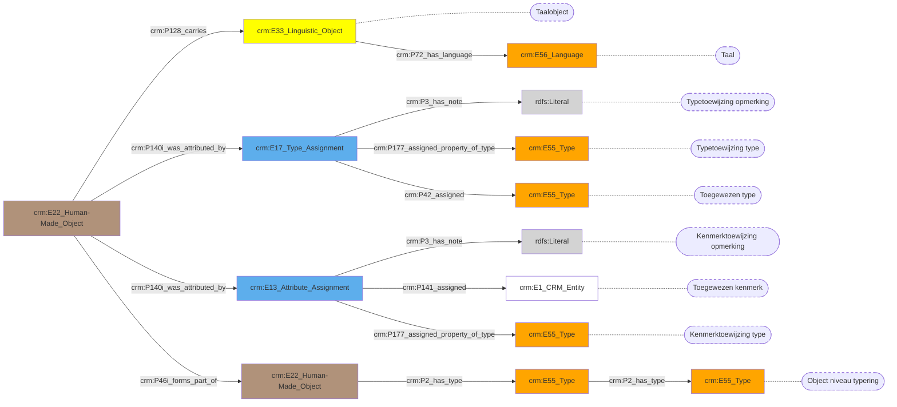

```mermaid
graph LR
style 2c5b6a89-27fa-11ef-b8c4-960002548b4f fill:#5DAEEC
style 2c5b6eaa-27fa-11ef-9689-960002548b4f fill:#ffa500
style 2c5b6ff0-27fa-11ef-9d72-960002548b4f fill:#ffa500
style 2c5b72e5-27fa-11ef-8715-960002548b4f fill:#D3D3D3
style 3314e289-27f8-11ef-bc2d-960002548b4f fill:#B0927A
style 4632cd83-2e0a-11ef-8865-960002548b4f fill:#ffa500
style 6168f567-2890-11ef-8702-960002548b4f fill:#ffff00
style 63dd50eb-2e0a-11ef-9146-960002548b4f fill:#ffa500
style 80135468-2890-11ef-a884-960002548b4f fill:#ffa500
style d2a82d20-27f9-11ef-85ef-960002548b4f fill:#5DAEEC
style d2a82f8e-27f9-11ef-aea3-960002548b4f fill:#D3D3D3
style d2a830d9-27f9-11ef-9088-960002548b4f fill:#ffa500
style d2a83155-27f9-11ef-afd3-960002548b4f fill:#ffffff
style f03920c2-27f7-11ef-8f92-960002548b4f fill:#B0927A
2c5b6a89-27fa-11ef-b8c4-960002548b4f["crm:E17_Type_Assignment"]-->|"crm:P3_has_note"|2c5b72e5-27fa-11ef-8715-960002548b4f(rdfs:Literal)
d2a82d20-27f9-11ef-85ef-960002548b4f["crm:E13_Attribute_Assignment"]-->|"crm:P3_has_note"|d2a82f8e-27f9-11ef-aea3-960002548b4f(rdfs:Literal)
style 2c5b6eaa-27fa-11ef-9689-960002548b4f_s stroke-dasharray: 5
style 2c5b72e5-27fa-11ef-8715-960002548b4f_s stroke-dasharray: 5
style 2c5b6ff0-27fa-11ef-9d72-960002548b4f_s stroke-dasharray: 5
style 63dd50eb-2e0a-11ef-9146-960002548b4f_s stroke-dasharray: 5
style 80135468-2890-11ef-a884-960002548b4f_s stroke-dasharray: 5
style d2a83155-27f9-11ef-afd3-960002548b4f_s stroke-dasharray: 5
style d2a830d9-27f9-11ef-9088-960002548b4f_s stroke-dasharray: 5
style d2a82f8e-27f9-11ef-aea3-960002548b4f_s stroke-dasharray: 5
style 6168f567-2890-11ef-8702-960002548b4f_s stroke-dasharray: 5
2c5b6eaa-27fa-11ef-9689-960002548b4f["crm:E55_Type"]-.-2c5b6eaa-27fa-11ef-9689-960002548b4f_s(["Typetoewijzing type"])
2c5b72e5-27fa-11ef-8715-960002548b4f["rdfs:Literal"]-.-2c5b72e5-27fa-11ef-8715-960002548b4f_s(["Typetoewijzing opmerking"])
2c5b6ff0-27fa-11ef-9d72-960002548b4f["crm:E55_Type"]-.-2c5b6ff0-27fa-11ef-9d72-960002548b4f_s(["Toegewezen type"])
63dd50eb-2e0a-11ef-9146-960002548b4f["crm:E55_Type"]-.-63dd50eb-2e0a-11ef-9146-960002548b4f_s(["Object niveau typering"])
80135468-2890-11ef-a884-960002548b4f["crm:E56_Language"]-.-80135468-2890-11ef-a884-960002548b4f_s(["Taal"])
d2a83155-27f9-11ef-afd3-960002548b4f["crm:E1_CRM_Entity"]-.-d2a83155-27f9-11ef-afd3-960002548b4f_s(["Toegewezen kenmerk"])
d2a830d9-27f9-11ef-9088-960002548b4f["crm:E55_Type"]-.-d2a830d9-27f9-11ef-9088-960002548b4f_s(["Kenmerktoewijzing type"])
d2a82f8e-27f9-11ef-aea3-960002548b4f["rdfs:Literal"]-.-d2a82f8e-27f9-11ef-aea3-960002548b4f_s(["Kenmerktoewijzing opmerking"])
6168f567-2890-11ef-8702-960002548b4f["crm:E33_Linguistic_Object"]-.-6168f567-2890-11ef-8702-960002548b4f_s(["Taalobject"])
2c5b6a89-27fa-11ef-b8c4-960002548b4f["crm:E17_Type_Assignment"]-->|"crm:P177_assigned_property_of_type"|2c5b6eaa-27fa-11ef-9689-960002548b4f["crm:E55_Type"]
2c5b6a89-27fa-11ef-b8c4-960002548b4f["crm:E17_Type_Assignment"]-->|"crm:P42_assigned"|2c5b6ff0-27fa-11ef-9d72-960002548b4f["crm:E55_Type"]
3314e289-27f8-11ef-bc2d-960002548b4f["crm:E22_Human-Made_Object"]-->|"crm:P2_has_type"|4632cd83-2e0a-11ef-8865-960002548b4f["crm:E55_Type"]
4632cd83-2e0a-11ef-8865-960002548b4f["crm:E55_Type"]-->|"crm:P2_has_type"|63dd50eb-2e0a-11ef-9146-960002548b4f["crm:E55_Type"]
6168f567-2890-11ef-8702-960002548b4f["crm:E33_Linguistic_Object"]-->|"crm:P72_has_language"|80135468-2890-11ef-a884-960002548b4f["crm:E56_Language"]
d2a82d20-27f9-11ef-85ef-960002548b4f["crm:E13_Attribute_Assignment"]-->|"crm:P141_assigned"|d2a83155-27f9-11ef-afd3-960002548b4f["crm:E1_CRM_Entity"]
d2a82d20-27f9-11ef-85ef-960002548b4f["crm:E13_Attribute_Assignment"]-->|"crm:P177_assigned_property_of_type"|d2a830d9-27f9-11ef-9088-960002548b4f["crm:E55_Type"]
f03920c2-27f7-11ef-8f92-960002548b4f["crm:E22_Human-Made_Object"]-->|"crm:P128_carries"|6168f567-2890-11ef-8702-960002548b4f["crm:E33_Linguistic_Object"]
f03920c2-27f7-11ef-8f92-960002548b4f["crm:E22_Human-Made_Object"]-->|"crm:P140i_was_attributed_by"|2c5b6a89-27fa-11ef-b8c4-960002548b4f["crm:E17_Type_Assignment"]
f03920c2-27f7-11ef-8f92-960002548b4f["crm:E22_Human-Made_Object"]-->|"crm:P140i_was_attributed_by"|d2a82d20-27f9-11ef-85ef-960002548b4f["crm:E13_Attribute_Assignment"]
f03920c2-27f7-11ef-8f92-960002548b4f["crm:E22_Human-Made_Object"]-->|"crm:P46i_forms_part_of"|3314e289-27f8-11ef-bc2d-960002548b4f["crm:E22_Human-Made_Object"]
```
