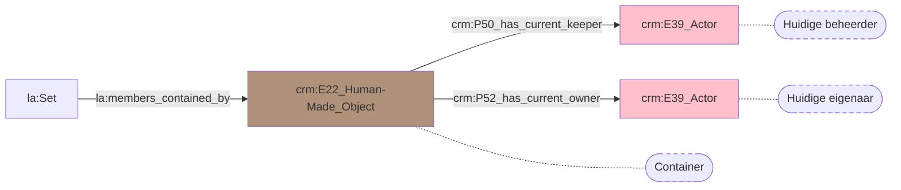

```mermaid
graph LR
style 52d75ae2-b2ea-11ef-a481-960003b0d355 fill:#B0927A
style 83e6ac34-b2ed-11ef-a481-960003b0d355 fill:#ffc0cb
style a7ce825c-b2ed-11ef-9b84-960003b0d355 fill:#ffc0cb
style 83e6ac34-b2ed-11ef-a481-960003b0d355_s stroke-dasharray: 5
style a7ce825c-b2ed-11ef-9b84-960003b0d355_s stroke-dasharray: 5
style 52d75ae2-b2ea-11ef-a481-960003b0d355_s stroke-dasharray: 5
52d75ae2-b2ea-11ef-a481-960003b0d355["crm:E22_Human-Made_Object"]-->|"crm:P50_has_current_keeper"|83e6ac34-b2ed-11ef-a481-960003b0d355["crm:E39_Actor"]
52d75ae2-b2ea-11ef-a481-960003b0d355["crm:E22_Human-Made_Object"]-->|"crm:P52_has_current_owner"|a7ce825c-b2ed-11ef-9b84-960003b0d355["crm:E39_Actor"]
92985afe-b0b1-11ef-95ba-960003b0d355["la:Set"]-->|"la:members_contained_by"|52d75ae2-b2ea-11ef-a481-960003b0d355["crm:E22_Human-Made_Object"]
83e6ac34-b2ed-11ef-a481-960003b0d355["crm:E39_Actor"]-.-83e6ac34-b2ed-11ef-a481-960003b0d355_s(["Huidige beheerder"])
a7ce825c-b2ed-11ef-9b84-960003b0d355["crm:E39_Actor"]-.-a7ce825c-b2ed-11ef-9b84-960003b0d355_s(["Huidige eigenaar"])
52d75ae2-b2ea-11ef-a481-960003b0d355["crm:E22_Human-Made_Object"]-.-52d75ae2-b2ea-11ef-a481-960003b0d355_s(["Container"])
```
