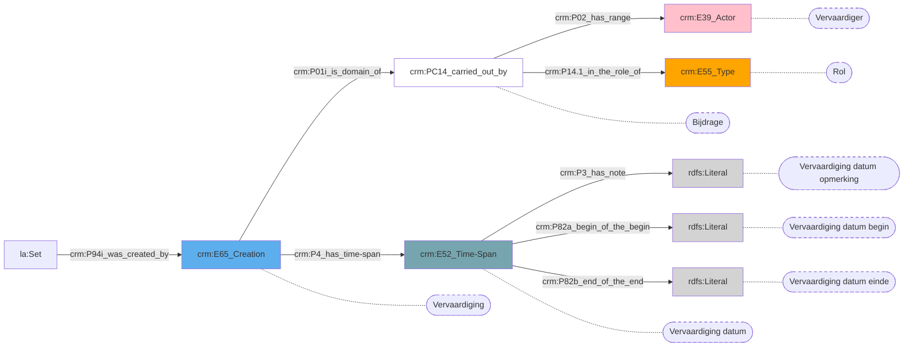

```mermaid
graph LR
style 5033c8b0-b2eb-11ef-a481-960003b0d355 fill:#76A5AF
style 5033cdd8-b2eb-11ef-a481-960003b0d355 fill:#D3D3D3
style 5033d1ca-b2eb-11ef-a481-960003b0d355 fill:#D3D3D3
style 5033d33c-b2eb-11ef-a481-960003b0d355 fill:#D3D3D3
style da9ca540-b2ea-11ef-a481-960003b0d355 fill:#5DAEEC
style f59cd6ae-bb9a-11ef-86f2-960003b0d355 fill:#ffffff
style f59cda82-bb9a-11ef-86f2-960003b0d355 fill:#ffc0cb
style f59cdbb8-bb9a-11ef-86f2-960003b0d355 fill:#ffa500
5033c8b0-b2eb-11ef-a481-960003b0d355["crm:E52_Time-Span"]-->|"crm:P3_has_note"|5033cdd8-b2eb-11ef-a481-960003b0d355(rdfs:Literal)
5033c8b0-b2eb-11ef-a481-960003b0d355["crm:E52_Time-Span"]-->|"crm:P82a_begin_of_the_begin"|5033d1ca-b2eb-11ef-a481-960003b0d355(rdfs:Literal)
5033c8b0-b2eb-11ef-a481-960003b0d355["crm:E52_Time-Span"]-->|"crm:P82b_end_of_the_end"|5033d33c-b2eb-11ef-a481-960003b0d355(rdfs:Literal)
style 5033cdd8-b2eb-11ef-a481-960003b0d355_s stroke-dasharray: 5
style 5033d1ca-b2eb-11ef-a481-960003b0d355_s stroke-dasharray: 5
style 5033d33c-b2eb-11ef-a481-960003b0d355_s stroke-dasharray: 5
style da9ca540-b2ea-11ef-a481-960003b0d355_s stroke-dasharray: 5
style f59cd6ae-bb9a-11ef-86f2-960003b0d355_s stroke-dasharray: 5
style 5033c8b0-b2eb-11ef-a481-960003b0d355_s stroke-dasharray: 5
style f59cda82-bb9a-11ef-86f2-960003b0d355_s stroke-dasharray: 5
style f59cdbb8-bb9a-11ef-86f2-960003b0d355_s stroke-dasharray: 5
92985afe-b0b1-11ef-95ba-960003b0d355["la:Set"]-->|"crm:P94i_was_created_by"|da9ca540-b2ea-11ef-a481-960003b0d355["crm:E65_Creation"]
da9ca540-b2ea-11ef-a481-960003b0d355["crm:E65_Creation"]-->|"crm:P01i_is_domain_of"|f59cd6ae-bb9a-11ef-86f2-960003b0d355["crm:PC14_carried_out_by"]
da9ca540-b2ea-11ef-a481-960003b0d355["crm:E65_Creation"]-->|"crm:P4_has_time-span"|5033c8b0-b2eb-11ef-a481-960003b0d355["crm:E52_Time-Span"]
f59cd6ae-bb9a-11ef-86f2-960003b0d355["crm:PC14_carried_out_by"]-->|"crm:P02_has_range"|f59cda82-bb9a-11ef-86f2-960003b0d355["crm:E39_Actor"]
f59cd6ae-bb9a-11ef-86f2-960003b0d355["crm:PC14_carried_out_by"]-->|"crm:P14.1_in_the_role_of"|f59cdbb8-bb9a-11ef-86f2-960003b0d355["crm:E55_Type"]
5033cdd8-b2eb-11ef-a481-960003b0d355["rdfs:Literal"]-.-5033cdd8-b2eb-11ef-a481-960003b0d355_s(["Vervaardiging datum opmerking"])
5033d1ca-b2eb-11ef-a481-960003b0d355["rdfs:Literal"]-.-5033d1ca-b2eb-11ef-a481-960003b0d355_s(["Vervaardiging datum begin"])
5033d33c-b2eb-11ef-a481-960003b0d355["rdfs:Literal"]-.-5033d33c-b2eb-11ef-a481-960003b0d355_s(["Vervaardiging datum einde"])
da9ca540-b2ea-11ef-a481-960003b0d355["crm:E65_Creation"]-.-da9ca540-b2ea-11ef-a481-960003b0d355_s(["Vervaardiging"])
f59cd6ae-bb9a-11ef-86f2-960003b0d355["crm:PC14_carried_out_by"]-.-f59cd6ae-bb9a-11ef-86f2-960003b0d355_s(["Bijdrage"])
5033c8b0-b2eb-11ef-a481-960003b0d355["crm:E52_Time-Span"]-.-5033c8b0-b2eb-11ef-a481-960003b0d355_s(["Vervaardiging datum"])
f59cda82-bb9a-11ef-86f2-960003b0d355["crm:E39_Actor"]-.-f59cda82-bb9a-11ef-86f2-960003b0d355_s(["Vervaardiger"])
f59cdbb8-bb9a-11ef-86f2-960003b0d355["crm:E55_Type"]-.-f59cdbb8-bb9a-11ef-86f2-960003b0d355_s(["Rol"])
```
