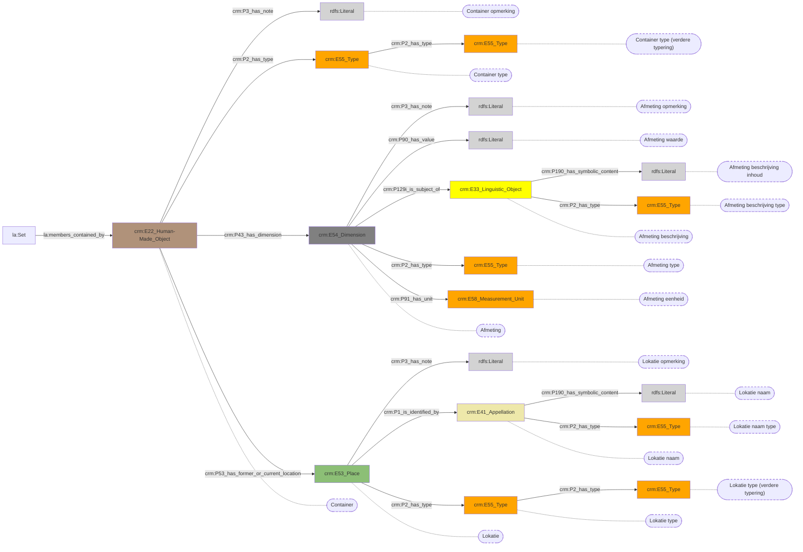

```mermaid
graph LR
style 33f83b5a-bb96-11ef-9b84-960003b0d355 fill:#808080
style 33f83f4c-bb96-11ef-9b84-960003b0d355 fill:#D3D3D3
style 33f8408c-bb96-11ef-9b84-960003b0d355 fill:#D3D3D3
style 33f8419a-bb96-11ef-9b84-960003b0d355 fill:#ffa500
style 33f842b2-bb96-11ef-9b84-960003b0d355 fill:#ffff00
style 33f84398-bb96-11ef-9b84-960003b0d355 fill:#ffa500
style 33f84488-bb96-11ef-9b84-960003b0d355 fill:#D3D3D3
style 33f8456e-bb96-11ef-9b84-960003b0d355 fill:#ffa500
style 52d75ae2-b2ea-11ef-a481-960003b0d355 fill:#B0927A
style 70ff1ea8-b2ed-11ef-9b84-960003b0d355 fill:#8CBF76
style 70ff26aa-b2ed-11ef-9b84-960003b0d355 fill:#ffa500
style 70ff27a4-b2ed-11ef-9b84-960003b0d355 fill:#D3D3D3
style 70ff2894-b2ed-11ef-9b84-960003b0d355 fill:#D3D3D3
style 70ff297a-b2ed-11ef-9b84-960003b0d355 fill:#ffa500
style 70ff2a56-b2ed-11ef-9b84-960003b0d355 fill:#ffa500
style 70ff2b3c-b2ed-11ef-9b84-960003b0d355 fill:#EEE8AA
style c12a2a58-bbad-11ef-95ba-960003b0d355 fill:#D3D3D3
style e81f7726-bbad-11ef-9b84-960003b0d355 fill:#ffa500
style e81f7b68-bbad-11ef-9b84-960003b0d355 fill:#ffa500
33f83b5a-bb96-11ef-9b84-960003b0d355["crm:E54_Dimension"]-->|"crm:P3_has_note"|33f83f4c-bb96-11ef-9b84-960003b0d355(rdfs:Literal)
33f83b5a-bb96-11ef-9b84-960003b0d355["crm:E54_Dimension"]-->|"crm:P90_has_value"|33f8408c-bb96-11ef-9b84-960003b0d355(rdfs:Literal)
33f842b2-bb96-11ef-9b84-960003b0d355["crm:E33_Linguistic_Object"]-->|"crm:P190_has_symbolic_content"|33f84488-bb96-11ef-9b84-960003b0d355(rdfs:Literal)
52d75ae2-b2ea-11ef-a481-960003b0d355["crm:E22_Human-Made_Object"]-->|"crm:P3_has_note"|c12a2a58-bbad-11ef-95ba-960003b0d355(rdfs:Literal)
70ff1ea8-b2ed-11ef-9b84-960003b0d355["crm:E53_Place"]-->|"crm:P3_has_note"|70ff2894-b2ed-11ef-9b84-960003b0d355(rdfs:Literal)
70ff2b3c-b2ed-11ef-9b84-960003b0d355["crm:E41_Appellation"]-->|"crm:P190_has_symbolic_content"|70ff27a4-b2ed-11ef-9b84-960003b0d355(rdfs:Literal)
style 33f842b2-bb96-11ef-9b84-960003b0d355_s stroke-dasharray: 5
style 33f8456e-bb96-11ef-9b84-960003b0d355_s stroke-dasharray: 5
style 33f83f4c-bb96-11ef-9b84-960003b0d355_s stroke-dasharray: 5
style 33f8408c-bb96-11ef-9b84-960003b0d355_s stroke-dasharray: 5
style 33f8419a-bb96-11ef-9b84-960003b0d355_s stroke-dasharray: 5
style 33f84488-bb96-11ef-9b84-960003b0d355_s stroke-dasharray: 5
style 33f84398-bb96-11ef-9b84-960003b0d355_s stroke-dasharray: 5
style e81f7726-bbad-11ef-9b84-960003b0d355_s stroke-dasharray: 5
style c12a2a58-bbad-11ef-95ba-960003b0d355_s stroke-dasharray: 5
style 33f83b5a-bb96-11ef-9b84-960003b0d355_s stroke-dasharray: 5
style 70ff1ea8-b2ed-11ef-9b84-960003b0d355_s stroke-dasharray: 5
style 70ff2b3c-b2ed-11ef-9b84-960003b0d355_s stroke-dasharray: 5
style 70ff26aa-b2ed-11ef-9b84-960003b0d355_s stroke-dasharray: 5
style 70ff2894-b2ed-11ef-9b84-960003b0d355_s stroke-dasharray: 5
style 70ff297a-b2ed-11ef-9b84-960003b0d355_s stroke-dasharray: 5
style 70ff27a4-b2ed-11ef-9b84-960003b0d355_s stroke-dasharray: 5
style 70ff2a56-b2ed-11ef-9b84-960003b0d355_s stroke-dasharray: 5
style 52d75ae2-b2ea-11ef-a481-960003b0d355_s stroke-dasharray: 5
style e81f7b68-bbad-11ef-9b84-960003b0d355_s stroke-dasharray: 5
33f83b5a-bb96-11ef-9b84-960003b0d355["crm:E54_Dimension"]-->|"crm:P129i_is_subject_of"|33f842b2-bb96-11ef-9b84-960003b0d355["crm:E33_Linguistic_Object"]
33f83b5a-bb96-11ef-9b84-960003b0d355["crm:E54_Dimension"]-->|"crm:P2_has_type"|33f8456e-bb96-11ef-9b84-960003b0d355["crm:E55_Type"]
33f83b5a-bb96-11ef-9b84-960003b0d355["crm:E54_Dimension"]-->|"crm:P91_has_unit"|33f8419a-bb96-11ef-9b84-960003b0d355["crm:E58_Measurement_Unit"]
33f842b2-bb96-11ef-9b84-960003b0d355["crm:E33_Linguistic_Object"]-->|"crm:P2_has_type"|33f84398-bb96-11ef-9b84-960003b0d355["crm:E55_Type"]
52d75ae2-b2ea-11ef-a481-960003b0d355["crm:E22_Human-Made_Object"]-->|"crm:P2_has_type"|e81f7726-bbad-11ef-9b84-960003b0d355["crm:E55_Type"]
52d75ae2-b2ea-11ef-a481-960003b0d355["crm:E22_Human-Made_Object"]-->|"crm:P43_has_dimension"|33f83b5a-bb96-11ef-9b84-960003b0d355["crm:E54_Dimension"]
52d75ae2-b2ea-11ef-a481-960003b0d355["crm:E22_Human-Made_Object"]-->|"crm:P53_has_former_or_current_location"|70ff1ea8-b2ed-11ef-9b84-960003b0d355["crm:E53_Place"]
70ff1ea8-b2ed-11ef-9b84-960003b0d355["crm:E53_Place"]-->|"crm:P1_is_identified_by"|70ff2b3c-b2ed-11ef-9b84-960003b0d355["crm:E41_Appellation"]
70ff1ea8-b2ed-11ef-9b84-960003b0d355["crm:E53_Place"]-->|"crm:P2_has_type"|70ff26aa-b2ed-11ef-9b84-960003b0d355["crm:E55_Type"]
70ff26aa-b2ed-11ef-9b84-960003b0d355["crm:E55_Type"]-->|"crm:P2_has_type"|70ff297a-b2ed-11ef-9b84-960003b0d355["crm:E55_Type"]
70ff2b3c-b2ed-11ef-9b84-960003b0d355["crm:E41_Appellation"]-->|"crm:P2_has_type"|70ff2a56-b2ed-11ef-9b84-960003b0d355["crm:E55_Type"]
92985afe-b0b1-11ef-95ba-960003b0d355["la:Set"]-->|"la:members_contained_by"|52d75ae2-b2ea-11ef-a481-960003b0d355["crm:E22_Human-Made_Object"]
e81f7726-bbad-11ef-9b84-960003b0d355["crm:E55_Type"]-->|"crm:P2_has_type"|e81f7b68-bbad-11ef-9b84-960003b0d355["crm:E55_Type"]
33f842b2-bb96-11ef-9b84-960003b0d355["crm:E33_Linguistic_Object"]-.-33f842b2-bb96-11ef-9b84-960003b0d355_s(["Afmeting beschrijving"])
33f8456e-bb96-11ef-9b84-960003b0d355["crm:E55_Type"]-.-33f8456e-bb96-11ef-9b84-960003b0d355_s(["Afmeting type"])
33f83f4c-bb96-11ef-9b84-960003b0d355["rdfs:Literal"]-.-33f83f4c-bb96-11ef-9b84-960003b0d355_s(["Afmeting opmerking"])
33f8408c-bb96-11ef-9b84-960003b0d355["rdfs:Literal"]-.-33f8408c-bb96-11ef-9b84-960003b0d355_s(["Afmeting waarde"])
33f8419a-bb96-11ef-9b84-960003b0d355["crm:E58_Measurement_Unit"]-.-33f8419a-bb96-11ef-9b84-960003b0d355_s(["Afmeting eenheid"])
33f84488-bb96-11ef-9b84-960003b0d355["rdfs:Literal"]-.-33f84488-bb96-11ef-9b84-960003b0d355_s(["Afmeting beschrijving inhoud"])
33f84398-bb96-11ef-9b84-960003b0d355["crm:E55_Type"]-.-33f84398-bb96-11ef-9b84-960003b0d355_s(["Afmeting beschrijving type"])
e81f7726-bbad-11ef-9b84-960003b0d355["crm:E55_Type"]-.-e81f7726-bbad-11ef-9b84-960003b0d355_s(["Container type"])
c12a2a58-bbad-11ef-95ba-960003b0d355["rdfs:Literal"]-.-c12a2a58-bbad-11ef-95ba-960003b0d355_s(["Container opmerking"])
33f83b5a-bb96-11ef-9b84-960003b0d355["crm:E54_Dimension"]-.-33f83b5a-bb96-11ef-9b84-960003b0d355_s(["Afmeting"])
70ff1ea8-b2ed-11ef-9b84-960003b0d355["crm:E53_Place"]-.-70ff1ea8-b2ed-11ef-9b84-960003b0d355_s(["Lokatie"])
70ff2b3c-b2ed-11ef-9b84-960003b0d355["crm:E41_Appellation"]-.-70ff2b3c-b2ed-11ef-9b84-960003b0d355_s(["Lokatie naam"])
70ff26aa-b2ed-11ef-9b84-960003b0d355["crm:E55_Type"]-.-70ff26aa-b2ed-11ef-9b84-960003b0d355_s(["Lokatie type"])
70ff2894-b2ed-11ef-9b84-960003b0d355["rdfs:Literal"]-.-70ff2894-b2ed-11ef-9b84-960003b0d355_s(["Lokatie opmerking"])
70ff297a-b2ed-11ef-9b84-960003b0d355["crm:E55_Type"]-.-70ff297a-b2ed-11ef-9b84-960003b0d355_s(["Lokatie type (verdere typering)"])
70ff27a4-b2ed-11ef-9b84-960003b0d355["rdfs:Literal"]-.-70ff27a4-b2ed-11ef-9b84-960003b0d355_s(["Lokatie naam"])
70ff2a56-b2ed-11ef-9b84-960003b0d355["crm:E55_Type"]-.-70ff2a56-b2ed-11ef-9b84-960003b0d355_s(["Lokatie naam type"])
52d75ae2-b2ea-11ef-a481-960003b0d355["crm:E22_Human-Made_Object"]-.-52d75ae2-b2ea-11ef-a481-960003b0d355_s(["Container"])
e81f7b68-bbad-11ef-9b84-960003b0d355["crm:E55_Type"]-.-e81f7b68-bbad-11ef-9b84-960003b0d355_s(["Container type (verdere typering)"])
```
